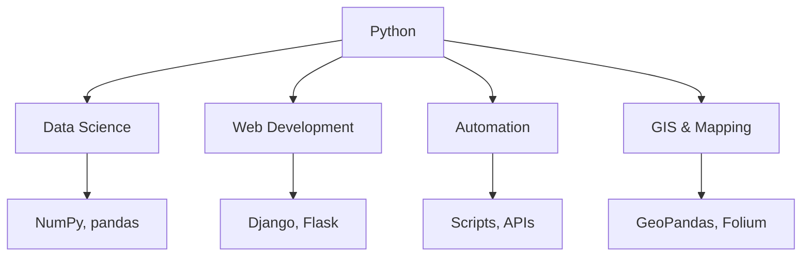
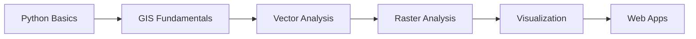

# Module 1: Python Basics

## Learning Goals

This module builds a foundation in Python syntax and core data structures so you can read scripts and write small programs confidently. The outcomes below are the skills you should recognize and practice before moving on to geospatial libraries. Use the code examples and exercises to connect each bullet to working code.

- Understand what Python is and where it's used
- Work with variables and basic data types (`int`, `float`, `str`, `bool`)
- Use lists, tuples, sets, and dictionaries effectively
- Branch with conditionals (`if`, `elif`, `else`)
- Write and use `for` and `while` loops
- Create simple functions with arguments and return values
- Import and use libraries
- Read and write text files safely (paths, encoding, `with open`, `pathlib`)
- Use NumPy arrays for numeric vectors and grids
- Read and shape tabular data with pandas

## What is Python?

Python is a general-purpose, high-level language designed to be readable and quick to write. Your source code is executed by an interpreter (or runtime), so you can run small snippets or full programs without a separate compilation step. A very large standard library and third-party packages make it a common choice for data analysis, automation, web services, and scientific or geospatial work.

Here are some common application areas:

- **Data Science & Analytics** - NumPy, pandas, matplotlib
- **Web Development** - Django, Flask
- **Automation & Scripting** - System administration, data processing
- **Geospatial Analysis** - GeoPandas, Rasterio, Shapely
- **Machine Learning** - scikit-learn, TensorFlow



## 1. Python as a Calculator

You can type numeric expressions in Python and get results immediately, much like a desk calculator. Operators such as `+`, `-`, `*`, `/`, `**`, and `%` follow familiar math rules, with a few Python-specific details (for example, `/` always produces a floating-point result). This is a simple way to check syntax, explore numbers, and build toward variables and scripts.

Let's start with basic arithmetic operations:

```python
# Basic arithmetic
print(5 + 3)    # Addition: 8
print(10 - 4)   # Subtraction: 6
print(6 * 7)    # Multiplication: 42
print(15 / 3)   # Division: 5.0
print(2 ** 3)   # Exponentiation: 8
print(17 % 5)   # Modulo (remainder): 2
```

!!! tip "Python Calculator Tips"
    - Use `**` for exponentiation (not `^`)
    - Division `/` always returns a float
    - Use `//` for integer division
    - Use `%` to get the remainder

## 2. Variables and Data Types

A **variable** is a name that refers to a value stored in memory, so you can reuse and update data without repeating literals. **Data types** describe what kind of value something is—such as whole numbers (`int`), decimals (`float`), text (`str`), or true/false (`bool`)—and they determine which operations are valid. Python figures out many types automatically, and you can inspect them with `type()`.

Variables store data that can be used later:

```python
# Numbers
age = 25
temperature = 23.5
population = 1_000_000  # Underscores for readability

# Strings
city_name = "San Francisco"
country = 'United States'
description = """This is a 
multi-line string"""

# Boolean
is_capital = True
has_data = False

# Check data types
print(type(age))          # <class 'int'>
print(type(temperature))  # <class 'float'>
print(type(city_name))    # <class 'str'>
print(type(is_capital))   # <class 'bool'>
```

### Core types at a glance

| Type | Role | Examples |
|------|------|----------|
| `int` | Whole numbers | `42`, `-1`, `1_000_000` |
| `float` | Decimal (approximate) real numbers | `3.14`, `1.0`, `2.5e3` |
| `str` | Text (immutable sequence of characters) | `"hello"`, `'GIS'` |
| `bool` | Logical true/false | `True`, `False` |

You can **convert** between types when it makes sense: `int("10")`, `float("3.5")`, `str(99)`, `bool(0)`. For conditionals, values like `0`, `None`, `False`, `""`, and empty collections behave as **falsy**; most other values are **truthy**.

### String Operations

**Strings** are sequences of characters used for names, labels, and text. You can combine them (concatenation), build messages with **f-strings**, and call **methods** like `.lower()` or `.replace()` to transform text without changing the original string in place (strings are immutable). These operations are central to cleaning labels, paths, and CSV fields in real projects.

```python
# String concatenation and formatting
first_name = "John"
last_name = "Doe"

# Method 1: Concatenation
full_name = first_name + " " + last_name
print(full_name)  # John Doe

# Method 2: f-strings (recommended)
greeting = f"Hello, {first_name}! You are {age} years old."
print(greeting)

# String methods
city = "san francisco"
print(city.title())      # San Francisco
print(city.upper())      # SAN FRANCISCO
print(city.replace(" ", "_"))  # san_francisco
```

## 3. Lists, Tuples, Sets, and Dictionaries (overview)

### Lists — ordered, mutable

A **list** is an ordered, mutable collection: items keep their sequence, and you can add, remove, or change elements by index. Lists can hold mixed types, though in data work you often keep one type per list (for example, all numbers or all strings). Indexing starts at `0`, and slicing lets you take contiguous sub-ranges efficiently.

Lists store multiple items in order:

```python
# Creating lists
cities = ["New York", "London", "Tokyo", "Sydney"]
populations = [8_400_000, 9_000_000, 13_960_000, 5_300_000]
mixed_data = ["Paris", 2_161_000, True, 48.8566]

# Accessing elements (0-indexed)
print(cities[0])    # New York (first item)
print(cities[-1])   # Sydney (last item)
print(cities[1:3])  # ['London', 'Tokyo'] (slice)

# Modifying lists
cities.append("Berlin")           # Add to end
cities.insert(1, "Los Angeles")  # Insert at position
cities.remove("Tokyo")           # Remove by value
last_city = cities.pop()         # Remove and return last

# List operations
print(len(cities))              # Number of items
print("London" in cities)       # Check if item exists
print(max(populations))         # Maximum value
print(sum(populations))         # Sum of all values
```

### List Comprehensions (Bonus)

A **list comprehension** is a compact way to build a new list by looping over another iterable, optionally filtering with `if`. It often replaces a short `for` loop plus `.append()` with a single readable expression. Comprehensions are idiomatic in Python for transforming or filtering sequences of values.

```python
# Create new lists based on existing ones
numbers = [1, 2, 3, 4, 5]
squares = [x**2 for x in numbers]
print(squares)  # [1, 4, 9, 16, 25]

# Filter and transform
large_cities = [city for city in cities if len(city) > 6]
print(large_cities)
```

### Tuples — ordered, immutable

A **tuple** is like a list that **cannot** be changed after creation (no `.append()`, no item assignment). Tuples are lightweight and hashable when their items are hashable, so they can be used as **dictionary keys** or **set members**—unlike lists.

```python
# Creating tuples (parentheses optional but readable)
point = (12.5, 45.3, 100.0)   # often x, y, z or lon, lat, elevation
single = (42,)                 # comma required for a one-item tuple
from_list = tuple([1, 2, 3])

# Access and unpack
print(point[0], point[-1])
lon, lat, z = point

# Immutable: point[0] = 0 would raise TypeError
```

### Sets — unique elements, fast membership

A **set** stores **unique** items and supports fast **membership** checks (`in`) and **set algebra** (union, intersection, difference). Elements must be **hashable** (for example numbers, strings, tuples of hashables—not lists).

```python
# Creating sets
tags = {"urban", "park", "water", "urban"}  # duplicates dropped → one "urban"
more = set(["forest", "park"])

# Add / remove
tags.add("wetland")
tags.discard("missing")  # no error if absent

# Membership and size
print("park" in tags)
print(len(tags))

# Set operations
print(tags | more)   # union
print(tags & more)   # intersection
print(tags - more)   # difference
```

## 4. Dictionaries - Key-Value Pairs

A **dictionary** maps unique **keys** to **values**, so you look up data by name (for example a city id or column-like label) instead of by position. Keys must be hashable (often strings or numbers); values can be any type, including nested dicts or lists. Dictionaries are ideal for records, configuration, and structured attributes you want to access by key.

Dictionaries store data as key-value pairs:

```python
# Creating dictionaries
city_info = {
    "name": "San Francisco",
    "country": "USA",
    "population": 884_000,
    "coordinates": [37.7749, -122.4194],
    "is_capital": False
}

# Accessing values
print(city_info["name"])        # San Francisco
print(city_info.get("population"))  # 884000
print(city_info.get("area", "Unknown"))  # Unknown (default value)

# Modifying dictionaries
city_info["area"] = 121.4  # Add new key-value pair
city_info["population"] = 900_000  # Update existing value

# Dictionary methods
print(city_info.keys())    # All keys
print(city_info.values())  # All values
print(city_info.items())   # Key-value pairs

# Multiple cities
cities_data = {
    "San Francisco": {"population": 884_000, "country": "USA"},
    "London": {"population": 9_000_000, "country": "UK"},
    "Tokyo": {"population": 13_960_000, "country": "Japan"}
}

print(cities_data["London"]["population"])  # 9000000
```

### Lists, Tuples, Sets, and Dictionaries (overview)

| Structure | Ordered? | Mutable? | Duplicate elements? | Typical use |
|-----------|----------|----------|---------------------|-------------|
| **List** | Yes | Yes | Allowed | Sequences you change (rows, coordinates as you build them) |
| **Tuple** | Yes | No | Allowed | Fixed records, keys, or return bundles |
| **Set** | No* | Yes | Unique only | Membership tests, deduplication, set math |
| **Dictionary** | Insertion-ordered (3.7+) | Yes | Keys unique; values can repeat | Records by name, lookup tables |

\*Sets do not preserve a meaningful order for iteration; do not rely on order for logic.

## 5. Conditional Statements (`if`, `elif`, `else`)

**Conditionals** choose which code runs based on **boolean** tests. Python uses **`if`** for the first branch, **`elif`** for extra tests, and **`else`** for the fallback. Comparison operators include `==`, `!=`, `<`, `>`, `<=`, `>=`. You can combine conditions with **`and`**, **`or`**, and **`not`**.

```python
score = 85

if score >= 90:
    grade = "A"
elif score >= 80:
    grade = "B"
elif score >= 70:
    grade = "C"
else:
    grade = "F"

# Combining conditions
temp_c = 22
if 18 <= temp_c <= 28:
    print("Comfortable range")

# Truthiness: empty list/dict/str and zero are falsy
cities = ["Oslo", "Bergen"]
if cities:
    print(f"Processing {len(cities)} cities")
```

**`match` / `case`** (Python 3.10+) is optional for advanced pattern matching; `if`/`elif`/`else` is enough for most scripts you will see in this course.

## 6. Loops — `for` and `while`

### `for` loops — iteration over a sequence

A **`for` loop** runs the same block of code once for each item in a sequence (like a list, string, or dictionary view). It is the usual way to process many rows, files, or keys without copying and pasting logic. You can also pair values with indices using `enumerate()` when you need position as well as the item.

`for` loops let you repeat code for each item in a collection:

```python
# Loop through lists
cities = ["New York", "London", "Tokyo", "Sydney"]

for city in cities:
    print(f"I want to visit {city}")

# Loop with index
for i, city in enumerate(cities):
    print(f"{i+1}. {city}")

# Loop through dictionaries
city_populations = {
    "New York": 8_400_000,
    "London": 9_000_000,
    "Tokyo": 13_960_000
}

# Loop through keys
for city in city_populations:
    print(city)

# Loop through key-value pairs
for city, population in city_populations.items():
    print(f"{city}: {population:,} people")

# Loop through values
for population in city_populations.values():
    print(f"Population: {population:,}")
```

### Range Function

**`range`** produces a sequence of integers on demand, which is memory-efficient and works naturally in `for` loops. You can pass one argument (stop), or start and stop, or start, stop, and step—much like slice notation but for counting. It is commonly used for repeating an action a fixed number of times or generating numeric indices.

```python
# Generate sequences of numbers
for i in range(5):          # 0, 1, 2, 3, 4
    print(i)

for i in range(1, 6):       # 1, 2, 3, 4, 5
    print(i)

for i in range(0, 10, 2):   # 0, 2, 4, 6, 8
    print(i)

# Practical example: process multiple files
file_numbers = range(1, 6)
for num in file_numbers:
    filename = f"data_{num}.csv"
    print(f"Processing {filename}")
```

### `while` loops — repeat while a condition holds

A **`while` loop** checks a condition **before** each iteration; the body runs only while that condition is `True`. Use it when the number of repetitions is **not** known upfront (for example, reading until a sentinel value) or when modeling a simple state machine. **`break`** exits the loop early; **`continue`** skips to the next iteration.

```python
# Count up with a condition
n = 0
while n < 3:
    print(n)
    n += 1

# Typical pattern: process until done
pending = ["file_a.csv", "file_b.csv"]
while pending:
    path = pending.pop()
    print(f"Would load {path}")

# break: stop when you find a match
values = [0.1, 0.5, 99.9, 1.0]
for v in values:
    if v > 50:
        print("Found large value:", v)
        break
```

Prefer a **`for`** loop when you already have an iterable or a clear `range()`; use **`while`** when progress depends on a condition that updates inside the loop.

## 7. Functions - Reusable Code

A **function** is a named block of code that takes inputs (**parameters**), does work, and often **returns** a result to the caller. **Arguments** are the values you pass when you call the function; **return** sends a value back (or `None` implicitly if there is no `return`). Defining functions avoids duplication, makes scripts easier to read, and lets you test one piece of logic in isolation. Default parameter values and docstrings help document behavior and common use cases.

Functions help organize and reuse code:

```python
# Simple function: one argument, one return value
def greet(name):
    """Greet a person by name"""
    return f"Hello, {name}!"

# Call the function
message = greet("Alice")
print(message)  # Hello, Alice!

# Multiple parameters and a returned number
def calculate_density(population, area):
    """Calculate population density"""
    if area == 0:
        return 0
    return population / area

# Function with default parameters
def describe_city(name, population, country="Unknown"):
    """Describe a city with its basic information"""
    density = calculate_density(population, 100)  # Assume 100 km²
    return f"{name} ({country}): {population:,} people, density: {density:.1f}/km²"

# Using functions
sf_info = describe_city("San Francisco", 884_000, "USA")
print(sf_info)

mystery_city = describe_city("Mystery City", 500_000)
print(mystery_city)
```

**Multiple return values** are often packed in a **tuple**; unpacking at the call site keeps code clear:

```python
def min_max(values):
    return min(values), max(values)

low, high = min_max([3, 1, 4, 1, 5])
```

### Functions with Lists and Dictionaries

When a function accepts a **list** or **dictionary**, it can aggregate, filter, or reshape structured data in one place. You often loop over items or keys, use built-ins like `sum()` and `max()`, or build a new dict to return several related results at once. This pattern mirrors how you will later wrap pandas or GIS operations in small, testable helpers.

```python
def analyze_cities(cities_dict):
    """Analyze a dictionary of cities and their populations"""
    total_population = sum(cities_dict.values())
    largest_city = max(cities_dict, key=cities_dict.get)
    smallest_city = min(cities_dict, key=cities_dict.get)
    
    return {
        "total_population": total_population,
        "largest_city": largest_city,
        "smallest_city": smallest_city,
        "average_population": total_population / len(cities_dict)
    }

# Example usage
cities = {
    "New York": 8_400_000,
    "Los Angeles": 3_900_000,
    "Chicago": 2_700_000,
    "Houston": 2_300_000
}

analysis = analyze_cities(cities)
print(f"Total population: {analysis['total_population']:,}")
print(f"Largest city: {analysis['largest_city']}")
print(f"Average population: {analysis['average_population']:,.0f}")
```

## 8. Importing Libraries

A **library** (or **module**) is reusable code—functions, classes, and constants—packaged so you can load it into your program. The `import` statement brings that code into scope, optionally under a short **alias** (for example `np` for NumPy and `pd` for pandas). Using the standard library and well-known packages saves time and avoids reimplementing common tasks like math, dates, and random numbers.

Libraries extend Python's capabilities:

```python
# Import entire modules
import math
import random
from datetime import datetime

# Using imported functions
print(math.sqrt(16))        # 4.0
print(math.pi)              # 3.141592653589793
print(random.randint(1, 10))  # Random number between 1-10
print(datetime.now())       # Current date and time

# Import specific functions
from math import sqrt, pi, sin
print(sqrt(25))  # 5.0

# Import with alias (NumPy first is a common teaching order)
import numpy as np
import pandas as pd

# These are common conventions in data science
```

## 9. File Handling

Most real programs **read input** from disk (logs, field notes, CSV exports, config text) and **write output** (reports, cleaned tables, small caches). Python’s built-in tools focus on **plain text** and **binary** streams: open a path, read or write bytes or decoded text, and close the file reliably. Tabular **CSV** is often easier with **pandas** (section 11); here you learn the **`open()`** / **`pathlib`** patterns that underpin any format, including larger files you stream line by line.

### Files, paths, and programs

A **path** is a string (or `pathlib.Path`) that names a location on disk, for example `"data/readings.txt"` or `"C:/Users/you/project/config.txt"`. On Windows, both backslashes and forward slashes often work in Python strings; forward slashes are portable in code.

A minimal **program** that uses files has three parts: (1) choose a path, (2) **open** the file in the right **mode**, (3) **read** or **write**, then **close** (or use `with`, which closes for you).

| Mode | Meaning |
|------|--------|
| `"r"` | Read text (default); error if file missing |
| `"w"` | Write text; creates or **truncates** (empties) the file |
| `"a"` | Append text; creates file if needed, keeps existing content |
| `"rb"` / `"wb"` | Read/write **binary** (bytes)—images, some GIS binaries, not decoded as text |

Always specify **`encoding="utf-8"`** for text files so accents and international characters behave consistently across machines.

### The `with` statement and `open()`

`open()` returns a **file object**. Wrapping it in **`with`** guarantees the file is **closed** when the block ends—even if an error occurs—so you do not leak handles or lose buffered data on write.

```python
from pathlib import Path

# Ensure a folder exists (optional; avoids errors on write)
Path("data").mkdir(parents=True, exist_ok=True)

# Write text (UTF-8)
with open("data/note.txt", "w", encoding="utf-8") as f:
    f.write("First line\n")
    f.write("Second line\n")

# Read entire file as one string
with open("data/note.txt", "r", encoding="utf-8") as f:
    text = f.read()
print(text)

# Memory-friendly: process line by line (good for large logs)
with open("data/note.txt", "r", encoding="utf-8") as f:
    for line in f:
        print(line.strip())  # strip removes trailing newline/spaces
```

!!! tip "File handling habits"
    - Prefer **`with open(...)`** over calling `f.close()` yourself
    - Use **`encoding="utf-8"`** for all text files unless a legacy format forces something else
    - **`"w"` overwrites** the whole file; use **`"a"`** to append or open a different filename if you must keep the old version

### `pathlib` for paths (recommended basics)

The **`pathlib`** module treats paths as **`Path`** objects. You can join segments with `/`, check existence, and read or write **whole small files** in one call—handy for configs and notes.

```python
from pathlib import Path

root = Path("data")
file_path = root / "summary.txt"

root.mkdir(parents=True, exist_ok=True)
file_path.write_text("Total sites: 42\n", encoding="utf-8")

content = file_path.read_text(encoding="utf-8")
print(content)
print(file_path.exists(), file_path.name)
```

For **very large** files, still stream with `open()` and a `for line in f` loop instead of `read_text()`.

### When things go wrong

Common issues: wrong path (**`FileNotFoundError`**), permission errors, or disk full on write. For short scripts you can catch **`FileNotFoundError`** and choose a default (for example create a folder or start with an empty file). For **encoding** problems, confirm the file is really UTF-8 text before forcing **`encoding="utf-8"`**; binary data should use **`"rb"`** / **`"wb"`** instead of text modes.

```python
from pathlib import Path

path = Path("data/maybe_missing.txt")
try:
    text = path.read_text(encoding="utf-8")
except FileNotFoundError:
    print("No file yet; starting empty")
    text = ""

print(repr(text[:200]))  # first characters, if any
```

!!! tip "Text files vs tables vs binary"
    - **Plain text** (this section): logs, notes, simple line-based formats; always set **`encoding="utf-8"`** unless a legacy format requires something else
    - **CSV / tables**: flat columns; use **pandas** `read_csv` / `to_csv` in section 11 when rows and columns dominate
    - **Binary** (`"rb"` / `"wb"`): images, some GIS binaries; you read **`bytes`**, not decoded strings

## 10. NumPy

**NumPy** (**Numerical Python**) is a library for working with **homogeneous, fixed-type arrays** of numbers (and similar values) in one or more dimensions. Its core type is the **`ndarray`**: values sit in a contiguous block of memory, so element-wise math and reductions (sum, mean, min, max) run in **compiled code** instead of slow Python loops over scalars.

**Where NumPy shows up:** scientific and statistical computing, **machine-learning** stacks (many frameworks accept or return NumPy arrays), **image and raster grids** (elevation bands, satellite pixels), **coordinate arrays** (lists of x/y or lon/lat as vectors), and as the **numeric engine behind pandas**—a `DataFrame` column of floats is often backed by a NumPy array. In this course you will see it again when rasters and array-shaped results appear in later modules.

The usual import alias is **`np`**. Below: build an array from a Python list, inspect **`shape`**, use **`np.mean`**, and apply **vectorized** arithmetic (multiply every element at once).

```python
import numpy as np
a = np.array([101.2, 98.0, 105.5, 99.1])
print(a.shape, np.mean(a))   # (4,) 100.95 — dimensions and average
print((a * 2).max())         # 211.0 — whole array × 2, then largest value
```

### String arrays (`dtype` like `<U6`)

NumPy can store text in arrays too, using **fixed-width Unicode** dtypes (often written **`U{n}`** or **`<U{n}`**, meaning “Unicode string, up to **n** characters per element”). The width is chosen from the **longest string at creation time** unless you pass an explicit **`dtype`**.

**Example: creating a string array**

```python
import numpy as np

arr = np.array(["apple", "banana", "cherry"])
print(arr)
print(arr.dtype)   # e.g. <U6 — Unicode, max length 6 (from "banana")
```

Here **`dtype`** looks like **`<U6`**: a Unicode string with **room for six characters** per slot (because **"banana"** has six letters).

### Fixed-length behavior (truncation)

Each element’s storage has a **fixed maximum length**. If you assign a **longer** string than the dtype allows, NumPy **truncates**—it does **not** grow the element like a Python `list` of arbitrary strings.

```python
arr = np.array(["cat", "dog"])
arr[0] = "elephant"
print(arr)   # ['ele' 'dog'] — "elephant" truncated to fit the original width (3)
```

!!! warning "String truncation"
    Always know your **string dtype width** when you assign into NumPy string arrays. Silent truncation is a common source of wrong labels in pipelines that mix NumPy and file I/O.

### Choosing the string length with `dtype`

If you know you need longer values, set **`dtype`** when you create the array (for example **`"U10"`** for up to 10 characters per element):

```python
arr = np.array(["cat", "dog"], dtype="U10")
arr[0] = "elephant"
print(arr)   # ['elephant' 'dog'] — fits within 10 characters
```

### Vectorized string operations (`np.char`)

For element-wise text operations on the whole array, NumPy exposes **`np.char`** (similar ideas to the older **`np.chararray`**). These are **limited** compared to full Python **`str`** methods, but they avoid writing a Python `for` loop over rows.

```python
words = np.array(["apple", "Banana"], dtype="U10")  # room for longer results
print(np.char.upper(words))       # ['APPLE' 'BANANA']
print(np.char.lower(words))       # ['apple' 'banana']
print(np.char.add(words, "s"))    # ['apples' 'Bananas']
```

For **variable-length text**, **pandas** `Series` of Python `object` strings or dedicated **string dtypes** are often easier; use NumPy string dtypes when you deliberately want **compact, fixed-width** storage.

!!! tip "NumPy Tips"
    - Prefer **vectorized** operations (`arr * 2`, `np.sqrt(arr)`) over `for` loops over single elements when arrays are large
    - `shape`, `dtype`, and `reshape()` are the first things to check when an array does not match what you expect
    - In the next section, pandas **Series** often use the same NumPy-style stats (for example `series.mean()` delegates to fast array code)

## 11. Pandas

**pandas** is an open-source Python library for **tabular data**: tables with **named columns** and **row labels** (an **index**). Its main object is the **`DataFrame`** (many columns, many rows). Each column is a **`Series`**—a one-dimensional labeled array that often shares the same index as the parent table. Think **spreadsheet or SQL table in memory**, with rich methods for slicing, filtering, aggregating, and joining.

### Advantages

- **Labeled rows and columns** — select by name (`df["population"]`) instead of only by position.
- **Mixed types per column** — numbers, text, dates, and missing values (**`NaN`**) in one table without hand-built nested lists.
- **Vectorized column operations** — add a whole column with one expression; many operations use fast NumPy-style code under the hood.
- **Data cleaning helpers** — detect duplicates (**`drop_duplicates`**), missing values (**`isna`**, **`fillna`**), type casts (**`astype`**), renames (**`rename`**).
- **File and API interchange** — **`read_csv`** / **`to_csv`** (and many other readers/writers) for workflows that round-trip with spreadsheets or databases.
- **Geospatial companion** — **GeoPandas** builds on pandas for **attribute tables**; the same habits (filter, merge, groupby) apply to spatial layers.

### Create a `DataFrame`

Common constructors:

- **`pd.DataFrame({ "col": […], … })`** — from a **dictionary** of column name → list of values (all lists the same length).
- **`pd.DataFrame([{…}, {…}])`** — from a **list of row records** (each dict is one row; keys become columns).

### Access data

- **One column:** **`df["city"]`** (returns a **`Series`**). **Several columns:** **`df[["city", "population"]]`** (returns a **`DataFrame`**).
- **By labels:** **`df.loc[row_index, "col"]`** — row/column names (with the default index, row labels are **`0, 1, 2, …`**).
- **By position:** **`df.iloc[row_i, col_i]`** — integer positions, counting from zero.
- **Filter rows:** **`df[df["population"] > 1_000_000]`** — boolean mask; keep rows where the condition is true.
- **Quick views:** **`df.head(n)`**, **`df.tail(n)`**, **`df.shape`**, **`df.info()`**, **`df.describe()`** (numeric summary).

### Add, edit, and delete

- **Add a column:** assign like **`df["density"] = df["population"] / df["area_km2"]`**.
- **Edit values:** **`df.loc[2, "city"] = "Munich"`** for one cell; or assign a whole column with aligned **`Series`**.
- **Delete columns:** **`df.drop(columns=["density"], inplace=False)`** returns a **new** frame unless you pass **`inplace=True`** (many tutorials prefer reassignment: **`df = df.drop(...)`**).
- **Delete rows:** **`df.drop(index=[0, 3])`** or slice to the rows you want to keep.
- **Rename:** **`df.rename(columns={"old": "new"})`**.

### Basics in code

The script below ties **create → access → filter → add/edit → drop → inspect** together. Uncomment the CSV lines when you have real files.

```python
import pandas as pd

# --- Create -------------------------------------------------------------------
df = pd.DataFrame({
    "city": ["London", "Paris", "Berlin", "Madrid"],
    "population": [9_000_000, 2_161_000, 3_670_000, 3_200_000],
})
records = [{"site": "A1", "reading": 1.2}, {"site": "A2", "reading": 3.4}]
sites = pd.DataFrame(records)

# --- Access -------------------------------------------------------------------
print(df["city"].iloc[0])                    # first city (by position)
print(df.loc[1, "population"])               # row label 1, one cell
big = df[df["population"] > 3_000_000]     # filter: cities over 3M
print(big[["city", "population"]])

# --- Add / edit ---------------------------------------------------------------
df["country"] = ["UK", "France", "Germany", "Spain"]
df.loc[1, "population"] = 2_200_000          # edit one cell
df["pop_m"] = df["population"] / 1_000_000   # new derived column

# --- Delete -------------------------------------------------------------------
df2 = df.drop(columns=["pop_m"])             # without one column
df3 = df2.drop(index=3)                      # drop one row by index label

# --- Useful functions (tabular I/O) ------------------------------------------
# incoming = pd.read_csv("data/cities.csv")
# df3.to_csv("data/cities_out.csv", index=False)

print(df3.head())
print(df3.info())
print(df3["population"].mean())              # Series aggregation
```

### A few more methods you will see

| Task | Typical call |
|------|----------------|
| Sort rows | **`df.sort_values("population", ascending=False)`** |
| Count missing per column | **`df.isna().sum()`** |
| Fill missing | **`df["col"].fillna(value)`** |
| Duplicates | **`df.drop_duplicates()`** |
| Value frequencies | **`df["country"].value_counts()`** |
| Column types | **`df.astype({"population": "float64"})`** |

!!! tip "Pandas Tips"
    - Prefer **`df["column"]`** over **`df.column`** when column names have spaces or clash with method names.
    - After **`drop`**, **`rename`**, or many filters, assign back: **`df = df.drop(...)`** unless you deliberately use **`inplace=True`**.
    - Use **`df.info()`** early to see **dtypes** and **non-null counts**; use **`df.describe()`** for numeric columns.
    - For CSV: **`pd.read_csv("path.csv")`** in, **`df.to_csv("path.csv", index=False)`** out (omit the index column unless you need it).

## Practice Problems

These exercises apply the ideas from each section in small, self-contained scenarios. Try to solve them before opening the solutions, then compare your approach to the reference code. Repeating patterns like loops, dicts, and functions here will make later geospatial notebooks feel familiar.

### Problem 1: City Analysis
Create a program that analyzes city data:

```python
# Your task: Complete this code
cities_data = [
    {"name": "Mumbai", "population": 20_400_000, "area": 603},
    {"name": "Delhi", "population": 16_800_000, "area": 1484},
    {"name": "Bangalore", "population": 8_400_000, "area": 709},
    {"name": "Chennai", "population": 7_100_000, "area": 426}
]

# TODO: 
# 1. Calculate population density for each city
# 2. Find the city with highest density
# 3. Calculate average population
# 4. Create a function to format city information nicely

def calculate_city_stats(cities):
    # Your code here
    pass

# Test your function
result = calculate_city_stats(cities_data)
print(result)
```

??? success "Solution"
    ```python
    def calculate_city_stats(cities):
        # Add density to each city
        for city in cities:
            city['density'] = city['population'] / city['area']
        
        # Find highest density city
        highest_density_city = max(cities, key=lambda x: x['density'])
        
        # Calculate average population
        total_pop = sum(city['population'] for city in cities)
        avg_pop = total_pop / len(cities)
        
        return {
            'highest_density_city': highest_density_city['name'],
            'highest_density': highest_density_city['density'],
            'average_population': avg_pop,
            'total_cities': len(cities)
        }
    
    result = calculate_city_stats(cities_data)
    print(f"Highest density: {result['highest_density_city']} ({result['highest_density']:.1f} people/km²)")
    print(f"Average population: {result['average_population']:,.0f}")
    ```

### Problem 2: Data Processing
Work with a list of temperatures:

```python
# Temperature data for a week (in Celsius)
temperatures = [22, 25, 28, 24, 26, 30, 27]
days = ['Monday', 'Tuesday', 'Wednesday', 'Thursday', 'Friday', 'Saturday', 'Sunday']

# TODO:
# 1. Convert all temperatures to Fahrenheit
# 2. Find the hottest and coldest days
# 3. Calculate average temperature
# 4. Count how many days were above 25°C

def analyze_weather(temps, day_names):
    # Your code here
    pass
```

??? success "Solution"
    ```python
    def analyze_weather(temps, day_names):
        # Convert to Fahrenheit
        temps_f = [(temp * 9/5) + 32 for temp in temps]
        
        # Find hottest and coldest days
        hottest_idx = temps.index(max(temps))
        coldest_idx = temps.index(min(temps))
        
        # Calculate average
        avg_temp = sum(temps) / len(temps)
        
        # Count days above 25°C
        hot_days = sum(1 for temp in temps if temp > 25)
        
        return {
            'temperatures_f': temps_f,
            'hottest_day': day_names[hottest_idx],
            'coldest_day': day_names[coldest_idx],
            'average_temp': avg_temp,
            'days_above_25': hot_days
        }
    
    result = analyze_weather(temperatures, days)
    print(f"Hottest day: {result['hottest_day']}")
    print(f"Average temperature: {result['average_temp']:.1f}°C")
    print(f"Days above 25°C: {result['days_above_25']}")
    ```

### Problem 3: Working with Real Data
Create a simple data analysis:

```python
import pandas as pd

# Sample country data
country_data = {
    'country': ['China', 'India', 'USA', 'Indonesia', 'Pakistan', 'Brazil'],
    'population': [1439, 1380, 331, 273, 220, 212],  # millions
    'area': [9596, 3287, 9834, 1905, 881, 8515],     # thousand km²
    'gdp': [14.34, 2.87, 21.43, 1.29, 0.35, 1.61]   # trillion USD
}

# TODO:
# 1. Create a DataFrame
# 2. Calculate population density
# 3. Calculate GDP per capita
# 4. Find the top 3 countries by GDP per capita
# 5. Save results to a new CSV file

# Your code here
```

??? success "Solution"
    ```python
    import pandas as pd
    
    # Create DataFrame
    df = pd.DataFrame(country_data)
    
    # Calculate new columns
    df['pop_density'] = df['population'] / df['area']  # people per km²
    df['gdp_per_capita'] = (df['gdp'] * 1000) / df['population']  # thousands USD
    
    # Find top 3 by GDP per capita
    top_gdp = df.nlargest(3, 'gdp_per_capita')
    
    print("Top 3 countries by GDP per capita:")
    print(top_gdp[['country', 'gdp_per_capita']].round(1))
    
    # Save to CSV
    df.to_csv('country_analysis.csv', index=False)
    print("\nData saved to country_analysis.csv")
    ```

### Problem 4: File handling

Practice reading and writing **plain text** on disk. Create a short script (or notebook cell sequence) that:

```python
# Your task:
# 1. Create a list of strings: at least two lines, each "name,lat,lon" for a fictional station.
# 2. Use pathlib to ensure a data/ folder exists; write the lines to data/stations.txt (UTF-8, one station per line).
# 3. Read the file back and print how many non-empty lines were loaded.
# 4. Open the same file in append mode ("a") and add one more station line.

# Use with open(..., encoding="utf-8") for every read/write.
```

??? success "Solution"
    ```python
    from pathlib import Path

    lines = [
        "Alpha,59.9,10.7",
        "Beta,60.4,5.3",
    ]

    data_dir = Path("data")
    data_dir.mkdir(parents=True, exist_ok=True)
    path = data_dir / "stations.txt"

    with open(path, "w", encoding="utf-8") as f:
        f.write("\n".join(lines) + "\n")

    with open(path, "r", encoding="utf-8") as f:
        loaded = [ln.strip() for ln in f if ln.strip()]

    print(f"Loaded {len(loaded)} stations")

    with open(path, "a", encoding="utf-8") as f:
        f.write("Gamma,58.0,6.9\n")
    ```

## Key Takeaways

The lists below condense the main vocabulary and habits from this module. Use them as a checklist when you review or when you read someone else's Python for the first time. The best practices box highlights style and robustness, not just syntax.

!!! success "What You've Learned"
    - **Variables & types**: `int`, `float`, `str`, `bool`, and basic conversions
    - **Lists, tuples, sets**: Ordered vs mutable vs unique; when to use each
    - **Dictionaries**: Key-value pairs for structured data and fast lookup
    - **Conditionals**: `if` / `elif` / `else` for branching
    - **Loops**: `for` over sequences and `while` when a condition drives repetition
    - **Functions**: Parameters, arguments, return values, and small reusable units
    - **Libraries**: Extend Python with NumPy, pandas, and other packages
    - **Files**: `open()` with `with`, UTF-8, `pathlib`, text vs binary modes
    - **NumPy**: Fast numeric arrays, grids, and vectorized math
    - **Pandas**: `DataFrame` / `Series`, `loc` / `iloc`, add-edit-drop columns and rows, CSV I/O
    - **Data Analysis**: Basic operations on real-world datasets

!!! tip "Best Practices"
    - Use descriptive variable names: `population` not `p`
    - Comment your code to explain complex logic
    - Use f-strings for string formatting
    - Handle edge cases (like division by zero)
    - Import only what you need from libraries
    - Always use **`encoding="utf-8"`** for text files unless you have a specific reason not to

## Next Steps

The course now turns from general Python to geographic data models and tools. You will reuse variables, collections, loops, functions, files, NumPy arrays, and pandas tables as soon as you load spatial datasets, rasters, and attribute tables. The next module introduces how those datasets are represented and what to watch for when coordinates and CRS enter the picture.

In the next module, we'll apply these Python skills to geospatial data, learning about:
- Vector vs Raster data
- Coordinate Reference Systems
- Loading and visualizing geographic data
- Basic GIS concepts through Python

