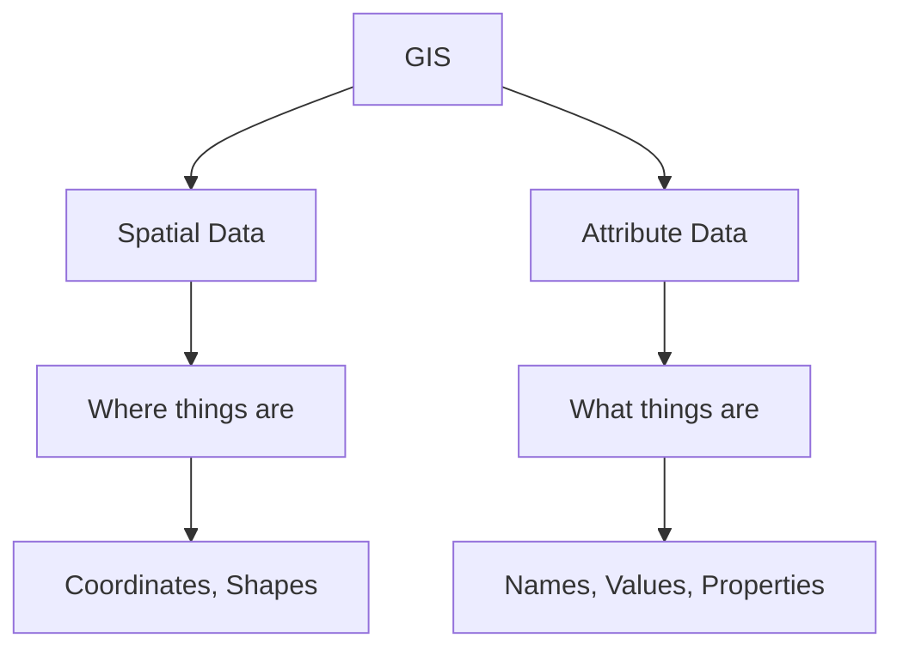
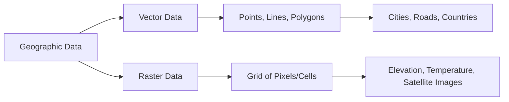
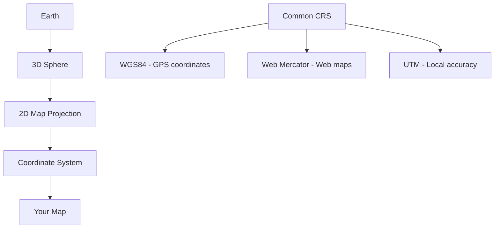
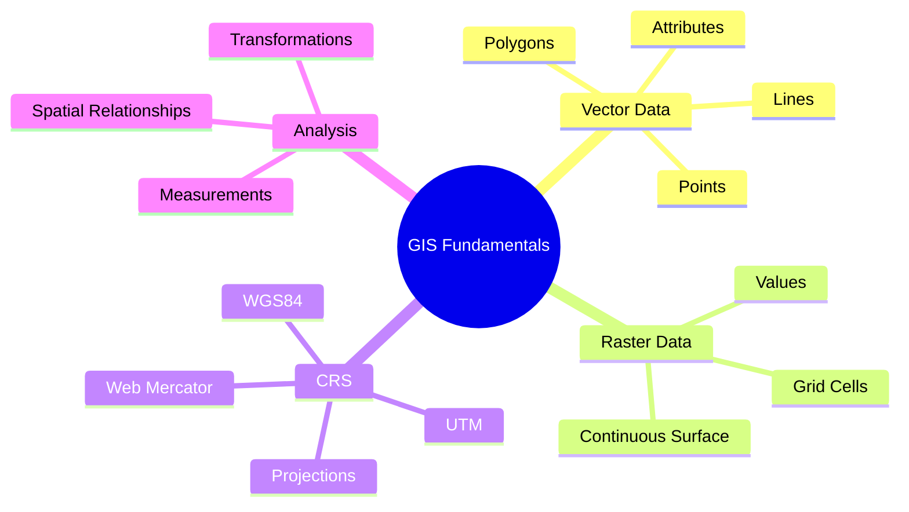
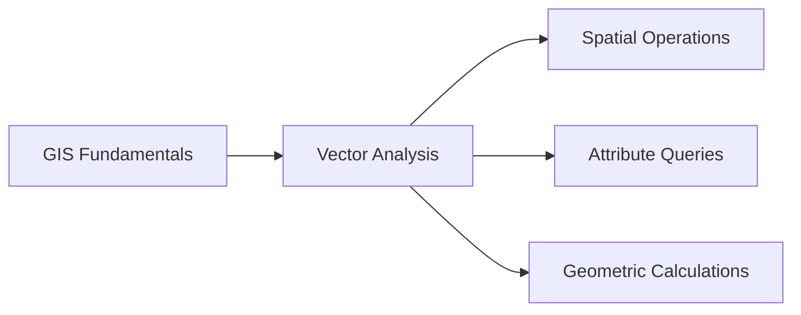

# Module 2: GIS Fundamentals

## Learning Goals
- Understand the difference between vector and raster data
- Learn about basic geometry types (Point, Line, Polygon)
- Understand attribute tables and their relationship to geometries
- Grasp the importance of Coordinate Reference Systems (CRS)
- See what happens when CRS is wrong

## What is GIS?

**Geographic Information Systems (GIS)** combine spatial data with attribute data to help us understand patterns, relationships, and trends in our world.



## Vector vs Raster Data

Geographic data comes in two main formats:



### Vector Data
- **Discrete objects** with defined boundaries
- Made up of **points, lines, and polygons**
- Each feature has **attributes** (properties)
- Examples: cities, roads, country boundaries, building footprints

### Raster Data
- **Continuous surface** divided into a grid
- Each cell has a **value**
- Examples: elevation, temperature, satellite imagery, population density

## Vector Geometry Types

### Setting Up

```python
from shapely.geometry import Point, LineString, Polygon
import matplotlib.pyplot as plt
```

### Points
- **Single coordinate pair** (x, y)
- Represent discrete locations
- Examples: cities, weather stations, GPS locations

```python
# Create a Point
p = Point(2, 3)

x, y = p.xy
plt.plot(x, y, 'ro')
plt.title("Point")
plt.grid()
plt.show()
```

### Lines (LineStrings)
- **Series of connected points**
- Represent linear features
- Examples: roads, rivers, flight paths

```python
# Create a LineString
line = LineString([(1, 1), (4, 2), (6, 5)])

x, y = line.xy
plt.plot(x, y, 'b-')
plt.title("LineString")
plt.grid()
plt.show()
```

### Polygons
- **Closed series of lines** forming a shape
- Represent areas with boundaries
- Examples: countries, lakes, building footprints

```python
# Create a Polygon
poly = Polygon([(2, 1), (6, 1), (7, 4), (4, 6), (2, 4)])

x, y = poly.exterior.xy
plt.fill(x, y, alpha=0.5, color='green')
plt.title("Polygon")
plt.grid()
plt.show()
```

## Attribute Tables

Every geographic feature has **attributes** - descriptive information about that feature:

```python
# Example: City features with attributes
city_features = [
    {
        "geometry": {"type": "Point", "coordinates": [-122.4194, 37.7749]},
        "properties": {
            "name": "San Francisco",
            "population": 884000,
            "country": "USA",
            "founded": 1776,
            "is_capital": False
        }
    },
    {
        "geometry": {"type": "Point", "coordinates": [-74.0060, 40.7128]},
        "properties": {
            "name": "New York",
            "population": 8400000,
            "country": "USA",
            "founded": 1624,
            "is_capital": False
        }
    }
]
```

!!! info "Geometry + Attributes = Geographic Feature"
    - **Geometry**: WHERE the feature is located
    - **Attributes**: WHAT the feature is and its properties
    - Together they create meaningful geographic information

## Coordinate Reference Systems (CRS)

A **Coordinate Reference System** defines how coordinates relate to real locations on Earth.



### Why CRS Matters

```python
import geopandas as gpd
import matplotlib.pyplot as plt

# Load Natural Earth countries data
world = gpd.read_file(gpd.datasets.get_path('naturalearth_lowres'))

# Check the current CRS
print(f"Current CRS: {world.crs}")
# Output: EPSG:4326 (WGS84 - latitude/longitude)

# Display basic information
print(f"Number of countries: {len(world)}")
print(f"Columns: {list(world.columns)}")
```

### Common Coordinate Reference Systems

| CRS | EPSG Code | Description | Use Case |
|-----|-----------|-------------|----------|
| **WGS84** | 4326 | Latitude/Longitude | GPS, global data |
| **Web Mercator** | 3857 | Web mapping | Google Maps, web apps |
| **UTM** | Various | Local projections | Accurate measurements |

## Loading and Inspecting Vector Data

Let's work with real geographic data:

```python
import geopandas as gpd
import matplotlib.pyplot as plt

# Load Natural Earth data (comes with GeoPandas)
import geopandas as gpd

world=gpd.read_file("/content/countries.zip")
states=gpd.read_file("/content/states.zip")
cities=gpd.read_file("/content/city.geojson")

# Inspect the data
print("=== WORLD COUNTRIES ===")
print(f"Shape: {world.shape}")  # (rows, columns)
print(f"CRS: {world.crs}")
print(f"Geometry types: {world.geometry.type.unique()}")
print(f"Available columns for world: {list(world.columns)}")

print("\n=== FIRST FEW COUNTRIES ===")
# Corrected column names to 'NAME' and 'CONTINENT'
print(world[['NAME', 'CONTINENT','geometry']].head())

print("\n=== CITIES ===")
print(f"Shape: {cities.shape}")
print(f"CRS: {cities.crs}")
print(f"Geometry types: {cities.geometry.type.unique()}")
```

### Inspecting Geometry

```python
# Look at specific geometries
print("=== GEOMETRY DETAILS ===")

# Get a specific country
usa = world[world['NAME'] == 'United States of America'].iloc[0]
print(f"USA geometry type: {usa.geometry.geom_type}")
print(f"USA bounds: {usa.geometry.bounds}")


print(f"Cities columns: {list(cities.columns)}")
print(cities[['city', "admin_name"]].head())
# Get a specific administrative division (e.g., a state/province)
sf_area = cities[cities['city'] == 'Delhi'].iloc[0]
print(f"Delhi geometry type: {sf_area.geometry.geom_type}")
print(f"Delhi bounds: {sf_area.geometry.bounds}")

# Check if geometries are valid
print(f"USA geometry is valid: {usa.geometry.is_valid}")
print(f"Delhi geometry is valid: {sf_area.geometry.is_valid}")
```

## Quick Visualization

```python
# Create a simple world map
fig, ax = plt.subplots(1, 1, figsize=(15, 10))

# Plot countries
world.plot(ax=ax, color='lightblue', edgecolor='black', linewidth=0.5)

# Plot cities (administrative divisions)
# cities.plot(ax=ax, color='red', markersize=20, alpha=0.7)

# Plot the specific administrative area (India) in green
cities[cities['country'] == 'India'].plot(ax=ax, color='green', markersize=5, alpha=0.7)

# Set the title
ax.set_title('World Countries and Cities in India', fontsize=16, fontweight='bold')
ax.set_xlabel('Longitude')
ax.set_ylabel('Latitude')

# Remove axis ticks for cleaner look
ax.set_xticks([])
ax.set_yticks([])

plt.tight_layout()
plt.show()
```

## What Happens When CRS is Wrong?

Let's see the impact of using the wrong coordinate system:

```python
import geopandas as gpd
import matplotlib.pyplot as plt


# Create subplots to compare projections
fig, axes = plt.subplots(2, 2, figsize=(15, 10))

# 1. Original WGS84 (EPSG:4326)
world.plot(ax=axes[0,0], color='lightblue', edgecolor='black')
axes[0,0].set_title('WGS84 (EPSG:4326)\nCorrect for global data')

# 2. Web Mercator (EPSG:3857)
world_mercator = world.to_crs('EPSG:3857')
world_mercator.plot(ax=axes[0,1], color='lightgreen', edgecolor='black')
axes[0,1].set_title('Web Mercator (EPSG:3857)\nGood for web maps')

# 3. Wrong projection - using UTM Zone 10N globally
try:
    world_utm = world.to_crs('EPSG:32610')  # UTM Zone 10N (California)
    world_utm.plot(ax=axes[1,0], color='lightcoral', edgecolor='black')
    axes[1,0].set_title('UTM Zone 10N (EPSG:32610)\nWRONG for global data!')
except:
    axes[1,0].text(0.5, 0.5, 'Projection Error!', ha='center', va='center')
    axes[1,0].set_title('UTM Zone 10N - Error!')

# 4. Focus on a specific region with appropriate UTM
california = world[world['NAME'] == 'United States of America']
california_utm = california.to_crs('EPSG:32610')  # UTM Zone 10N
california_utm.plot(ax=axes[1,1], color='yellow', edgecolor='black')
axes[1,1].set_title('UTM Zone 10N (EPSG:32610)\nCorrect for California')

plt.tight_layout()
plt.show()
```

### Understanding the Projections

```python
WGS84 (EPSG:4326): Global latitude–longitude system used by GPS; good for storing locations, not for measurements.

Web Mercator (EPSG:3857): Web-map projection in meters; looks familiar but distorts size, especially near the poles.

UTM used globally (WRONG): A local projection forced on the whole world, causing severe distortion and meaningless shapes.

UTM used locally (CORRECT): Right projection for its zone; meters are accurate and distances/areas make sense.
```

## Practical CRS Guidelines

```python
# Check CRS of your data
print(f"Data CRS: {world.crs}")

# Transform to different CRS
world_mercator = world.to_crs('EPSG:3857')  # Web Mercator
world_utm = world.to_crs('EPSG:32610')      # UTM Zone 10N

# Always check CRS before analysis
def check_crs_compatibility(gdf1, gdf2):
    """Check if two GeoDataFrames have the same CRS"""
    if gdf1.crs == gdf2.crs:
        print("✅ CRS match - safe to analyze together")
        return True
    else:
        print(f"❌ CRS mismatch: {gdf1.crs} vs {gdf2.crs}")
        print("Transform one dataset before analysis!")
        return False

# Example usage
check_crs_compatibility(world, cities)
check_crs_compatibility(world_mercator, cities)
check_crs_compatibility(world_utm, cities)
```

## Practice Problems

### Problem 1: Data Exploration
Explore the Natural Earth datasets:

```python
import geopandas as gpd

# Load the data
world = gpd.read_file(gpd.datasets.get_path('naturalearth_lowres'))
cities = gpd.read_file(gpd.datasets.get_path('naturalearth_cities'))

# TODO:
# 1. Find the 5 most populous countries
# 2. Find all cities in Europe
# 3. Count how many countries are in each continent
# 4. Find the country with the largest area

# Your code here
```

??? success "Solution"
    ```python
    # 1. Five most populous countries
    top_5_pop = world.nlargest(5, 'pop_est')[['name', 'pop_est']]
    print("Top 5 most populous countries:")
    print(top_5_pop)
    
    # 2. Cities in Europe
    european_cities = cities[cities['continent'] == 'Europe']
    print(f"\nNumber of European cities: {len(european_cities)}")
    print("European cities:")
    print(european_cities[['name', 'country']].head(10))
    
    # 3. Countries per continent
    continent_counts = world['continent'].value_counts()
    print("\nCountries per continent:")
    print(continent_counts)
    
    # 4. Largest country by area
    largest_country = world.loc[world['area_km2'].idxmax()]
    print(f"\nLargest country: {largest_country['name']}")
    print(f"Area: {largest_country['area_km2']:,.0f} km²")
    ```

### Problem 2: CRS Transformation
Practice working with different coordinate systems:

```python
import geopandas as gpd
import matplotlib.pyplot as plt

# Load data
world = gpd.read_file(gpd.datasets.get_path('naturalearth_lowres'))

# TODO:
# 1. Create a map showing the same data in 3 different projections
# 2. Calculate the area of Brazil in different CRS and compare
# 3. Transform cities data to Web Mercator and plot

# Your code here
```

??? success "Solution"
    ```python
    # 1. Three different projections
    fig, axes = plt.subplots(1, 3, figsize=(18, 6))
    
    # WGS84
    world.plot(ax=axes[0], color='lightblue', edgecolor='black')
    axes[0].set_title('WGS84 (EPSG:4326)')
    
    # Web Mercator
    world.to_crs('EPSG:3857').plot(ax=axes[1], color='lightgreen', edgecolor='black')
    axes[1].set_title('Web Mercator (EPSG:3857)')
    
    # Robinson projection (good for world maps)
    world.to_crs('+proj=robin').plot(ax=axes[2], color='lightcoral', edgecolor='black')
    axes[2].set_title('Robinson Projection')
    
    plt.tight_layout()
    plt.show()
    
    # 2. Brazil area comparison
    brazil = world[world['name'] == 'Brazil']
    
    # Original CRS (degrees)
    area_degrees = brazil.geometry.area.iloc[0]
    
    # Equal Area projection for accurate area calculation
    brazil_equal_area = brazil.to_crs('+proj=aea +lat_1=-5 +lat_2=-42 +lat_0=-32 +lon_0=-60')
    area_m2 = brazil_equal_area.geometry.area.iloc[0]
    area_km2 = area_m2 / 1_000_000
    
    print(f"Brazil area in degrees²: {area_degrees:.2f}")
    print(f"Brazil area in km²: {area_km2:,.0f}")
    
    # 3. Cities in Web Mercator
    cities = gpd.read_file(gpd.datasets.get_path('naturalearth_cities'))
    cities_mercator = cities.to_crs('EPSG:3857')
    
    fig, ax = plt.subplots(figsize=(12, 8))
    world.to_crs('EPSG:3857').plot(ax=ax, color='lightblue', edgecolor='black')
    cities_mercator.plot(ax=ax, color='red', markersize=30, alpha=0.7)
    ax.set_title('World Map in Web Mercator with Cities')
    plt.show()
    ```

## Key Concepts Summary



!!! success "What You've Learned"
    - **Vector vs Raster**: Two fundamental data types in GIS
    - **Geometry Types**: Points, lines, and polygons represent different features
    - **Attributes**: Descriptive data linked to geographic features
    - **CRS Importance**: Critical for accurate analysis and visualization
    - **Data Inspection**: How to explore and understand geographic datasets

!!! tip "Best Practices"
    - Always check the CRS of your data first
    - Use appropriate projections for your analysis area
    - Inspect data structure before analysis
    - Visualize data early to catch issues
    - Keep original and transformed versions separate

## Next Steps

In the next module, we'll dive deeper into vector analysis:
- Working with GeoDataFrames
- Spatial operations (buffers, intersections)
- Attribute-based filtering
- Spatial joins
- Creating new geographic features

