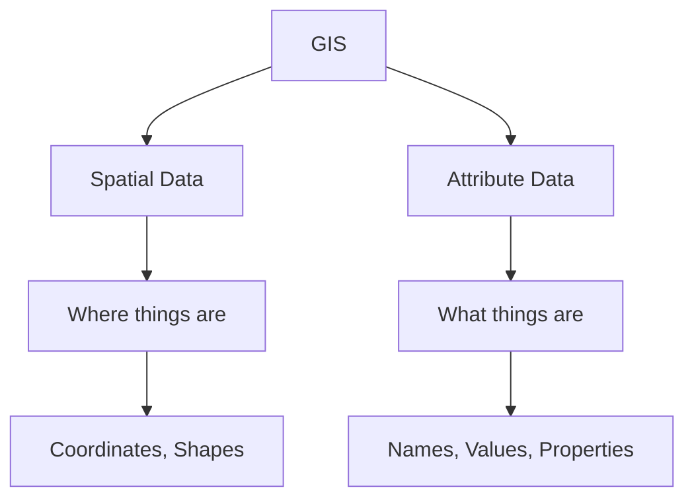
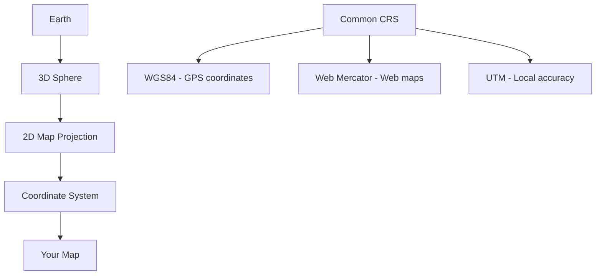
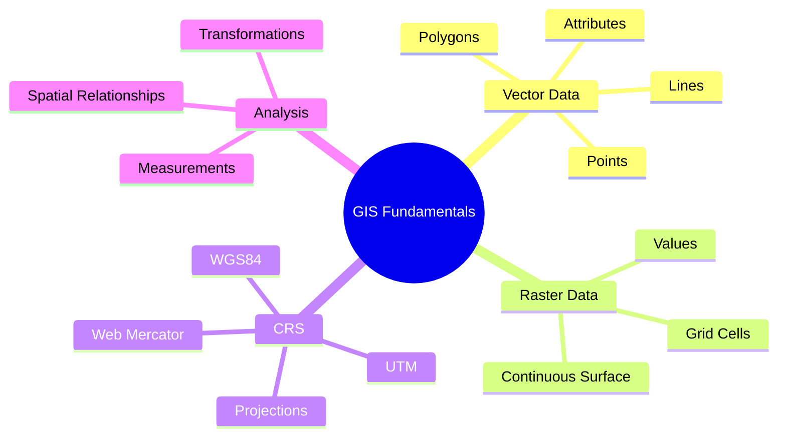
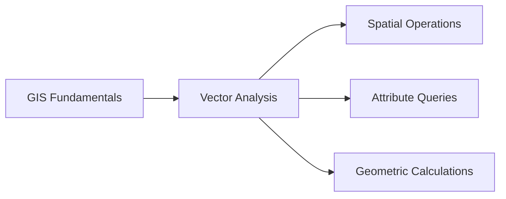

# Module 2: GIS Fundamentals

## Learning Goals

- State what **GIS** does: combine **locations** (spatial data) with **properties** (attributes) to map, query, and decide
- Compare **vector** and **raster** models and name one **typical use** for each in real projects
- Outline **raster** variants (continuous, categorical, multi-band) and how **TIFF / GeoTIFF** tie **pixels**, **tags**, and **CRS** together
- Relate **point, line, and polygon** (with sample **GeoJSON**) to **features** and their **attribute tables**
- Read **CRS** metadata at a practical level: **geographic vs projected**, **EPSG** codes, **datum** in brief, **reprojection vs assigning**, and the **figures** that illustrate globe vs map plane
- List common **CRS mistakes** (missing, mis-tagged, mixed systems) and why maps then look **wrong or misaligned**
- Open and **inspect** vector layers (schema, geometry types, CRS) and relate **bad CRS** choices to the **visualization** examples in this module

## What is GIS?

**GIS (Geographic Information System)** is a computer-based system used to collect, store, manage, analyze, and visualize geographic or location-based data. It allows users to map real-world features, study patterns, and understand relationships between different data layers, helping in planning, decision-making, resource management, and solving real-world problems efficiently.


```mermaid
graph TD
    A[GIS] --> B[Spatial Data]
    A --> C[Attribute Data]
    B --> D[Where things are]
    C --> E[What things are]
    D --> F[Coordinates, Shapes]
    E --> G[Names, Values, Properties]
```


## Vector Data in GIS
**Vector data in GIS** represents geographic features using **points, lines, and polygons**. It stores precise coordinates to define locations, shapes, and boundaries, along with attribute data (like name or type), making it ideal for mapping discrete features such as cities, roads, and parcels.

### Vector Geometry Types

The three core **vector** geometries are **point** (one location), **line** (ordered vertices along a path), and **polygon** (a closed ring—or rings with holes—that encloses an area).

### Point vs line vs polygon (comparison)

| | **Point** | **Line** (`LineString`) | **Polygon** |
|---|-----------|-------------------------|-------------|
| **What it represents** | One location | A path along a route | A bounded area (and optional holes) |
| **Vertices** | 1 coordinate pair | 2 or more, in order | 1+ closed rings; outer ring first, then holes |
| **Typical measures** | Position only; no length or area | Length along the path | Perimeter length and interior area |
| **GeoJSON `type`** | `Point` | `LineString` | `Polygon` |
| **Shapely class** | `Point` | `LineString` | `Polygon` |
| **Examples** | Towers, sensors, addresses | Roads, rivers, tracks | Countries, parcels, lakes |

**Rule of thumb:** use a **point** when “where” is a single spot; a **line** when connectivity or route matters; a **polygon** when you need an **inside** vs **outside** (area).

### Points


- **Single coordinate pair** `(x, y)` — in geographic data usually **(longitude, latitude)** in that order (GeoJSON / WGS84).
- **Zero-length** object: no area, no length; only position.
- Examples: cities, weather stations, GPS fixes, sampling sites.

**Example GeoJSON** (one `Point` feature with properties):

```json
{
  "type": "Feature",
  "properties": {
    "name": "Trailhead Kiosk",
    "amenity": "information"
  },
  "geometry": {
    "type": "Point",
    "coordinates": [-122.4194, 37.7749]
  }
}
```

### Lines (LineStrings)


- **Ordered sequence** of vertices; the line **connects them in order** (no branching in a single `LineString`).
- Has **length**, no area.
- Examples: roads, rivers, trails, ship tracks.

**Example GeoJSON** (`LineString` with four vertices):

```json
{
  "type": "Feature",
  "properties": {
    "name": "Ridge Trail segment",
    "surface": "unpaved"
  },
  "geometry": {
    "type": "LineString",
    "coordinates": [
      [-122.422, 37.773],
      [-122.418, 37.775],
      [-122.415, 37.7765],
      [-122.412, 37.778]
    ]
  }
}
```

### Polygons


- **Exterior ring** is closed (first point equals last in valid data); **interior rings** (holes) are optional.
- Has **area** and **perimeter** (boundary length).
- Examples: countries, parcels, lakes, study regions.

**Example GeoJSON** (`Polygon`: outer ring only; note the repeated closing coordinate):

```json
{
  "type": "Feature",
  "properties": {
    "name": "Study area boundary",
    "zone_code": "A-12"
  },
  "geometry": {
    "type": "Polygon",
    "coordinates": [
      [
        [-122.425, 37.772],
        [-122.408, 37.772],
        [-122.408, 37.781],
        [-122.425, 37.781],
        [-122.425, 37.772]
      ]
    ]
  }
}
```

## Raster data in GIS

**Vector** data stores **objects** (points, lines, polygons) with coordinates and attributes. **Raster** data stores values on a **regular grid** of **pixels** (also called **cells**): each cell has a row/column index and usually **one or more numeric values** (bands). The grid is anchored in map space by **origin**, **cell size** (resolution), **extent**, and **CRS**—you will tie those ideas to CRS metadata in the next section.

### How a raster differs from vector

| | **Vector** | **Raster** |
|---|------------|------------|
| **Geometry** | Exact vertices and edges | Uniform rectangles (pixels) |
| **Best for** | Boundaries, networks, discrete features | Continuous fields, imagery, scanned maps |
| **Storage** | Often smaller for sparse features | Can be large at fine resolution |


### TIFF

**TIFF** (Tagged Image File Format) is a flexible **image and raster container**: “tags” in the file header describe **image width and height**, **bits per sample**, **number of bands**, **compression** (often none or LZW/deflate for GIS), and optional **color maps**. TIFF is widely used because it supports **large files**, **lossless** storage, and **many bands**—ideal for elevation models and satellite tiles.

When those tags include **georeferencing** (CRS, pixel size, origin), the file is usually called **GeoTIFF**. For a **quick browser preview** of a GeoTIFF you generated or downloaded, you can use tools such as the **[Pozyx Online GeoTIFF Viewer](https://www.pozyx.io/free-tools/online-geotiff-viewer)**; Module 4 discusses limits and when to switch to **QGIS** or **Python**.


Pixels in a TIFF file are small grid cells, each storing a value representing color, intensity, or geographic data information.


!!! tip "Raster vocabulary"
    - **Resolution** — ground distance covered by one pixel edge (e.g. 10 m pixels).
    - **Extent / bounding box** — outer limits of the raster in map coordinates.
    - **NoData** — a sentinel value meaning “no observation here” (important for masks and mosaics).

## Coordinate Reference Systems (CRS)

A **CRS** is the metadata that tells software **how to interpret coordinate numbers** (axes, units, Earth model, and—if projected—which **map projection**). Without it, values like **−122.4194, 37.7749** are ambiguous (degrees vs meters, which origin). Layers and rasters carry CRS in their metadata (often an **EPSG** code) so every vertex or pixel lines up correctly on the map.


```mermaid
graph TD
    A[Earth] --> B[3D Sphere]
    B --> C[2D Map Projection]
    C --> D[Coordinate System]
    D --> E[Your Map]
    
    F[Common CRS] --> G[WGS84 - GPS coordinates]
    F --> H[Web Mercator - Web maps]
    F --> I[UTM - Local accuracy]
```
### Geographic CRS
A Geographic Coordinate Reference System uses the Earth as a sphere (or ellipsoid).

Uses Latitude (lat) and Longitude (long)
Units are in degrees (°)
Example:
👉 (19.0760°, 72.8777°)

### Projected CRS
A Projected Coordinate Reference System converts Earth into a flat map.

Uses X, Y coordinates
Units are in meters or feet
Example:
👉 (500000, 2100000)


### Geographic vs projected

| | **Geographic CRS** | **Projected CRS** |
|---|-------------------|-------------------|
| **Coordinates** | Usually **longitude** and **latitude** in **degrees** | **Easting** / **northing** (or x/y) in **meters** (or feet) |
| **Earth shape** | Angles on a **reference ellipsoid** | A **flat map plane** |
| **Examples** | WGS 84 — **EPSG:4326** | Web Mercator — **EPSG:3857**; UTM — e.g. **EPSG:32610** |
| **Typical use** | GPS, GeoJSON, global exchange | Web basemaps, local distance/area in meters |

Lon/lat are simply the usual **geographic** coordinate form; in a **projected** CRS the **same place** has **different numbers** (large eastings/northings) until you **transform** back.


### Datum and EPSG (short)

A **datum** ties your ellipsoid and origin to real surveys; changing datum can shift coordinates by **meters**. **EPSG** codes (registry maintained by **IOGP**) are shorthand for a full CRS definition—**`EPSG:4326`**, **`3857`**, **`32610`**, etc.—so GIS apps and libraries agree on **one** interpretation.

### Reprojection vs assigning CRS

**Reprojection** = transform geometry from **CRS A** to **CRS B**; the **location stays the same**, the **numbers change**. **Assigning** a CRS = “these numbers **already mean** this system”—it does **not** recalculate coordinates. Mixing the two (or mis-tagging degrees as meters) corrupts maps.

Same point near **San Francisco** in different CRS (your software reproduces the values):

| CRS | EPSG | First coordinate | Second coordinate |
|-----|------|------------------|-------------------|
| WGS 84 (geographic) | **4326** | −122.4194° (lon) | 37.7749° (lat) |
| Pseudo-Mercator | **3857** | −13,627,665 m (easting) | 4,547,675 m (northing) |
| UTM zone 10N | **32610** | 551,131 m (easting) | 4,180,999 m (northing) |

Do **not** paste lon/lat into a layer declared as a **meter** CRS without a proper transform.

### Typical problems (checklist)

- **No CRS** — software guesses or leaves the layer “unknown”; vectors/rasters fail to align with trusted data.
- **Wrong tag** — degrees labeled as **3857** (plots near null island); meters labeled as **4326** (stretched nonsense).
- **Mixed CRS** — overlay, buffer, join, and area need **one** common CRS (reproject first).
- **Wrong tool for measure** — distance/area in **4326** are in **degrees / degree²**; use a **local projected** CRS for meters/hectares when needed.

!!! tip "CRS workflow"
    - Record what CRS the coordinates **actually** use; **assign** metadata only when that is true.
    - **Reproject** when you need a **different CRS** for analysis or display; align all layers before **spatial join** or **merge**.

### Common Coordinate Reference Systems

| CRS | EPSG Code | Description | Use Case |
|-----|-----------|-------------|----------|
| **WGS 84** | 4326 | Geographic lon/lat on WGS 84 | GPS, GeoJSON, interchange |
| **Web Mercator** | 3857 | x/y meters (web tiling) | Basemaps, slippy maps |
| **UTM** | Zone codes (e.g. 32610) | Metric bands | Local mapping, engineering |

## Loading and Inspecting Vector Data

Let's work with real geographic data:

```python
import geopandas as gpd
import matplotlib.pyplot as plt

# Load Natural Earth data (comes with GeoPandas)
import geopandas as gpd

world=gpd.read_file("/content/countries.zip")
states=gpd.read_file("/content/states.zip")
cities=gpd.read_file("/content/city.geojson")

# Inspect the data
print("=== WORLD COUNTRIES ===")
print(f"Shape: {world.shape}")  # (rows, columns)
print(f"CRS: {world.crs}")
print(f"Geometry types: {world.geometry.type.unique()}")
print(f"Available columns for world: {list(world.columns)}")

print("\n=== FIRST FEW COUNTRIES ===")
# Corrected column names to 'NAME' and 'CONTINENT'
print(world[['NAME', 'CONTINENT','geometry']].head())

print("\n=== CITIES ===")
print(f"Shape: {cities.shape}")
print(f"CRS: {cities.crs}")
print(f"Geometry types: {cities.geometry.type.unique()}")
```

### Inspecting Geometry

```python
# Look at specific geometries
print("=== GEOMETRY DETAILS ===")

# Get a specific country
usa = world[world['NAME'] == 'United States of America'].iloc[0]
print(f"USA geometry type: {usa.geometry.geom_type}")
print(f"USA bounds: {usa.geometry.bounds}")


print(f"Cities columns: {list(cities.columns)}")
print(cities[['city', "admin_name"]].head())
# Get a specific administrative division (e.g., a state/province)
sf_area = cities[cities['city'] == 'Delhi'].iloc[0]
print(f"Delhi geometry type: {sf_area.geometry.geom_type}")
print(f"Delhi bounds: {sf_area.geometry.bounds}")

# Check if geometries are valid
print(f"USA geometry is valid: {usa.geometry.is_valid}")
print(f"Delhi geometry is valid: {sf_area.geometry.is_valid}")
```

## Quick Visualization

```python
# Create a simple world map
fig, ax = plt.subplots(1, 1, figsize=(15, 10))

# Plot countries
world.plot(ax=ax, color='lightblue', edgecolor='black', linewidth=0.5)

# Plot cities (administrative divisions)
# cities.plot(ax=ax, color='red', markersize=20, alpha=0.7)

# Plot the specific administrative area (India) in green
cities[cities['country'] == 'India'].plot(ax=ax, color='green', markersize=5, alpha=0.7)

# Set the title
ax.set_title('World Countries and Cities in India', fontsize=16, fontweight='bold')
ax.set_xlabel('Longitude')
ax.set_ylabel('Latitude')

# Remove axis ticks for cleaner look
ax.set_xticks([])
ax.set_yticks([])

plt.tight_layout()
plt.show()
```

## What Happens When CRS is Wrong?

Let's see the impact of using the wrong coordinate system:

```python
import geopandas as gpd
import matplotlib.pyplot as plt


# Create subplots to compare projections
fig, axes = plt.subplots(2, 2, figsize=(15, 10))

# 1. Original WGS84 (EPSG:4326)
world.plot(ax=axes[0,0], color='lightblue', edgecolor='black')
axes[0,0].set_title('WGS84 (EPSG:4326)\nCorrect for global data')

# 2. Web Mercator (EPSG:3857)
world_mercator = world.to_crs('EPSG:3857')
world_mercator.plot(ax=axes[0,1], color='lightgreen', edgecolor='black')
axes[0,1].set_title('Web Mercator (EPSG:3857)\nGood for web maps')

# 3. Wrong projection - using UTM Zone 10N globally
try:
    world_utm = world.to_crs('EPSG:32610')  # UTM Zone 10N (California)
    world_utm.plot(ax=axes[1,0], color='lightcoral', edgecolor='black')
    axes[1,0].set_title('UTM Zone 10N (EPSG:32610)\nWRONG for global data!')
except:
    axes[1,0].text(0.5, 0.5, 'Projection Error!', ha='center', va='center')
    axes[1,0].set_title('UTM Zone 10N - Error!')

# 4. Focus on a specific region with appropriate UTM
california = world[world['NAME'] == 'United States of America']
california_utm = california.to_crs('EPSG:32610')  # UTM Zone 10N
california_utm.plot(ax=axes[1,1], color='yellow', edgecolor='black')
axes[1,1].set_title('UTM Zone 10N (EPSG:32610)\nCorrect for California')

plt.tight_layout()
plt.show()
```

### Understanding the Projections

```python
WGS84 (EPSG:4326): Global latitude–longitude system used by GPS; good for storing locations, not for measurements.

Web Mercator (EPSG:3857): Web-map projection in meters; looks familiar but distorts size, especially near the poles.

UTM used globally (WRONG): A local projection forced on the whole world, causing severe distortion and meaningless shapes.

UTM used locally (CORRECT): Right projection for its zone; meters are accurate and distances/areas make sense.
```

## Practical CRS Guidelines

```python
# Check CRS of your data
print(f"Data CRS: {world.crs}")

# Transform to different CRS
world_mercator = world.to_crs('EPSG:3857')  # Web Mercator
world_utm = world.to_crs('EPSG:32610')      # UTM Zone 10N

# Always check CRS before analysis
def check_crs_compatibility(gdf1, gdf2):
    """Check if two GeoDataFrames have the same CRS"""
    if gdf1.crs == gdf2.crs:
        print("✅ CRS match - safe to analyze together")
        return True
    else:
        print(f"❌ CRS mismatch: {gdf1.crs} vs {gdf2.crs}")
        print("Transform one dataset before analysis!")
        return False

# Example usage
check_crs_compatibility(world, cities)
check_crs_compatibility(world_mercator, cities)
check_crs_compatibility(world_utm, cities)
```

## Practice Problems

### Problem 1: Data Exploration
Explore the Natural Earth datasets:

```python
import geopandas as gpd

# Load the data
world = gpd.read_file(gpd.datasets.get_path('naturalearth_lowres'))
cities = gpd.read_file(gpd.datasets.get_path('naturalearth_cities'))

# TODO:
# 1. Find the 5 most populous countries
# 2. Find all cities in Europe
# 3. Count how many countries are in each continent
# 4. Find the country with the largest area

# Your code here
```

??? success "Solution"
    ```python
    # 1. Five most populous countries
    top_5_pop = world.nlargest(5, 'pop_est')[['name', 'pop_est']]
    print("Top 5 most populous countries:")
    print(top_5_pop)
    
    # 2. Cities in Europe
    european_cities = cities[cities['continent'] == 'Europe']
    print(f"\nNumber of European cities: {len(european_cities)}")
    print("European cities:")
    print(european_cities[['name', 'country']].head(10))
    
    # 3. Countries per continent
    continent_counts = world['continent'].value_counts()
    print("\nCountries per continent:")
    print(continent_counts)
    
    # 4. Largest country by area
    largest_country = world.loc[world['area_km2'].idxmax()]
    print(f"\nLargest country: {largest_country['name']}")
    print(f"Area: {largest_country['area_km2']:,.0f} km²")
    ```

### Problem 2: CRS Transformation
Practice working with different coordinate systems:

```python
import geopandas as gpd
import matplotlib.pyplot as plt

# Load data
world = gpd.read_file(gpd.datasets.get_path('naturalearth_lowres'))

# TODO:
# 1. Create a map showing the same data in 3 different projections
# 2. Calculate the area of Brazil in different CRS and compare
# 3. Transform cities data to Web Mercator and plot

# Your code here
```

??? success "Solution"
    ```python
    # 1. Three different projections
    fig, axes = plt.subplots(1, 3, figsize=(18, 6))
    
    # WGS84
    world.plot(ax=axes[0], color='lightblue', edgecolor='black')
    axes[0].set_title('WGS84 (EPSG:4326)')
    
    # Web Mercator
    world.to_crs('EPSG:3857').plot(ax=axes[1], color='lightgreen', edgecolor='black')
    axes[1].set_title('Web Mercator (EPSG:3857)')
    
    # Robinson projection (good for world maps)
    world.to_crs('+proj=robin').plot(ax=axes[2], color='lightcoral', edgecolor='black')
    axes[2].set_title('Robinson Projection')
    
    plt.tight_layout()
    plt.show()
    
    # 2. Brazil area comparison
    brazil = world[world['name'] == 'Brazil']
    
    # Original CRS (degrees)
    area_degrees = brazil.geometry.area.iloc[0]
    
    # Equal Area projection for accurate area calculation
    brazil_equal_area = brazil.to_crs('+proj=aea +lat_1=-5 +lat_2=-42 +lat_0=-32 +lon_0=-60')
    area_m2 = brazil_equal_area.geometry.area.iloc[0]
    area_km2 = area_m2 / 1_000_000
    
    print(f"Brazil area in degrees²: {area_degrees:.2f}")
    print(f"Brazil area in km²: {area_km2:,.0f}")
    
    # 3. Cities in Web Mercator
    cities = gpd.read_file(gpd.datasets.get_path('naturalearth_cities'))
    cities_mercator = cities.to_crs('EPSG:3857')
    
    fig, ax = plt.subplots(figsize=(12, 8))
    world.to_crs('EPSG:3857').plot(ax=ax, color='lightblue', edgecolor='black')
    cities_mercator.plot(ax=ax, color='red', markersize=30, alpha=0.7)
    ax.set_title('World Map in Web Mercator with Cities')
    plt.show()
    ```

## Key Concepts Summary


```mermaid
mindmap
  root((GIS Fundamentals))
    Vector Data
      Points
      Lines
      Polygons
      Attributes
    Raster Data
      Grid Cells
      Continuous Surface
      Values
    CRS
      WGS84
      Web Mercator
      UTM
      Projections
    Analysis
      Spatial Relationships
      Measurements
      Transformations
```

!!! success "What You've Learned"
    - **Vector vs Raster**: Two fundamental data types in GIS
    - **Geometry Types**: Points, lines, and polygons represent different features
    - **Attributes**: Descriptive data linked to geographic features
    - **CRS**: Datum + units; geographic (lon/lat in degrees) vs projected (meters); same place → different numbers after `to_crs()`
    - **Data Inspection**: How to explore and understand geographic datasets

!!! tip "Best Practices"
    - Always check the CRS of your data first
    - Use appropriate projections for your analysis area
    - Inspect data structure before analysis
    - Visualize data early to catch issues
    - Keep original and transformed versions separate

## Next Steps

In the next module, we'll dive deeper into vector analysis:
- Working with GeoDataFrames
- Spatial operations (buffers, intersections)
- Attribute-based filtering
- Spatial joins
- Creating new geographic features


```mermaid
graph LR
    A[GIS Fundamentals] --> B[Vector Analysis]
    B --> C[Spatial Operations]
    B --> D[Attribute Queries]
    B --> E[Geometric Calculations]
```