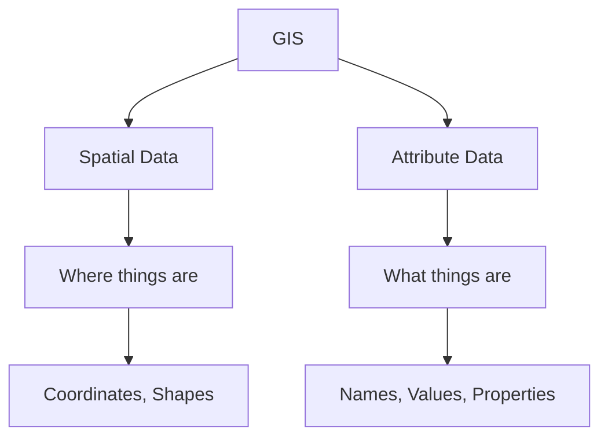
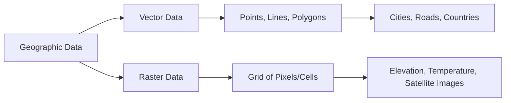
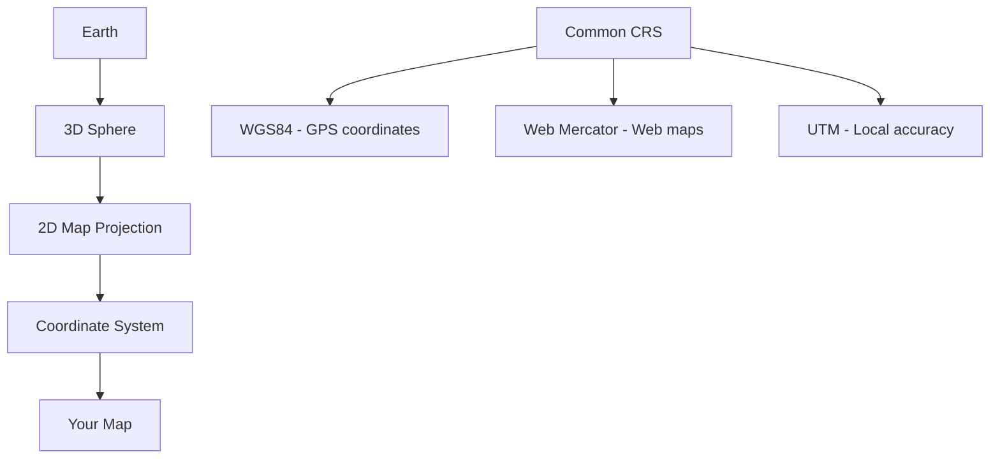
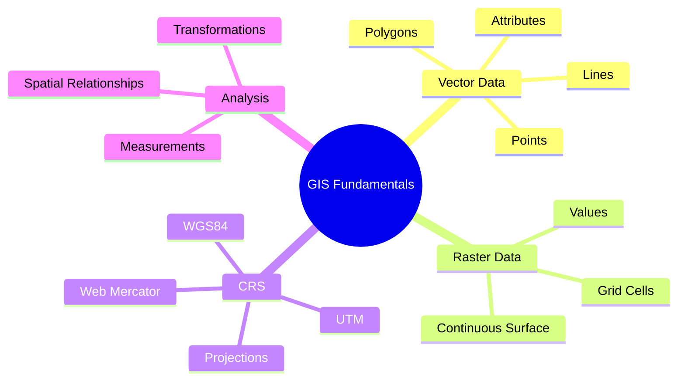
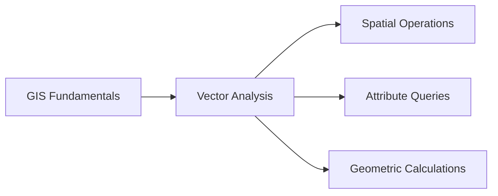

# Module 2: GIS Fundamentals

## Learning Goals
- Understand the difference between vector and raster data
- Learn about basic geometry types (Point, Line, Polygon)
- Understand attribute tables and their relationship to geometries
- Grasp what a CRS is (datum, units, geographic vs projected)
- Express the **same real-world location** with different coordinate numbers after reprojection
- See what happens when CRS is wrong or mis-declared

## What is GIS?

**Geographic Information Systems (GIS)** combine spatial data with attribute data to help us understand patterns, relationships, and trends in our world.


```mermaid
graph TD
    A[GIS] --> B[Spatial Data]
    A --> C[Attribute Data]
    B --> D[Where things are]
    C --> E[What things are]
    D --> F[Coordinates, Shapes]
    E --> G[Names, Values, Properties]
```

## Vector vs Raster Data

Geographic data comes in two main formats:


```mermaid
graph LR
    A[Geographic Data] --> B[Vector Data]
    A --> C[Raster Data]
    B --> D[Points, Lines, Polygons]
    C --> E[Grid of Pixels/Cells]
    D --> F[Cities, Roads, Countries]
    E --> G[Elevation, Temperature, Satellite Images]
```

### Vector Data
- **Discrete objects** with defined boundaries
- Made up of **points, lines, and polygons**
- Each feature has **attributes** (properties)
- Examples: cities, roads, country boundaries, building footprints

### Raster Data
- **Continuous surface** divided into a grid
- Each cell has a **value**
- Examples: elevation, temperature, satellite imagery, population density

## Vector Geometry Types

The three core **vector** geometries are **point** (one location), **line** (ordered vertices along a path), and **polygon** (a closed ring—or rings with holes—that encloses an area). Diagrams below show the idea in map coordinates; the **example data** sections give real **GeoJSON** you can save, load in Python, or open in QGIS.

### Point vs line vs polygon (comparison)

| | **Point** | **Line** (`LineString`) | **Polygon** |
|---|-----------|-------------------------|-------------|
| **What it represents** | One location | A path along a route | A bounded area (and optional holes) |
| **Vertices** | 1 coordinate pair | 2 or more, in order | 1+ closed rings; outer ring first, then holes |
| **Typical measures** | Position only; no length or area | Length along the path | Perimeter length and interior area |
| **GeoJSON `type`** | `Point` | `LineString` | `Polygon` |
| **Shapely class** | `Point` | `LineString` | `Polygon` |
| **Examples** | Towers, sensors, addresses | Roads, rivers, tracks | Countries, parcels, lakes |

**Rule of thumb:** use a **point** when “where” is a single spot; a **line** when connectivity or route matters; a **polygon** when you need an **inside** vs **outside** (area).

### Setting Up

```python
from shapely.geometry import Point, LineString, Polygon
import matplotlib.pyplot as plt
```

### Points


- **Single coordinate pair** `(x, y)` — in geographic data usually **(longitude, latitude)** in that order (GeoJSON / WGS84).
- **Zero-length** object: no area, no length; only position.
- Examples: cities, weather stations, GPS fixes, sampling sites.

**Example GeoJSON** (one `Point` feature with properties):

```json
{
  "type": "Feature",
  "properties": {
    "name": "Trailhead Kiosk",
    "amenity": "information"
  },
  "geometry": {
    "type": "Point",
    "coordinates": [-122.4194, 37.7749]
  }
}
```

In Python with Shapely, the same location looks like:

```python
# Create a Point (here using simple plot coordinates; use lon/lat for real maps)
p = Point(2, 3)

x, y = p.xy
plt.plot(x, y, 'ro', markersize=10)
plt.title("Point")
plt.xlabel("x")
plt.ylabel("y")
plt.axis("equal")
plt.grid()
plt.show()
```

### Lines (LineStrings)


- **Ordered sequence** of vertices; the line **connects them in order** (no branching in a single `LineString`).
- Has **length**, no area.
- Examples: roads, rivers, trails, ship tracks.

**Example GeoJSON** (`LineString` with four vertices):

```json
{
  "type": "Feature",
  "properties": {
    "name": "Ridge Trail segment",
    "surface": "unpaved"
  },
  "geometry": {
    "type": "LineString",
    "coordinates": [
      [-122.422, 37.773],
      [-122.418, 37.775],
      [-122.415, 37.7765],
      [-122.412, 37.778]
    ]
  }
}
```

```python
# Create a LineString
line = LineString([(1, 1), (4, 2), (6, 5)])

x, y = line.xy
plt.plot(x, y, 'b-o', linewidth=2, markersize=6)
plt.title("LineString")
plt.xlabel("x")
plt.ylabel("y")
plt.axis("equal")
plt.grid()
plt.show()
```

### Polygons


- **Exterior ring** is closed (first point equals last in valid data); **interior rings** (holes) are optional.
- Has **area** and **perimeter** (boundary length).
- Examples: countries, parcels, lakes, study regions.

**Example GeoJSON** (`Polygon`: outer ring only; note the repeated closing coordinate):

```json
{
  "type": "Feature",
  "properties": {
    "name": "Study area boundary",
    "zone_code": "A-12"
  },
  "geometry": {
    "type": "Polygon",
    "coordinates": [
      [
        [-122.425, 37.772],
        [-122.408, 37.772],
        [-122.408, 37.781],
        [-122.425, 37.781],
        [-122.425, 37.772]
      ]
    ]
  }
}
```

```python
# Create a Polygon (exterior ring; Shapely may close the ring for you)
poly = Polygon([(2, 1), (6, 1), (7, 4), (4, 6), (2, 4)])

x, y = poly.exterior.xy
plt.fill(x, y, alpha=0.5, color='green', edgecolor='darkgreen', linewidth=2)
plt.title("Polygon")
plt.xlabel("x")
plt.ylabel("y")
plt.axis("equal")
plt.grid()
plt.show()
```

### Example file: point, line, and polygon together

The repository includes a single **GeoJSON FeatureCollection** with one point, one line, and one polygon so you can practice I/O without hunting for data:

**File:** [`data/example_point_line_polygon.geojson`](data/example_point_line_polygon.geojson)

Load it with GeoPandas:

```python
import geopandas as gpd
from pathlib import Path

# Path to the example file (adjust if your working directory is not the repo root)
geojson_path = Path("docs/data/example_point_line_polygon.geojson")
if not geojson_path.exists():
    geojson_path = Path("data/example_point_line_polygon.geojson")

gdf = gpd.read_file(geojson_path)
print(gdf[["name", "feature_type", "geometry"]])
print(gdf.geometry.geom_type)
```

You should see three rows with geometry types `Point`, `LineString`, and `Polygon`. Plot them together:

```python
import matplotlib.pyplot as plt

fig, ax = plt.subplots(figsize=(8, 8))
gdf[gdf.geometry.geom_type == "Polygon"].plot(ax=ax, color="lightgreen", edgecolor="darkgreen", alpha=0.6)
gdf[gdf.geometry.geom_type == "LineString"].plot(ax=ax, color="blue", linewidth=2)
gdf[gdf.geometry.geom_type == "Point"].plot(ax=ax, color="red", markersize=80)
ax.set_title("Point + LineString + Polygon (example GeoJSON)")
ax.set_xlabel("Longitude")
ax.set_ylabel("Latitude")
plt.tight_layout()
plt.show()
```

## Attribute Tables

Every geographic feature has **attributes** - descriptive information about that feature:

```python
# Example: City features with attributes
city_features = [
    {
        "geometry": {"type": "Point", "coordinates": [-122.4194, 37.7749]},
        "properties": {
            "name": "San Francisco",
            "population": 884000,
            "country": "USA",
            "founded": 1776,
            "is_capital": False
        }
    },
    {
        "geometry": {"type": "Point", "coordinates": [-74.0060, 40.7128]},
        "properties": {
            "name": "New York",
            "population": 8400000,
            "country": "USA",
            "founded": 1624,
            "is_capital": False
        }
    }
]
```

!!! info "Geometry + Attributes = Geographic Feature"
    - **Geometry**: WHERE the feature is located
    - **Attributes**: WHAT the feature is and its properties
    - Together they create meaningful geographic information

## Coordinate Reference Systems (CRS)

A **Coordinate Reference System (CRS)** is the rulebook that turns numbers in your file into **real positions on Earth**. It ties together:

- A **datum** (which mathematical model of the Earth you use, e.g. WGS 84)
- **Axes and units** (degrees vs meters, which direction is “x”, etc.)
- For **projected** CRS, a **map projection** (how the curved Earth is flattened to 2D)

Without a CRS, a coordinate pair like `(-122.4194, 37.7749)` is ambiguous: degrees? meters? which hemisphere? Software uses the CRS metadata (often an **EPSG** code such as `EPSG:4326`) to interpret those numbers correctly.


```mermaid
graph TD
    A[Earth] --> B[3D Sphere]
    B --> C[2D Map Projection]
    C --> D[Coordinate System]
    D --> E[Your Map]
    
    F[Common CRS] --> G[WGS84 - GPS coordinates]
    F --> H[Web Mercator - Web maps]
    F --> I[UTM - Local accuracy]
```

### Geographic vs projected CRS

| | **Geographic CRS** | **Projected CRS** |
|---|-------------------|-------------------|
| **Coordinates** | Usually **longitude** and **latitude** in **degrees** | **Easting** and **northing** (or x/y) in **meters** (or feet) |
| **Earth shape** | On a sphere or ellipsoid (angular) | Flattened map plane (distances/areas can be meaningful locally) |
| **Examples** | WGS 84 — `EPSG:4326` | Web Mercator — `EPSG:3857`; UTM zones — e.g. `EPSG:32610` |
| **Typical use** | GPS, GeoJSON storage, global exchange | Web maps, engineering, “how many meters apart?” |

**Latitude and longitude** are not a separate magic format: they are the normal way to write positions in a **geographic** CRS (especially WGS 84). In a **projected** CRS, the **same place on the ground** is written with **different numbers** (meters), not with lat/lon—unless you first **transform** back to geographic.

### Same real-world location, different coordinate pairs

Take one fixed place: **near San Francisco** in WGS 84 as **longitude −122.4194°, latitude 37.7749°**. That is **one** spot on Earth. If you **reproject** the point to other CRS, the **stored x/y change**, but the **location does not**:

| CRS | EPSG | First coordinate (interpretation) | Second coordinate (interpretation) |
|-----|------|-----------------------------------|-------------------------------------|
| WGS 84 (geographic) | **4326** | −122.4194 (**degrees** longitude) | 37.7749 (**degrees** latitude) |
| WGS 84 / Pseudo-Mercator | **3857** | −13,627,665.27 (**meters**, easting) | 4,547,675.35 (**meters**, northing) |
| WGS 84 / UTM zone 10N | **32610** | 551,130.77 (**meters**, easting) | 4,180,998.88 (**meters**, northing) |

The **large meter values** are not “more precise” versions of lat/lon—they are a **different coordinate system** for the **same** point. You convert with `to_crs()` in GeoPandas (or equivalent in other libraries); never assume you can paste lat/lon into a projected system without transforming.

```python
import geopandas as gpd
from shapely.geometry import Point

# One place on Earth: lon, lat in WGS 84 (geographic)
lon, lat = -122.4194, 37.7749
gdf = gpd.GeoDataFrame(geometry=[Point(lon, lat)], crs="EPSG:4326")

# Same geometry, expressed in Web Mercator (meters)
gdf_merc = gdf.to_crs("EPSG:3857")
x_m, y_m = gdf_merc.geometry.iloc[0].x, gdf_merc.geometry.iloc[0].y

# Same geometry, expressed in UTM zone 10N (meters)
gdf_utm = gdf.to_crs("EPSG:32610")
x_u, y_u = gdf_utm.geometry.iloc[0].x, gdf_utm.geometry.iloc[0].y

print(f"EPSG:4326 (deg):  lon={lon}, lat={lat}")
print(f"EPSG:3857 (m):    x={x_m:,.2f}, y={y_m:,.2f}")
print(f"EPSG:32610 (m):   x={x_u:,.2f}, y={y_u:,.2f}")
```

### Common mistake: “lat/lon” numbers with a projected CRS label

If your values are really **degrees** (e.g. from GPS) but the file says **EPSG:3857** (meters), software will treat **−122.4** as **−122.4 meters** on the map—far from North America. Always **set the CRS to what the numbers actually are**, then **reproject** to the CRS you need for analysis or display.

!!! tip "CRS workflow"
    - **Store** global exchange data often as **WGS 84 / EPSG:4326** (or another agreed geographic CRS).
    - **Reproject** to a **projected** CRS for **distance, area, or local mapping** in meters.
    - **Never** mix two CRS in one map or spatial join without aligning them with `to_crs()`.

### Why CRS Matters

```python
import geopandas as gpd
import matplotlib.pyplot as plt

# Load Natural Earth countries data
world = gpd.read_file(gpd.datasets.get_path('naturalearth_lowres'))

# Check the current CRS
print(f"Current CRS: {world.crs}")
# Output: EPSG:4326 (WGS84 - latitude/longitude)

# Display basic information
print(f"Number of countries: {len(world)}")
print(f"Columns: {list(world.columns)}")
```

### Common Coordinate Reference Systems

| CRS | EPSG Code | Description | Use Case |
|-----|-----------|-------------|----------|
| **WGS84** | 4326 | Latitude/Longitude | GPS, global data |
| **Web Mercator** | 3857 | Web mapping | Google Maps, web apps |
| **UTM** | Various | Local projections | Accurate measurements |

## Loading and Inspecting Vector Data

Let's work with real geographic data:

```python
import geopandas as gpd
import matplotlib.pyplot as plt

# Load Natural Earth data (comes with GeoPandas)
import geopandas as gpd

world=gpd.read_file("/content/countries.zip")
states=gpd.read_file("/content/states.zip")
cities=gpd.read_file("/content/city.geojson")

# Inspect the data
print("=== WORLD COUNTRIES ===")
print(f"Shape: {world.shape}")  # (rows, columns)
print(f"CRS: {world.crs}")
print(f"Geometry types: {world.geometry.type.unique()}")
print(f"Available columns for world: {list(world.columns)}")

print("\n=== FIRST FEW COUNTRIES ===")
# Corrected column names to 'NAME' and 'CONTINENT'
print(world[['NAME', 'CONTINENT','geometry']].head())

print("\n=== CITIES ===")
print(f"Shape: {cities.shape}")
print(f"CRS: {cities.crs}")
print(f"Geometry types: {cities.geometry.type.unique()}")
```

### Inspecting Geometry

```python
# Look at specific geometries
print("=== GEOMETRY DETAILS ===")

# Get a specific country
usa = world[world['NAME'] == 'United States of America'].iloc[0]
print(f"USA geometry type: {usa.geometry.geom_type}")
print(f"USA bounds: {usa.geometry.bounds}")


print(f"Cities columns: {list(cities.columns)}")
print(cities[['city', "admin_name"]].head())
# Get a specific administrative division (e.g., a state/province)
sf_area = cities[cities['city'] == 'Delhi'].iloc[0]
print(f"Delhi geometry type: {sf_area.geometry.geom_type}")
print(f"Delhi bounds: {sf_area.geometry.bounds}")

# Check if geometries are valid
print(f"USA geometry is valid: {usa.geometry.is_valid}")
print(f"Delhi geometry is valid: {sf_area.geometry.is_valid}")
```

## Quick Visualization

```python
# Create a simple world map
fig, ax = plt.subplots(1, 1, figsize=(15, 10))

# Plot countries
world.plot(ax=ax, color='lightblue', edgecolor='black', linewidth=0.5)

# Plot cities (administrative divisions)
# cities.plot(ax=ax, color='red', markersize=20, alpha=0.7)

# Plot the specific administrative area (India) in green
cities[cities['country'] == 'India'].plot(ax=ax, color='green', markersize=5, alpha=0.7)

# Set the title
ax.set_title('World Countries and Cities in India', fontsize=16, fontweight='bold')
ax.set_xlabel('Longitude')
ax.set_ylabel('Latitude')

# Remove axis ticks for cleaner look
ax.set_xticks([])
ax.set_yticks([])

plt.tight_layout()
plt.show()
```

## What Happens When CRS is Wrong?

Let's see the impact of using the wrong coordinate system:

```python
import geopandas as gpd
import matplotlib.pyplot as plt


# Create subplots to compare projections
fig, axes = plt.subplots(2, 2, figsize=(15, 10))

# 1. Original WGS84 (EPSG:4326)
world.plot(ax=axes[0,0], color='lightblue', edgecolor='black')
axes[0,0].set_title('WGS84 (EPSG:4326)\nCorrect for global data')

# 2. Web Mercator (EPSG:3857)
world_mercator = world.to_crs('EPSG:3857')
world_mercator.plot(ax=axes[0,1], color='lightgreen', edgecolor='black')
axes[0,1].set_title('Web Mercator (EPSG:3857)\nGood for web maps')

# 3. Wrong projection - using UTM Zone 10N globally
try:
    world_utm = world.to_crs('EPSG:32610')  # UTM Zone 10N (California)
    world_utm.plot(ax=axes[1,0], color='lightcoral', edgecolor='black')
    axes[1,0].set_title('UTM Zone 10N (EPSG:32610)\nWRONG for global data!')
except:
    axes[1,0].text(0.5, 0.5, 'Projection Error!', ha='center', va='center')
    axes[1,0].set_title('UTM Zone 10N - Error!')

# 4. Focus on a specific region with appropriate UTM
california = world[world['NAME'] == 'United States of America']
california_utm = california.to_crs('EPSG:32610')  # UTM Zone 10N
california_utm.plot(ax=axes[1,1], color='yellow', edgecolor='black')
axes[1,1].set_title('UTM Zone 10N (EPSG:32610)\nCorrect for California')

plt.tight_layout()
plt.show()
```

### Understanding the Projections

```python
WGS84 (EPSG:4326): Global latitude–longitude system used by GPS; good for storing locations, not for measurements.

Web Mercator (EPSG:3857): Web-map projection in meters; looks familiar but distorts size, especially near the poles.

UTM used globally (WRONG): A local projection forced on the whole world, causing severe distortion and meaningless shapes.

UTM used locally (CORRECT): Right projection for its zone; meters are accurate and distances/areas make sense.
```

## Practical CRS Guidelines

```python
# Check CRS of your data
print(f"Data CRS: {world.crs}")

# Transform to different CRS
world_mercator = world.to_crs('EPSG:3857')  # Web Mercator
world_utm = world.to_crs('EPSG:32610')      # UTM Zone 10N

# Always check CRS before analysis
def check_crs_compatibility(gdf1, gdf2):
    """Check if two GeoDataFrames have the same CRS"""
    if gdf1.crs == gdf2.crs:
        print("✅ CRS match - safe to analyze together")
        return True
    else:
        print(f"❌ CRS mismatch: {gdf1.crs} vs {gdf2.crs}")
        print("Transform one dataset before analysis!")
        return False

# Example usage
check_crs_compatibility(world, cities)
check_crs_compatibility(world_mercator, cities)
check_crs_compatibility(world_utm, cities)
```

## Practice Problems

### Problem 1: Data Exploration
Explore the Natural Earth datasets:

```python
import geopandas as gpd

# Load the data
world = gpd.read_file(gpd.datasets.get_path('naturalearth_lowres'))
cities = gpd.read_file(gpd.datasets.get_path('naturalearth_cities'))

# TODO:
# 1. Find the 5 most populous countries
# 2. Find all cities in Europe
# 3. Count how many countries are in each continent
# 4. Find the country with the largest area

# Your code here
```

??? success "Solution"
    ```python
    # 1. Five most populous countries
    top_5_pop = world.nlargest(5, 'pop_est')[['name', 'pop_est']]
    print("Top 5 most populous countries:")
    print(top_5_pop)
    
    # 2. Cities in Europe
    european_cities = cities[cities['continent'] == 'Europe']
    print(f"\nNumber of European cities: {len(european_cities)}")
    print("European cities:")
    print(european_cities[['name', 'country']].head(10))
    
    # 3. Countries per continent
    continent_counts = world['continent'].value_counts()
    print("\nCountries per continent:")
    print(continent_counts)
    
    # 4. Largest country by area
    largest_country = world.loc[world['area_km2'].idxmax()]
    print(f"\nLargest country: {largest_country['name']}")
    print(f"Area: {largest_country['area_km2']:,.0f} km²")
    ```

### Problem 2: CRS Transformation
Practice working with different coordinate systems:

```python
import geopandas as gpd
import matplotlib.pyplot as plt

# Load data
world = gpd.read_file(gpd.datasets.get_path('naturalearth_lowres'))

# TODO:
# 1. Create a map showing the same data in 3 different projections
# 2. Calculate the area of Brazil in different CRS and compare
# 3. Transform cities data to Web Mercator and plot

# Your code here
```

??? success "Solution"
    ```python
    # 1. Three different projections
    fig, axes = plt.subplots(1, 3, figsize=(18, 6))
    
    # WGS84
    world.plot(ax=axes[0], color='lightblue', edgecolor='black')
    axes[0].set_title('WGS84 (EPSG:4326)')
    
    # Web Mercator
    world.to_crs('EPSG:3857').plot(ax=axes[1], color='lightgreen', edgecolor='black')
    axes[1].set_title('Web Mercator (EPSG:3857)')
    
    # Robinson projection (good for world maps)
    world.to_crs('+proj=robin').plot(ax=axes[2], color='lightcoral', edgecolor='black')
    axes[2].set_title('Robinson Projection')
    
    plt.tight_layout()
    plt.show()
    
    # 2. Brazil area comparison
    brazil = world[world['name'] == 'Brazil']
    
    # Original CRS (degrees)
    area_degrees = brazil.geometry.area.iloc[0]
    
    # Equal Area projection for accurate area calculation
    brazil_equal_area = brazil.to_crs('+proj=aea +lat_1=-5 +lat_2=-42 +lat_0=-32 +lon_0=-60')
    area_m2 = brazil_equal_area.geometry.area.iloc[0]
    area_km2 = area_m2 / 1_000_000
    
    print(f"Brazil area in degrees²: {area_degrees:.2f}")
    print(f"Brazil area in km²: {area_km2:,.0f}")
    
    # 3. Cities in Web Mercator
    cities = gpd.read_file(gpd.datasets.get_path('naturalearth_cities'))
    cities_mercator = cities.to_crs('EPSG:3857')
    
    fig, ax = plt.subplots(figsize=(12, 8))
    world.to_crs('EPSG:3857').plot(ax=ax, color='lightblue', edgecolor='black')
    cities_mercator.plot(ax=ax, color='red', markersize=30, alpha=0.7)
    ax.set_title('World Map in Web Mercator with Cities')
    plt.show()
    ```

## Key Concepts Summary


```mermaid
mindmap
  root((GIS Fundamentals))
    Vector Data
      Points
      Lines
      Polygons
      Attributes
    Raster Data
      Grid Cells
      Continuous Surface
      Values
    CRS
      WGS84
      Web Mercator
      UTM
      Projections
    Analysis
      Spatial Relationships
      Measurements
      Transformations
```

!!! success "What You've Learned"
    - **Vector vs Raster**: Two fundamental data types in GIS
    - **Geometry Types**: Points, lines, and polygons represent different features
    - **Attributes**: Descriptive data linked to geographic features
    - **CRS**: Datum + units; geographic (lon/lat in degrees) vs projected (meters); same place → different numbers after `to_crs()`
    - **Data Inspection**: How to explore and understand geographic datasets

!!! tip "Best Practices"
    - Always check the CRS of your data first
    - Use appropriate projections for your analysis area
    - Inspect data structure before analysis
    - Visualize data early to catch issues
    - Keep original and transformed versions separate

## Next Steps

In the next module, we'll dive deeper into vector analysis:
- Working with GeoDataFrames
- Spatial operations (buffers, intersections)
- Attribute-based filtering
- Spatial joins
- Creating new geographic features


```mermaid
graph LR
    A[GIS Fundamentals] --> B[Vector Analysis]
    B --> C[Spatial Operations]
    B --> D[Attribute Queries]
    B --> E[Geometric Calculations]
```