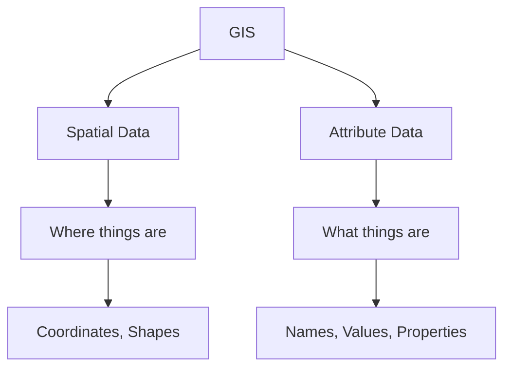
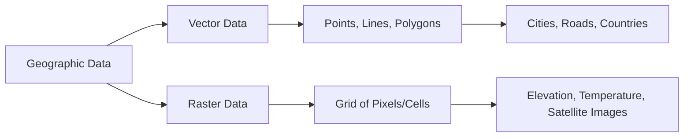
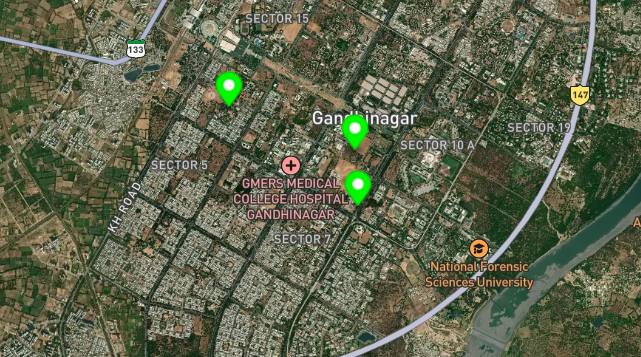
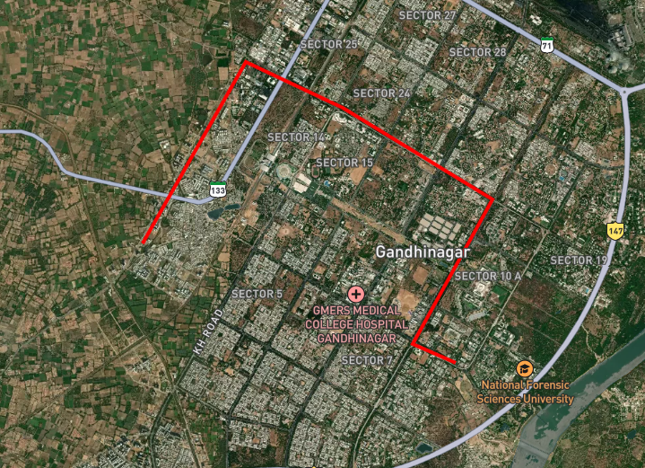
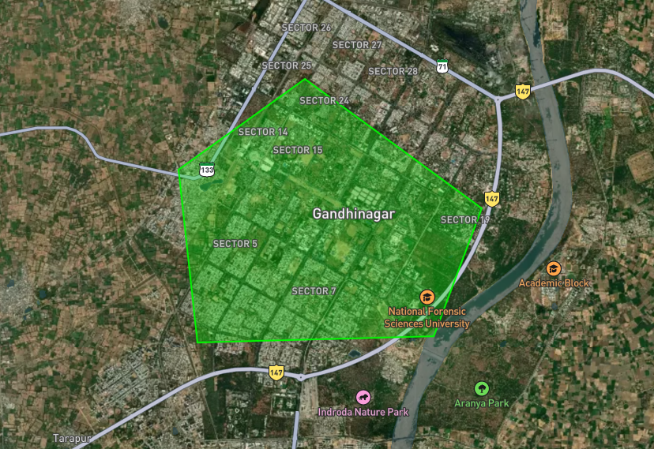
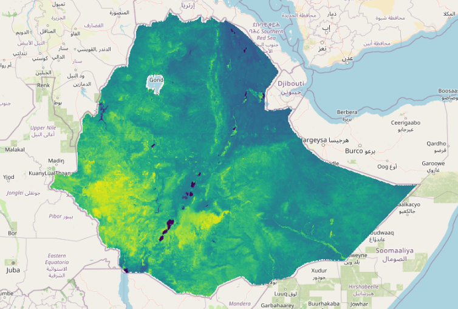
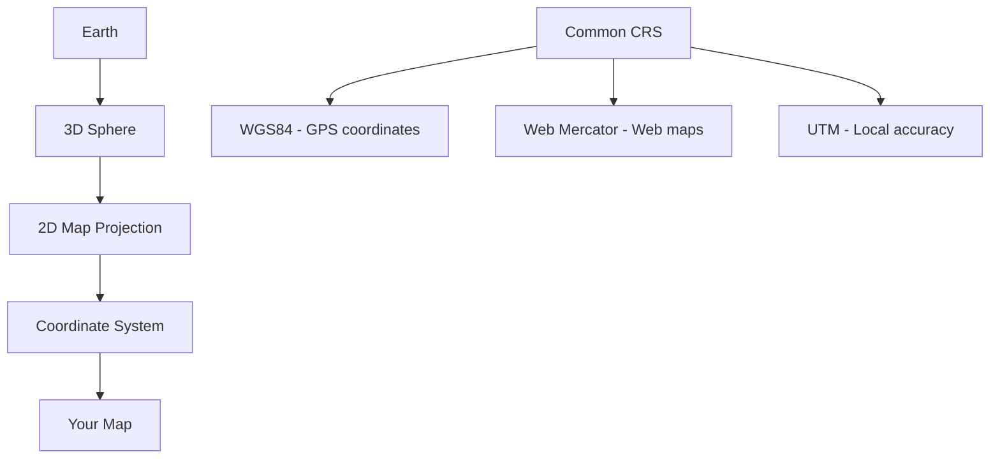
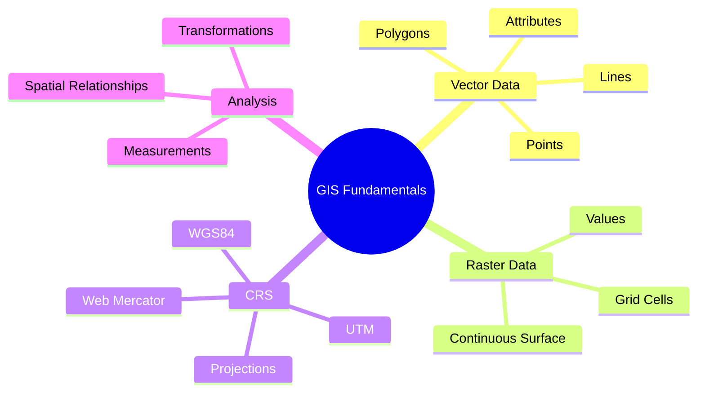
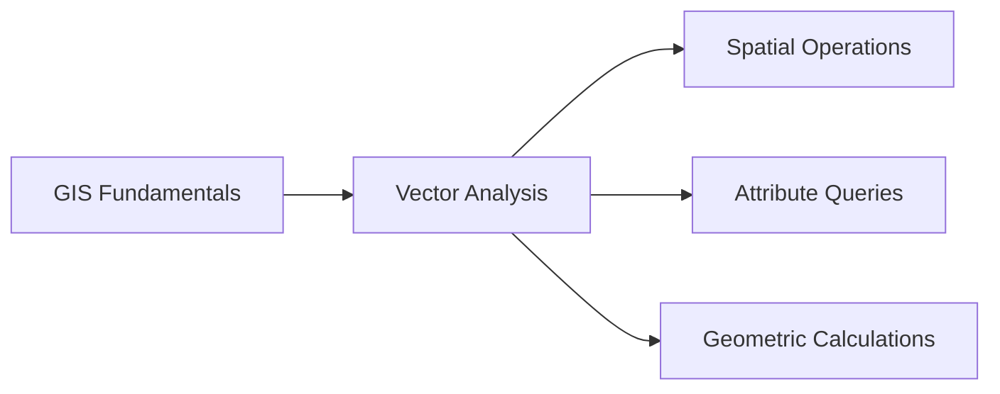

# Module 2: GIS Fundamentals

## Learning Goals
- Understand the difference between vector and raster data
- Recognize common **raster** themes (continuous, categorical, multi-band) and how **TIFF / GeoTIFF** store grids and georeferencing
- Learn about basic geometry types (Point, Line, Polygon)
- Understand attribute tables and their relationship to geometries
- Grasp what a CRS is (datum, units, geographic vs projected)
- Express the **same real-world location** with different coordinate numbers after reprojection
- See what happens when CRS is wrong or mis-declared

## What is GIS?

**Geographic Information Systems (GIS)** combine spatial data with attribute data to help us understand patterns, relationships, and trends in our world.


```mermaid
graph TD
    A[GIS] --> B[Spatial Data]
    A --> C[Attribute Data]
    B --> D[Where things are]
    C --> E[What things are]
    D --> F[Coordinates, Shapes]
    E --> G[Names, Values, Properties]
```

## Vector vs Raster Data

Geographic data comes in two main formats:


```mermaid
graph LR
    A[Geographic Data] --> B[Vector Data]
    A --> C[Raster Data]
    B --> D[Points, Lines, Polygons]
    C --> E[Grid of Pixels/Cells]
    D --> F[Cities, Roads, Countries]
    E --> G[Elevation, Temperature, Satellite Images]
```

### Vector Data
- **Discrete objects** with defined boundaries
- Made up of **points, lines, and polygons**
- Each feature has **attributes** (properties)
- Examples: cities, roads, country boundaries, building footprints

### Raster Data
- **Continuous surface** divided into a grid
- Each cell has a **value**
- Examples: elevation, temperature, satellite imagery, population density

## Vector Geometry Types

The three core **vector** geometries are **point** (one location), **line** (ordered vertices along a path), and **polygon** (a closed ring—or rings with holes—that encloses an area). Diagrams below show the idea in map coordinates; the **example data** sections give real **GeoJSON** you can save, load in Python, or open in QGIS.

### Point vs line vs polygon (comparison)

| | **Point** | **Line** (`LineString`) | **Polygon** |
|---|-----------|-------------------------|-------------|
| **What it represents** | One location | A path along a route | A bounded area (and optional holes) |
| **Vertices** | 1 coordinate pair | 2 or more, in order | 1+ closed rings; outer ring first, then holes |
| **Typical measures** | Position only; no length or area | Length along the path | Perimeter length and interior area |
| **GeoJSON `type`** | `Point` | `LineString` | `Polygon` |
| **Shapely class** | `Point` | `LineString` | `Polygon` |
| **Examples** | Towers, sensors, addresses | Roads, rivers, tracks | Countries, parcels, lakes |

**Rule of thumb:** use a **point** when “where” is a single spot; a **line** when connectivity or route matters; a **polygon** when you need an **inside** vs **outside** (area).

### Setting Up

```python
from shapely.geometry import Point, LineString, Polygon
import matplotlib.pyplot as plt
```

### Points



- **Single coordinate pair** `(x, y)` — in geographic data usually **(longitude, latitude)** in that order (GeoJSON / WGS84).
- **Zero-length** object: no area, no length; only position.
- Examples: cities, weather stations, GPS fixes, sampling sites.

**Example GeoJSON** (one `Point` feature with properties):

```json
{
  "type": "Feature",
  "properties": {
    "name": "Trailhead Kiosk",
    "amenity": "information"
  },
  "geometry": {
    "type": "Point",
    "coordinates": [-122.4194, 37.7749]
  }
}
```

In Python with Shapely, the same location looks like:

```python
# Create a Point (here using simple plot coordinates; use lon/lat for real maps)
p = Point(2, 3)

x, y = p.xy
plt.plot(x, y, 'ro', markersize=10)
plt.title("Point")
plt.xlabel("x")
plt.ylabel("y")
plt.axis("equal")
plt.grid()
plt.show()
```

### Lines (LineStrings)



- **Ordered sequence** of vertices; the line **connects them in order** (no branching in a single `LineString`).
- Has **length**, no area.
- Examples: roads, rivers, trails, ship tracks.

**Example GeoJSON** (`LineString` with four vertices):

```json
{
  "type": "Feature",
  "properties": {
    "name": "Ridge Trail segment",
    "surface": "unpaved"
  },
  "geometry": {
    "type": "LineString",
    "coordinates": [
      [-122.422, 37.773],
      [-122.418, 37.775],
      [-122.415, 37.7765],
      [-122.412, 37.778]
    ]
  }
}
```

```python
# Create a LineString
line = LineString([(1, 1), (4, 2), (6, 5)])

x, y = line.xy
plt.plot(x, y, 'b-o', linewidth=2, markersize=6)
plt.title("LineString")
plt.xlabel("x")
plt.ylabel("y")
plt.axis("equal")
plt.grid()
plt.show()
```

### Polygons



- **Exterior ring** is closed (first point equals last in valid data); **interior rings** (holes) are optional.
- Has **area** and **perimeter** (boundary length).
- Examples: countries, parcels, lakes, study regions.

**Example GeoJSON** (`Polygon`: outer ring only; note the repeated closing coordinate):

```json
{
  "type": "Feature",
  "properties": {
    "name": "Study area boundary",
    "zone_code": "A-12"
  },
  "geometry": {
    "type": "Polygon",
    "coordinates": [
      [
        [-122.425, 37.772],
        [-122.408, 37.772],
        [-122.408, 37.781],
        [-122.425, 37.781],
        [-122.425, 37.772]
      ]
    ]
  }
}
```

## Raster data in GIS

**Vector** data stores **objects** (points, lines, polygons) with coordinates and attributes. **Raster** data stores values on a **regular grid** of **pixels** (also called **cells**): each cell has a row/column index and usually **one or more numeric values** (bands). The grid is anchored in map space by **origin**, **cell size** (resolution), **extent**, and **CRS**—you will tie those ideas to CRS metadata in the next section.

### How a raster differs from vector

| | **Vector** | **Raster** |
|---|------------|------------|
| **Geometry** | Exact vertices and edges | Uniform rectangles (pixels) |
| **Best for** | Boundaries, networks, discrete features | Continuous fields, imagery, scanned maps |
| **Storage** | Often smaller for sparse features | Can be large at fine resolution |

### Common kinds of raster (by what each pixel means)

- **Single-band continuous** — One real number per cell: **elevation (DEM)**, **slope**, **temperature**, **rainfall**, **population density**. Values interpolate conceptually between cells.
- **Single-band categorical** — Integer **codes** per cell: **land cover** (forest = 5, water = 1), **soil class**, **admin zones**. The number is a **label**, not a quantity; a legend maps code → meaning.
- **Multi-band** — Several values per cell, e.g. **red, green, blue** for color imagery, or many **spectral bands** (satellite). Display stacks bands into a color composite; analysis may use all bands.
- **Binary / mask** — 0/1 (or no-data) for **study area**, **cloud mask**, **suitable / not suitable**.

The **same file format** (for example GeoTIFF) can hold any of the above; what changes is **band count**, **data type**, and **how you interpret** the numbers.

### TIFF and GeoTIFF

**TIFF** (Tagged Image File Format) is a flexible **image and raster container**: “tags” in the file header describe **image width and height**, **bits per sample**, **number of bands**, **compression** (often none or LZW/deflate for GIS), and optional **color maps**. TIFF is widely used because it supports **large files**, **lossless** storage, and **many bands**—ideal for elevation models and satellite tiles.

**GeoTIFF** is a TIFF that adds **geospatial tags** (or a sidecar world file) so software knows **where each pixel lies on Earth**—CRS, cell size, and origin. In Python you will often open GeoTIFFs with **rasterio** or **xarray**; in desktop GIS with **QGIS** or **ArcGIS**. Module 4 goes deeper into reading and analyzing rasters; here the goal is to recognize **grid + bands + georeferencing** as the raster counterpart to **vector geometries + CRS**.



The diagram above emphasizes the **file as a header + pixel matrix**. The next figure zooms to the **grid**: each **pixel** is one storage unit; its **(row, col)** maps to ground coordinates once **geotransform** and **CRS** are known.


!!! tip "Raster vocabulary"
    - **Resolution** — ground distance covered by one pixel edge (e.g. 10 m pixels).
    - **Extent / bounding box** — outer limits of the raster in map coordinates.
    - **NoData** — a sentinel value meaning “no observation here” (important for masks and mosaics).

## Coordinate Reference Systems (CRS)

### What is a Coordinate Reference System (CRS)?

A **Coordinate Reference System (CRS)** is the complete **rulebook** that tells software how to interpret stored coordinates so they correspond to **real locations on or near the Earth’s surface**. Coordinates in a file are only numbers until you know:

- **Which axes** you are using (e.g. east/north, longitude/latitude, or 3D X/Y/Z).
- **Which units** apply (degrees, meters, feet, …).
- **How those axes relate to the Earth**—through a **datum** (see below) and, for map coordinates, often a **map projection** that converts the curved Earth to a flat plane.

Without a CRS, a pair like **−122.4194** and **37.7749** is **ambiguous**: are those **degrees** of longitude and latitude, or **meters** on some grid? Which hemisphere and which origin? GIS and Python libraries use **CRS metadata** attached to the layer (or embedded in formats like GeoTIFF) so every vertex or pixel corner is interpreted **consistently**. Getting that metadata **right** is as important as getting the geometry numbers right.


```mermaid
graph TD
    A[Earth] --> B[3D Sphere]
    B --> C[2D Map Projection]
    C --> D[Coordinate System]
    D --> E[Your Map]
    
    F[Common CRS] --> G[WGS84 - GPS coordinates]
    F --> H[Web Mercator - Web maps]
    F --> I[UTM - Local accuracy]
```

### Types of CRS

CRS types differ by **what the coordinates measure** and **how they are arranged**. The two you will use most often in 2D mapping are **geographic** and **projected**.

| | **Geographic CRS** | **Projected CRS** |
|---|-------------------|-------------------|
| **Coordinates** | Usually **longitude** and **latitude** in **degrees** | **Easting** and **northing** (or x/y) in **meters** (or feet) |
| **Earth shape** | Angles on a **reference ellipsoid** (or sphere) | A **flat map plane** derived by projection |
| **Examples** | WGS 84 — **EPSG:4326** | Web Mercator — **EPSG:3857**; UTM zones — e.g. **EPSG:32610** |
| **Typical use** | GPS, global exchange, GeoJSON storage | Web maps, engineering, local distance and area |

**Latitude and longitude** are the usual way to express position in a **geographic** CRS (especially WGS 84). They are **not** a separate data model from “CRS”: they **are** the coordinate values for that CRS type. In a **projected** CRS, the **same ground point** is written with **different numbers** (typically large easting/northing values in meters), not as lon/lat, unless you **transform** the coordinates back to geographic form.

Other CRS families appear in specialized work: **geocentric** CRS (X, Y, Z in meters from Earth’s center), **vertical** CRS (heights above a reference surface, important for hydrology and engineering), and **compound** CRS that combine horizontal and vertical definitions. For most web and regional GIS in this course, **geographic vs projected** is the main distinction.

### What is a datum?

A **datum** is a **defined relationship** between a **mathematical model of the Earth** (usually an **ellipsoid** with fixed semi-major axis and flattening) and **real-world measurements** (control points, satellite orbits, national surveys). In plain terms: the datum answers **“which Earth shape and which origin/orientation are we using?”** so that latitude and longitude (or projected coordinates tied to that ellipsoid) line up with physical marks on the ground.

Changing datum (for example from an older national realization to **WGS 84**) can shift reported coordinates by **meters**—small on a globe diagram, **large** for cadastral or construction work. A full CRS definition **includes** the datum (or references it through a standard like EPSG). When people say **“WGS 84”** in everyday GIS, they often mean both the **datum** and the **geographic CRS** built on it (**EPSG:4326**).

### What are EPSG codes?

The **EPSG** dataset (maintained by the **International Association of Oil & Gas Producers**, IOGP) is a widely used catalog of coordinate systems. Each entry has a **numeric code**—for example **4326** for WGS 84 geographic lon/lat, **3857** for Web Mercator, **32610** for WGS 84 / UTM zone 10N. Software stores these as identifiers such as **`EPSG:4326`**.

An EPSG code is a **shorthand for a full definition**: axis order, units, datum, projection parameters, and sometimes area of use. Using a standard code **reduces mistakes** compared to typing projection parameters by hand, and it lets QGIS, ArcGIS, GDAL, and Python libraries agree on **one** interpretation. If someone shares **“EPSG:XXXX”**, they are pointing to that single, registry-defined CRS—not to a vague “kind of like WGS 84.”

### What is reprojection?

**Reprojection** (more formally, a **coordinate transformation** or **CRS transformation**) means: take geometry defined in **CRS A**, apply the correct mathematics, and express the **same locations** in **CRS B**. The **ground truth does not move**; only the **stored coordinate numbers** change.

Example: one point **near San Francisco** in WGS 84 as **longitude −122.4194°, latitude 37.7749°**. After reprojection to other standard CRS, the **first and second coordinates** look like this (values are illustrative of the math; your software will reproduce them exactly):

| CRS | EPSG | First coordinate (interpretation) | Second coordinate (interpretation) |
|-----|------|-----------------------------------|-------------------------------------|
| WGS 84 (geographic) | **4326** | −122.4194 (**degrees** longitude) | 37.7749 (**degrees** latitude) |
| WGS 84 / Pseudo-Mercator | **3857** | −13,627,665.27 (**meters**, easting) | 4,547,675.35 (**meters**, northing) |
| WGS 84 / UTM zone 10N | **32610** | 551,130.77 (**meters**, easting) | 4,180,998.88 (**meters**, northing) |

The **large meter values** are not “more precise” lat/lon—they are **the same point** in a **different system**. You must use a **transformation** implemented by your GIS or library; **never** paste lon/lat values into a layer that is declared as a **meter-based projected CRS** without transforming them.

**Reprojection** is not the same as **assigning** a CRS to data that had none: **assignment** says “these numbers **already are** in this system.” **Reprojection** **computes new numbers** for a **new** system. Doing the wrong one—reprojecting data that was actually mis-labeled—can silently corrupt positions.

### Common problems without CRS or with a wrong CRS

**Missing CRS**

- The file has coordinates but **no CRS metadata**. Many programs **guess** (often WGS 84) or treat the layer as **unknown**. Layers may **plot on top of each other by accident** in a small test area, then **fail** when combined with authoritative data.
- **Raster** workflows suffer too: without CRS and georeferencing, pixels cannot be aligned with vectors or other rasters.

**Wrong or mis-declared CRS**

- Values are **actually** longitude and latitude in **degrees**, but the layer is tagged **EPSG:3857** (meters). Software plots **−122.4** as **−122.4 meters**—nowhere near North America.
- The opposite: projected meter coordinates labeled as **EPSG:4326** will stretch or stack features in nonsensical ways.

**Mixing layers without aligning CRS**

- Two valid layers in **different** CRS will **not overlay correctly** until at least one is **transformed** to match the other’s CRS (or both to a common analysis CRS).
- **Spatial joins**, **buffers in meters**, and **area** calculations all assume a **consistent** CRS story; mixing systems produces **wrong distances and topology**.

**Using the wrong CRS for the job**

- Measuring **distance** or **area** in **EPSG:4326** uses **degrees** along the ellipsoid or degree²—**not** intuitive meters or hectares for local sites. For many local analyses you **project** to a suitable **meter-based** CRS for the study region.

**Datum and transformation confusion**

- Reprojecting between two CRS that use **different datums** requires a **transformation path** (sometimes multiple steps). Using a default that does not match your jurisdiction’s recommended transformation can introduce **decimeter- to meter-level** shifts—critical for legal parcels and engineering.

!!! tip "CRS workflow"
    - **Record** the CRS your data **actually** use when you receive or create them.
    - **Assign** metadata only when it reflects the truth; use **reprojection** when you need **different numbers** for a target CRS.
    - **Store** global exchange data often as **WGS 84 / EPSG:4326** (or another agreed geographic CRS) when that matches the capture method.
    - **Reproject** to a **projected** CRS for **distance, area, or local mapping** in meters where appropriate.
    - **Align every layer to one CRS** (or transform on the fly consistently) before **overlay, spatial join, or merge** so geometries occupy the same coordinate space.

### Common Coordinate Reference Systems

| CRS | EPSG Code | Description | Use Case |
|-----|-----------|-------------|----------|
| **WGS 84** | 4326 | Geographic longitude/latitude on the WGS 84 datum | GPS, GeoJSON, global interchange |
| **Web Mercator** | 3857 | Pseudo-Mercator on a WGS 84 sphere; x/y in meters | Basemaps, many web tiles |
| **UTM** | Zone-specific (e.g. 32610 for 10N) | Transverse Mercator bands, meters | Local mapping and measurement |

## Loading and Inspecting Vector Data

Let's work with real geographic data:

```python
import geopandas as gpd
import matplotlib.pyplot as plt

# Load Natural Earth data (comes with GeoPandas)
import geopandas as gpd

world=gpd.read_file("/content/countries.zip")
states=gpd.read_file("/content/states.zip")
cities=gpd.read_file("/content/city.geojson")

# Inspect the data
print("=== WORLD COUNTRIES ===")
print(f"Shape: {world.shape}")  # (rows, columns)
print(f"CRS: {world.crs}")
print(f"Geometry types: {world.geometry.type.unique()}")
print(f"Available columns for world: {list(world.columns)}")

print("\n=== FIRST FEW COUNTRIES ===")
# Corrected column names to 'NAME' and 'CONTINENT'
print(world[['NAME', 'CONTINENT','geometry']].head())

print("\n=== CITIES ===")
print(f"Shape: {cities.shape}")
print(f"CRS: {cities.crs}")
print(f"Geometry types: {cities.geometry.type.unique()}")
```

### Inspecting Geometry

```python
# Look at specific geometries
print("=== GEOMETRY DETAILS ===")

# Get a specific country
usa = world[world['NAME'] == 'United States of America'].iloc[0]
print(f"USA geometry type: {usa.geometry.geom_type}")
print(f"USA bounds: {usa.geometry.bounds}")


print(f"Cities columns: {list(cities.columns)}")
print(cities[['city', "admin_name"]].head())
# Get a specific administrative division (e.g., a state/province)
sf_area = cities[cities['city'] == 'Delhi'].iloc[0]
print(f"Delhi geometry type: {sf_area.geometry.geom_type}")
print(f"Delhi bounds: {sf_area.geometry.bounds}")

# Check if geometries are valid
print(f"USA geometry is valid: {usa.geometry.is_valid}")
print(f"Delhi geometry is valid: {sf_area.geometry.is_valid}")
```

## Quick Visualization

```python
# Create a simple world map
fig, ax = plt.subplots(1, 1, figsize=(15, 10))

# Plot countries
world.plot(ax=ax, color='lightblue', edgecolor='black', linewidth=0.5)

# Plot cities (administrative divisions)
# cities.plot(ax=ax, color='red', markersize=20, alpha=0.7)

# Plot the specific administrative area (India) in green
cities[cities['country'] == 'India'].plot(ax=ax, color='green', markersize=5, alpha=0.7)

# Set the title
ax.set_title('World Countries and Cities in India', fontsize=16, fontweight='bold')
ax.set_xlabel('Longitude')
ax.set_ylabel('Latitude')

# Remove axis ticks for cleaner look
ax.set_xticks([])
ax.set_yticks([])

plt.tight_layout()
plt.show()
```

## What Happens When CRS is Wrong?

Let's see the impact of using the wrong coordinate system:

```python
import geopandas as gpd
import matplotlib.pyplot as plt


# Create subplots to compare projections
fig, axes = plt.subplots(2, 2, figsize=(15, 10))

# 1. Original WGS84 (EPSG:4326)
world.plot(ax=axes[0,0], color='lightblue', edgecolor='black')
axes[0,0].set_title('WGS84 (EPSG:4326)\nCorrect for global data')

# 2. Web Mercator (EPSG:3857)
world_mercator = world.to_crs('EPSG:3857')
world_mercator.plot(ax=axes[0,1], color='lightgreen', edgecolor='black')
axes[0,1].set_title('Web Mercator (EPSG:3857)\nGood for web maps')

# 3. Wrong projection - using UTM Zone 10N globally
try:
    world_utm = world.to_crs('EPSG:32610')  # UTM Zone 10N (California)
    world_utm.plot(ax=axes[1,0], color='lightcoral', edgecolor='black')
    axes[1,0].set_title('UTM Zone 10N (EPSG:32610)\nWRONG for global data!')
except:
    axes[1,0].text(0.5, 0.5, 'Projection Error!', ha='center', va='center')
    axes[1,0].set_title('UTM Zone 10N - Error!')

# 4. Focus on a specific region with appropriate UTM
california = world[world['NAME'] == 'United States of America']
california_utm = california.to_crs('EPSG:32610')  # UTM Zone 10N
california_utm.plot(ax=axes[1,1], color='yellow', edgecolor='black')
axes[1,1].set_title('UTM Zone 10N (EPSG:32610)\nCorrect for California')

plt.tight_layout()
plt.show()
```

### Understanding the Projections

```python
WGS84 (EPSG:4326): Global latitude–longitude system used by GPS; good for storing locations, not for measurements.

Web Mercator (EPSG:3857): Web-map projection in meters; looks familiar but distorts size, especially near the poles.

UTM used globally (WRONG): A local projection forced on the whole world, causing severe distortion and meaningless shapes.

UTM used locally (CORRECT): Right projection for its zone; meters are accurate and distances/areas make sense.
```

## Practical CRS Guidelines

```python
# Check CRS of your data
print(f"Data CRS: {world.crs}")

# Transform to different CRS
world_mercator = world.to_crs('EPSG:3857')  # Web Mercator
world_utm = world.to_crs('EPSG:32610')      # UTM Zone 10N

# Always check CRS before analysis
def check_crs_compatibility(gdf1, gdf2):
    """Check if two GeoDataFrames have the same CRS"""
    if gdf1.crs == gdf2.crs:
        print("✅ CRS match - safe to analyze together")
        return True
    else:
        print(f"❌ CRS mismatch: {gdf1.crs} vs {gdf2.crs}")
        print("Transform one dataset before analysis!")
        return False

# Example usage
check_crs_compatibility(world, cities)
check_crs_compatibility(world_mercator, cities)
check_crs_compatibility(world_utm, cities)
```

## Practice Problems

### Problem 1: Data Exploration
Explore the Natural Earth datasets:

```python
import geopandas as gpd

# Load the data
world = gpd.read_file(gpd.datasets.get_path('naturalearth_lowres'))
cities = gpd.read_file(gpd.datasets.get_path('naturalearth_cities'))

# TODO:
# 1. Find the 5 most populous countries
# 2. Find all cities in Europe
# 3. Count how many countries are in each continent
# 4. Find the country with the largest area

# Your code here
```

??? success "Solution"
    ```python
    # 1. Five most populous countries
    top_5_pop = world.nlargest(5, 'pop_est')[['name', 'pop_est']]
    print("Top 5 most populous countries:")
    print(top_5_pop)
    
    # 2. Cities in Europe
    european_cities = cities[cities['continent'] == 'Europe']
    print(f"\nNumber of European cities: {len(european_cities)}")
    print("European cities:")
    print(european_cities[['name', 'country']].head(10))
    
    # 3. Countries per continent
    continent_counts = world['continent'].value_counts()
    print("\nCountries per continent:")
    print(continent_counts)
    
    # 4. Largest country by area
    largest_country = world.loc[world['area_km2'].idxmax()]
    print(f"\nLargest country: {largest_country['name']}")
    print(f"Area: {largest_country['area_km2']:,.0f} km²")
    ```

### Problem 2: CRS Transformation
Practice working with different coordinate systems:

```python
import geopandas as gpd
import matplotlib.pyplot as plt

# Load data
world = gpd.read_file(gpd.datasets.get_path('naturalearth_lowres'))

# TODO:
# 1. Create a map showing the same data in 3 different projections
# 2. Calculate the area of Brazil in different CRS and compare
# 3. Transform cities data to Web Mercator and plot

# Your code here
```

??? success "Solution"
    ```python
    # 1. Three different projections
    fig, axes = plt.subplots(1, 3, figsize=(18, 6))
    
    # WGS84
    world.plot(ax=axes[0], color='lightblue', edgecolor='black')
    axes[0].set_title('WGS84 (EPSG:4326)')
    
    # Web Mercator
    world.to_crs('EPSG:3857').plot(ax=axes[1], color='lightgreen', edgecolor='black')
    axes[1].set_title('Web Mercator (EPSG:3857)')
    
    # Robinson projection (good for world maps)
    world.to_crs('+proj=robin').plot(ax=axes[2], color='lightcoral', edgecolor='black')
    axes[2].set_title('Robinson Projection')
    
    plt.tight_layout()
    plt.show()
    
    # 2. Brazil area comparison
    brazil = world[world['name'] == 'Brazil']
    
    # Original CRS (degrees)
    area_degrees = brazil.geometry.area.iloc[0]
    
    # Equal Area projection for accurate area calculation
    brazil_equal_area = brazil.to_crs('+proj=aea +lat_1=-5 +lat_2=-42 +lat_0=-32 +lon_0=-60')
    area_m2 = brazil_equal_area.geometry.area.iloc[0]
    area_km2 = area_m2 / 1_000_000
    
    print(f"Brazil area in degrees²: {area_degrees:.2f}")
    print(f"Brazil area in km²: {area_km2:,.0f}")
    
    # 3. Cities in Web Mercator
    cities = gpd.read_file(gpd.datasets.get_path('naturalearth_cities'))
    cities_mercator = cities.to_crs('EPSG:3857')
    
    fig, ax = plt.subplots(figsize=(12, 8))
    world.to_crs('EPSG:3857').plot(ax=ax, color='lightblue', edgecolor='black')
    cities_mercator.plot(ax=ax, color='red', markersize=30, alpha=0.7)
    ax.set_title('World Map in Web Mercator with Cities')
    plt.show()
    ```

## Key Concepts Summary


```mermaid
mindmap
  root((GIS Fundamentals))
    Vector Data
      Points
      Lines
      Polygons
      Attributes
    Raster Data
      Grid Cells
      Continuous Surface
      Values
    CRS
      WGS84
      Web Mercator
      UTM
      Projections
    Analysis
      Spatial Relationships
      Measurements
      Transformations
```

!!! success "What You've Learned"
    - **Vector vs Raster**: Two fundamental data types in GIS
    - **Geometry Types**: Points, lines, and polygons represent different features
    - **Attributes**: Descriptive data linked to geographic features
    - **CRS**: Datum + units; geographic (lon/lat in degrees) vs projected (meters); same place → different numbers after `to_crs()`
    - **Data Inspection**: How to explore and understand geographic datasets

!!! tip "Best Practices"
    - Always check the CRS of your data first
    - Use appropriate projections for your analysis area
    - Inspect data structure before analysis
    - Visualize data early to catch issues
    - Keep original and transformed versions separate

## Next Steps

In the next module, we'll dive deeper into vector analysis:
- Working with GeoDataFrames
- Spatial operations (buffers, intersections)
- Attribute-based filtering
- Spatial joins
- Creating new geographic features


```mermaid
graph LR
    A[GIS Fundamentals] --> B[Vector Analysis]
    B --> C[Spatial Operations]
    B --> D[Attribute Queries]
    B --> E[Geometric Calculations]
```