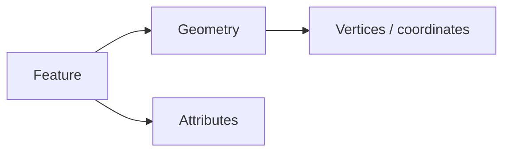
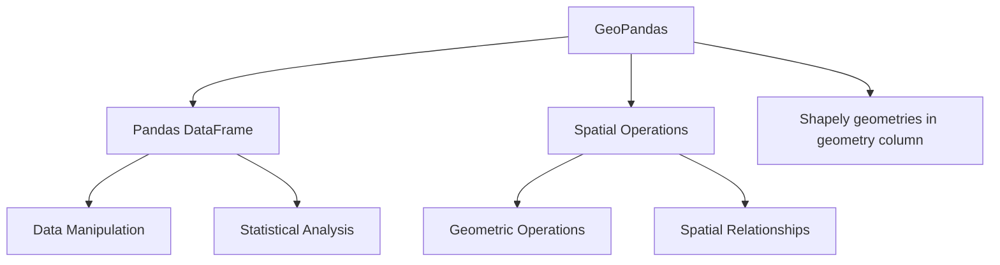
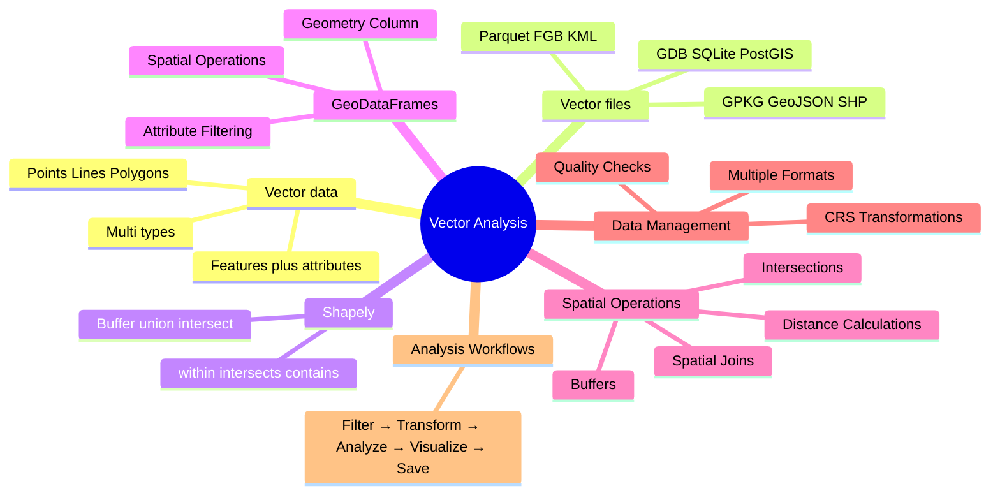
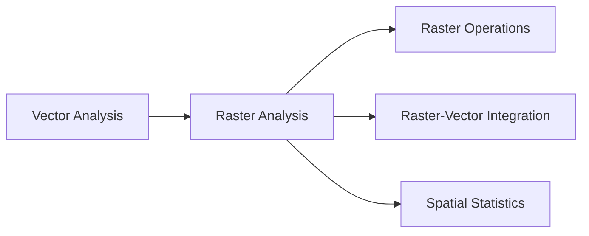

# Module 3: Vector Data & Analysis

## Learning Goals
- Understand what **vector data** is and how **geometry types** differ (point, line, polygon, multipart)
- Recognize common **vector file formats** (Shapefile, GeoJSON, GeoPackage, and others)
- Use **Shapely** for single-geometry operations (buffer, union, intersection, `within`, `intersects`)
- Master GeoDataFrames and the geometry column
- Perform spatial operations (buffers, intersections, joins)
- Filter features by attributes and spatial relationships
- Reproject data for accurate analysis
- Save results in various formats
- Create new geographic features

## What is vector data?

**Vector data** represents real-world objects as **discrete shapes** built from **coordinates** (and optional **measures** or **z** values). Each record is usually a **feature**: a **geometry** (where it is) plus **attributes** (what it is—name, population, land use, and so on). It is stored as **vertices** and how they connect (paths and closed rings), which keeps boundaries, networks, and labelled locations efficient to edit, query, and style.



### Types of vector geometries

Vector layers store one **geometry type** per column (or mixed types in some formats, but GeoPandas still uses one column). The standard types you will see in **GeoJSON**, **Shapefiles**, **GeoPackage**, and **Shapely** are:

| Type | What it stores | Examples |
|------|----------------|----------|
| **Point** | Single `(x, y)` (often lon/lat) | City centroid, sensor, well |
| **LineString** | Ordered sequence of vertices (a path) | Road segment, river reach, contour as line |
| **Polygon** | Closed ring(s): one **exterior** boundary and optional **interior** rings (holes) | Country, lake, building footprint |
| **MultiPoint** | Several separate points in one feature | Multi-campus school as one record |
| **MultiLineString** | Several lines in one feature | Disconnected trail segments under one id |
| **MultiPolygon** | Several polygons in one feature | Archipelago, country with exclaves |
| **GeometryCollection** | Mixed geometries in one feature | Rare; used when one id truly mixes types |

**Simple vs multipart:** a **Polygon** is one connected area; a **MultiPolygon** is many areas that belong to one attribute row (one “feature” in the table). Operations like **buffer** or **union** may change simple types to multipart when shapes split or merge.

### Features, layers, and files

- **Feature** — one row: geometry + attribute fields.
- **Layer** — a collection of features of the same kind (one thematic map layer: “roads”, “parcels”).
- **File / dataset** — may hold one or more layers (GeoPackage and File Geodatabase support multiple layers; one Shapefile set is usually one layer).

The **on-disk format** is only a container: geometry types (Point, Polygon, …) are the same across formats. The next section lists the main **vector file types** you will see in the wild and open with GeoPandas.

### How this module builds on the idea

**GeoPandas** puts vector geometries in a **`geometry` column** and keeps attributes in the other columns, so you can use both **pandas** workflows (filter, group, merge) and **spatial** workflows (buffer, intersect, spatial join). The next sections assume you are comfortable with **points, lines, and polygons**; for pictures and sample GeoJSON, see **Module 2 (GIS Fundamentals)**.

## Common vector file formats

Vector GIS data are stored in many **file and database formats**. GeoPandas uses **GDAL/OGR** under the hood (`gpd.read_file()` / `to_file()`), so if a format has a GDAL **vector driver**, you can often read it the same way—point at the path or URL and optionally pass a **layer** name when the container holds more than one table.

| Format | Typical extension(s) | Layers | Typical use | Notes |
|--------|----------------------|--------|-------------|--------|
| **GeoPackage** | `.gpkg` | Multiple (tables) | Default in QGIS; archival exchange | SQLite + OGC standard; supports rasters too in same file |
| **GeoJSON** | `.geojson`, `.json` | Usually one sequence | APIs, web maps, teaching | Plain text; large files can be slow |
| **JSON (newline / NDJSON)** | `.geojsonl`, `.ndjson`, `.jsonl` | One feature per line (stream) | Big data pipelines | Each line is one GeoJSON Feature object |
| **ESRI Shapefile** | `.shp` (+ required sidecars) | One per `.shp` set | Legacy industry exchange | Keep `.dbf`, `.shx`, `.prj` together; 2 GB size limit; use `.cpg` for UTF-8 text |
| **GeoParquet** | `.parquet` | One table per file | Cloud, pandas/Arrow workflows | Columnar; efficient filtering |
| **KML** | `.kml` | Folders / structure | Google Earth, simple web | XML; often read via GDAL “KML” / “LIBKML” driver |
| **KMZ** | `.kmz` | As inner KML | Packaged placemarks + assets | ZIP archive containing `.kml` (and images, etc.) |
| **PostGIS** | (database connection, not a file) | Schemas / tables | Server-side GIS | `gpd.read_postgis()` with SQL |
| **CSV** | `.csv` | One table | Spreadsheets with a WKT or lon/lat columns | Not a spatial format unless columns are interpreted |


Many other formats exist (**MicroStation DGN**, **AutoCAD DWG**, **GeoRSS**, **S-57**, etc.); check [GDAL vector drivers](https://gdal.org/drivers/vector/index.html) for the full list your install supports.

### Shapefile: keep the family together

A **shapefile** is never just `.shp`. At minimum you need:

- **`.shp`** — geometry  
- **`.shx`** — index  
- **`.dbf`** — attributes  

Usually also **`.prj`** (CRS) and often **`.cpg`** (text encoding, e.g. UTF-8). Copy or share the **whole set** with the same base name.

### Reading different formats with GeoPandas

```python
import geopandas as gpd

# Single-file formats: path to the file
gdf_gpkg = gpd.read_file("data/study_area.gpkg", layer="parcels")  # layer= optional if only one
gdf_json = gpd.read_file("data/sites.geojson")
gdf_parquet = gpd.read_file("data/sites.parquet")

# Shapefile: path to the .shp file (sidecars in same folder)
gdf_shp = gpd.read_file("data/roads.shp")

# File Geodatabase: path to the .gdb folder
# gdf_fc = gpd.read_file("data/project.gdb", layer="Roads")

# KMZ is often read like a path (GDAL reads inside the zip)
# gdf_kmz = gpd.read_file("data/sites.kmz", layer="sites")
```

Use `gpd.read_file(path, layer="...")` whenever the container has **multiple** layers (GeoPackage, FileGDB, some KML/KMZ).

!!! tip "Choosing a format for new work"
    - Prefer **GeoPackage** or **GeoParquet** for new projects when you can (open standard, metadata, multi-layer or columnar efficiency).
    - Use **GeoJSON** when humans need to diff or hand-edit small datasets.
    - Use **Shapefile** only when a partner or tool still requires it.

## Shapely — geometry objects and operations

**Shapely** is a Python library for **planar geometry**: it gives you **`Point`**, **`LineString`**, **`Polygon`**, and **multi** variants as plain Python objects. You construct coordinates, then call methods such as **`.buffer()`**, **`.union()`**, **`.intersection()`**, and **predicates** like **`.within()`** and **`.intersects()`**. Shapely does **not** attach attribute tables—that is what **GeoPandas** adds—but every geometry stored in a GeoDataFrame’s `geometry` column **is a Shapely object**.

Shapely follows the **OpenGIS Simple Features** model: coordinates are **(x, y)** — in geographic data usually **(longitude, latitude)** in **degrees** when your CRS is WGS 84 (`EPSG:4326`). The four programs below each stand alone: one task, one **`print`** of a single **GeoJSON `Feature`** (built with `shapely.geometry.mapping`). The same survey coordinates appear in [`data/shapely_demo_india.geojson`](data/shapely_demo_india.geojson).

**Blocks 1–4** below each include **sample printed output** (scrollable pretty JSON + a **single-line** JSON block—use your viewer’s **copy** control on the code block, or select all). Run the programs yourself to confirm the printed JSON matches these samples (floating-point text may differ slightly).

### Block 1 — Buffer around a point

**`.buffer(distance)`** uses the **same units as your coordinates** (here: degrees). For buffers in **meters**, project with GeoPandas (`to_crs("EPSG:32643")`) before buffering, as in the next section.

```python
"""One program: buffer a point → print one GeoJSON Feature."""
import json
from shapely.geometry import Point, mapping

site = Point(79.03740972004755, 22.178636725204527)
buffer_polygon = site.buffer(0.12)  # radius in degrees (illustration only)

feature = {
    "type": "Feature",
    "properties": {
        "operation": "buffer",
        "radius_degrees": 0.12,
        "center_site": "site_1",
    },
    "geometry": mapping(buffer_polygon),
}
print(json.dumps(feature, indent=2, ensure_ascii=False))
```

!!! tip "Buffers in meters"
    Prefer **`gdf.to_crs("EPSG:32643")`** (WGS 84 / UTM zone 43N for this longitude) then **`.buffer(50000)`** for 50 km, then **`to_crs(4326)`** if you need lon/lat again.

**Printed GeoJSON (`Feature`) output — buffer (sample)**

_Formatted (scroll the box if your theme wraps it):_

<div style="max-height:22rem;overflow-y:auto;border:1px solid #ccc;border-radius:6px;padding:0.5rem;margin:0.75rem 0;background:var(--md-code-bg-color, #f4f4f4);">

```json
{
  "type": "Feature",
  "properties": {
    "operation": "buffer",
    "radius_degrees": 0.12,
    "center_site": "site_1"
  },
  "geometry": {
    "type": "Polygon",
    "coordinates": [
      [
        [79.15740972004755, 22.178636725204527],
        [79.15683188724822, 22.16687466836498],
        [79.15510395369594, 22.15522588656259],
        [79.15224256033541, 22.143802563933992],
        [79.1482752639489, 22.132714713320716],
        [79.14324027176936, 22.122069116785408],
        [79.13718607352385, 22.111968297242175],
        [79.13017097445108, 22.10250953110489],
        [79.12226253378994, 22.09378391146214],
        [79.11353691414719, 22.085875470801],
        [79.1040781480099, 22.078860371728222],
        [79.09397732846666, 22.072806173482725],
        [79.08333173193137, 22.067771181303172],
        [79.07224388131809, 22.063803884916663],
        [79.06082055868949, 22.06094249155614],
        [79.04917177688709, 22.059214558003863],
        [79.03740972004755, 22.058636725204526],
        [79.025647663208, 22.059214558003863],
        [79.01399888140561, 22.06094249155614],
        [79.00257555877701, 22.063803884916663],
        [78.99148770816373, 22.067771181303172],
        [78.98084211162843, 22.072806173482725],
        [78.9707412920852, 22.078860371728222],
        [78.96128252594791, 22.085875470801],
        [78.95255690630516, 22.09378391146214],
        [78.94464846564402, 22.10250953110489],
        [78.93763336657125, 22.111968297242175],
        [78.93157916832574, 22.122069116785408],
        [78.9265441761462, 22.132714713320716],
        [78.92257687975969, 22.143802563933992],
        [78.91971548639916, 22.15522588656259],
        [78.91798755284688, 22.16687466836498],
        [78.91740972004754, 22.178636725204527],
        [78.91798755284688, 22.190398782044074],
        [78.91971548639916, 22.202047563846463],
        [78.92257687975969, 22.21347088647506],
        [78.9265441761462, 22.224558737088337],
        [78.93157916832574, 22.235204333623646],
        [78.93763336657125, 22.24530515316688],
        [78.94464846564402, 22.254763919304164],
        [78.95255690630516, 22.263489538946914],
        [78.96128252594791, 22.271397979608054],
        [78.9707412920852, 22.27841307868083],
        [78.98084211162843, 22.28446727692633],
        [78.99148770816373, 22.28950226910588],
        [79.00257555877701, 22.29346956549239],
        [79.01399888140561, 22.296330958852913],
        [79.025647663208, 22.29805889240519],
        [79.03740972004755, 22.298636725204528],
        [79.04917177688709, 22.29805889240519],
        [79.06082055868949, 22.296330958852913],
        [79.07224388131809, 22.29346956549239],
        [79.08333173193137, 22.28950226910588],
        [79.09397732846666, 22.28446727692633],
        [79.1040781480099, 22.27841307868083],
        [79.11353691414719, 22.271397979608054],
        [79.12226253378994, 22.263489538946914],
        [79.13017097445108, 22.254763919304164],
        [79.13718607352385, 22.24530515316688],
        [79.14324027176936, 22.235204333623646],
        [79.1482752639489, 22.224558737088337],
        [79.15224256033541, 22.21347088647506],
        [79.15510395369594, 22.202047563846463],
        [79.15683188724822, 22.190398782044074],
        [79.15740972004755, 22.178636725204527]
      ]
    ]
  }
}
```

</div>

**Map preview** — buffer around site_1 (same coordinates as above):


### Block 2 — LineString from three points

Builds one **LineString** through the three survey coordinates (order: site_1 → site_2 → site_3) and prints it as GeoJSON.

```python
"""One program: three points → one line → print one GeoJSON Feature."""
import json
from shapely.geometry import Point, LineString, mapping

p1 = Point(79.03740972004755, 22.178636725204527)
p2 = Point(79.55494947888741, 23.199065028047414)
p3 = Point(80.7856252663941, 22.58277453021138)
route = LineString([(p1.x, p1.y), (p2.x, p2.y), (p3.x, p3.y)])

feature = {
    "type": "Feature",
    "properties": {
        "operation": "line_from_points",
        "order": ["site_1", "site_2", "site_3"],
    },
    "geometry": mapping(route),
}
print(json.dumps(feature, indent=2, ensure_ascii=False))
```

**Printed GeoJSON (`Feature`) output — line from points (sample)**

_Formatted (scroll):_

<div style="max-height:22rem;overflow-y:auto;border:1px solid #ccc;border-radius:6px;padding:0.5rem;margin:0.75rem 0;background:var(--md-code-bg-color, #f4f4f4);">

```json
{
  "type": "Feature",
  "properties": {
    "operation": "line_from_points",
    "order": [
      "site_1",
      "site_2",
      "site_3"
    ]
  },
  "geometry": {
    "type": "LineString",
    "coordinates": [
      [
        79.03740972004755,
        22.178636725204527
      ],
      [
        79.55494947888741,
        23.199065028047414
      ],
      [
        80.7856252663941,
        22.58277453021138
      ]
    ]
  }
}
```

</div>

**Map preview** — line through site_1 → site_2 → site_3:


### Block 3 — Intersection of two polygons

Computes **`poly_a.intersection(poly_b)`** (shared area only) and prints it as one GeoJSON **Feature**.

```python
"""One program: two polygons → intersection → print one GeoJSON Feature."""
import json
from shapely.geometry import Polygon, mapping

poly_a = Polygon(
    [
        (75.70190002567679, 21.72372690573995),
        (75.70190002567679, 20.241430489641303),
        (78.05657866688904, 20.241430489641303),
        (78.05657866688904, 21.72372690573995),
        (75.70190002567679, 21.72372690573995),
    ]
)
poly_b = Polygon(
    [
        (77.30739303922036, 20.93443718935589),
        (77.30739303922036, 18.778554619422025),
        (80.17952030424942, 18.778554619422025),
        (80.17952030424942, 20.93443718935589),
        (77.30739303922036, 20.93443718935589),
    ]
)
overlap = poly_a.intersection(poly_b)

feature = {
    "type": "Feature",
    "properties": {"operation": "intersection", "inputs": ["region_north", "region_south"]},
    "geometry": mapping(overlap),
}
print(json.dumps(feature, indent=2, ensure_ascii=False))
```

**Printed GeoJSON (`Feature`) output — intersection (sample)**

_Formatted (scroll):_

<div style="max-height:22rem;overflow-y:auto;border:1px solid #ccc;border-radius:6px;padding:0.5rem;margin:0.75rem 0;background:var(--md-code-bg-color, #f4f4f4);">

```json
{
  "type": "Feature",
  "properties": {
    "operation": "intersection",
    "inputs": [
      "region_north",
      "region_south"
    ]
  },
  "geometry": {
    "type": "Polygon",
    "coordinates": [
      [
        [
          78.05657866688904,
          20.241430489641303
        ],
        [
          77.30739303922036,
          20.241430489641303
        ],
        [
          77.30739303922036,
          20.93443718935589
        ],
        [
          78.05657866688904,
          20.93443718935589
        ],
        [
          78.05657866688904,
          20.241430489641303
        ]
      ]
    ]
  }
}
```

</div>

**Map preview** — intersection of region north and region south:


### Block 4 — Union of two polygons

Computes **`poly_a.union(poly_b)`** (merged outline) and prints it as one GeoJSON **Feature**.

```python
"""One program: two polygons → union → print one GeoJSON Feature."""
import json
from shapely.geometry import Polygon, mapping

poly_a = Polygon(
    [
        (75.70190002567679, 21.72372690573995),
        (75.70190002567679, 20.241430489641303),
        (78.05657866688904, 20.241430489641303),
        (78.05657866688904, 21.72372690573995),
        (75.70190002567679, 21.72372690573995),
    ]
)
poly_b = Polygon(
    [
        (77.30739303922036, 20.93443718935589),
        (77.30739303922036, 18.778554619422025),
        (80.17952030424942, 18.778554619422025),
        (80.17952030424942, 20.93443718935589),
        (77.30739303922036, 20.93443718935589),
    ]
)
merged = poly_a.union(poly_b)

feature = {
    "type": "Feature",
    "properties": {"operation": "union", "inputs": ["region_north", "region_south"]},
    "geometry": mapping(merged),
}
print(json.dumps(feature, indent=2, ensure_ascii=False))
```

**Printed GeoJSON (`Feature`) output — union (sample)**

_Formatted (scroll):_

<div style="max-height:22rem;overflow-y:auto;border:1px solid #ccc;border-radius:6px;padding:0.5rem;margin:0.75rem 0;background:var(--md-code-bg-color, #f4f4f4);">

```json
{
  "type": "Feature",
  "properties": {
    "operation": "union",
    "inputs": [
      "region_north",
      "region_south"
    ]
  },
  "geometry": {
    "type": "Polygon",
    "coordinates": [
      [
        [
          75.70190002567679,
          20.241430489641303
        ],
        [
          75.70190002567679,
          21.72372690573995
        ],
        [
          78.05657866688904,
          21.72372690573995
        ],
        [
          78.05657866688904,
          20.93443718935589
        ],
        [
          80.17952030424942,
          20.93443718935589
        ],
        [
          80.17952030424942,
          18.778554619422025
        ],
        [
          77.30739303922036,
          18.778554619422025
        ],
        [
          77.30739303922036,
          20.241430489641303
        ],
        [
          75.70190002567679,
          20.241430489641303
        ]
      ]
    ]
  }
}
```

</div>

**Map preview** — union of region north and region south (single merged outline):


For **many features** and **attribute tables**, use the same operations through **GeoPandas** (`sjoin`, `overlay`, vectorized `.intersects`, …) in the next section.

## Introduction to GeoPandas

### What is GeoPandas?

**GeoPandas** adds a **`geometry` column** of **Shapely** objects to a **pandas** `DataFrame`, producing a **`GeoDataFrame`**. You keep **rows = features** and **columns = attributes**, while **CRS** metadata and **I/O** (Shapefile, GeoPackage, GeoJSON, …) are handled for the whole table. **`GeoSeries`** is the geometry column treated as a series—calling **`.buffer(100)`** on it applies **Shapely’s** buffer **per row**.

So: **Shapely** = one geometry, many methods; **GeoPandas** = many geometries + attributes + CRS + file read/write + spatial joins and overlays.



### Basic operations on a GeoDataFrame (buffer, merge, intersect, within)

These mirror the Shapely examples but run on **layers**. They load the same **[`data/shapely_demo_india.geojson`](data/shapely_demo_india.geojson)** used above (two polygons + three points).

```python
from pathlib import Path
import geopandas as gpd
import pandas as pd

path = Path("data/shapely_demo_india.geojson")
if not path.exists():
    path = Path("docs/data/shapely_demo_india.geojson")

gdf = gpd.read_file(path)
polys = gdf[gdf.geometry.type == "Polygon"].reset_index(drop=True)
pts = gdf[gdf.geometry.type == "Point"].reset_index(drop=True)

# BUFFER — first survey point, distance in meters (UTM zone 43N suits this longitude)
first = pts.iloc[[0]].copy()
first_utm = first.to_crs("EPSG:32643")
buffered = first_utm.copy()
buffered["geometry"] = first_utm.buffer(75_000)  # 75 km
buffered_wgs = buffered.to_crs("EPSG:4326")

# MERGE (attributes) — pandas on a key (GeoJSON already has `name` on points)
crew = pd.DataFrame({"name": ["site_1", "site_2"], "crew_size": [2, 3]})
pts_with_crew = pts.head(2).merge(crew, on="name", how="left")

# MERGE (two polygons → one geometry) — unary union of both regions
one_region = gpd.GeoDataFrame(geometry=[polys.geometry.unary_union], crs=gdf.crs)

# INTERSECT — planar intersection of the two polygon features
poly_a = polys.iloc[[0]].assign(region=["A"])
poly_b = polys.iloc[[1]].assign(region=["B"])
intersect_layer = gpd.overlay(poly_a, poly_b, how="intersection")

# WITHIN — spatial join: a known interior point vs the polygon that contains it
inner_pt = gpd.GeoDataFrame(
    {"label": ["representative"]},
    geometry=[polys.geometry.iloc[0].representative_point()],
    crs=gdf.crs,
)
inside = gpd.sjoin(inner_pt, polys.iloc[[0]], how="inner", predicate="within")
```

| Goal | Shapely (one geom) | GeoPandas (many features) |
|------|--------------------|---------------------------|
| Grow / shrink by distance | `geom.buffer(d)` | `gdf.to_crs(meters_crs).buffer(d)` on `GeoSeries` |
| Combine polygon outlines | `a.union(b)`, `unary_union([...])` | `gdf.geometry.unary_union` or `gpd.overlay(..., how="union")` |
| Overlap geometry | `a.intersection(b)` | `gpd.overlay(a, b, how="intersection")` |
| Test inside / overlap | `.within`, `.intersects` | `gpd.sjoin(..., predicate="within")` or vectorized `gdf.intersects(other)` |

Later sections use **Natural Earth** and larger workflows; the snippets above are the minimal building blocks.

## Setting Up the Environment

```python
import geopandas as gpd
import pandas as pd
import matplotlib.pyplot as plt
import numpy as np
from shapely.geometry import Point, LineString, Polygon
import warnings


# Set up plotting
plt.style.use('default')
```

## 1. Understanding GeoDataFrames

A **GeoDataFrame** is like a regular pandas DataFrame but with a special **geometry column**:

```python
# Load Natural Earth data
import geopandas as gpd

world=gpd.read_file("/content/countries.zip")
states=gpd.read_file("/content/states.zip")
cities=gpd.read_file("/content/city.geojson")

print("=== WORLD COUNTRIES GEODATAFRAME ===")
print(f"Type: {type(world)}")
print(f"Shape: {world.shape}")
print(f"CRS: {world.crs}")
print(f"Geometry column: {world.geometry.name}")

# Inspect the data
print("\n=== COLUMNS ===")
print(sorted(world.columns.tolist()))

print("\n=== FIRST FEW ROWS ===")
print(world[['name', 'continent', 'pop_est', 'geometry']].head())
```

### The Geometry Column

```python
# Examine geometry types
print("=== GEOMETRY ANALYSIS ===")
print(f"Geometry types: {world.geometry.type.value_counts()}")

# Get geometric properties
print(f"\nTotal bounds: {world.total_bounds}")  # [minx, miny, maxx, maxy]
print(f"Is valid: {world.geometry.is_valid.all()}")

# Individual geometry properties
usa = world[world['name'] == 'United States of America'].iloc[0]
print(f"\nUSA geometry type: {usa.geometry.geom_type}")
print(f"USA bounds: {usa.geometry.bounds}")
print(f"USA area (degrees²): {usa.geometry.area:.2f}")
print(f"USA centroid: {usa.geometry.centroid}")
```

## 2. Loading and Inspecting Vector Data

### Loading Different Data Sources

```python
# Method 1: Natural Earth data (built-in)
world = gpd.read_file(gpd.datasets.get_path('naturalearth_lowres'))
cities = gpd.read_file(gpd.datasets.get_path('naturalearth_cities'))

# Method 2: From URL (example)
# world = gpd.read_file('https://naturalearth.s3.amazonaws.com/110m_cultural/ne_110m_admin_0_countries.zip')

# Method 3: From local file
# world = gpd.read_file('path/to/your/shapefile.shp')
# world = gpd.read_file('path/to/your/geojson.geojson')

print("=== DATA OVERVIEW ===")
print(f"Countries: {len(world)} features")
print(f"Cities: {len(cities)} features")
```

### Data Quality Checks

```python
def inspect_geodataframe(gdf, name):
    """Comprehensive inspection of a GeoDataFrame"""
    print(f"\n=== {name.upper()} INSPECTION ===")
    print(f"Shape: {gdf.shape}")
    print(f"CRS: {gdf.crs}")
    print(f"Geometry types: {gdf.geometry.type.value_counts().to_dict()}")
    print(f"Valid geometries: {gdf.geometry.is_valid.sum()}/{len(gdf)}")
    print(f"Bounds: {gdf.total_bounds}")
    
    # Check for empty geometries
    empty_geoms = gdf.geometry.is_empty.sum()
    if empty_geoms > 0:
        print(f"⚠️  Empty geometries: {empty_geoms}")
    
    return gdf

# Inspect our datasets
world = inspect_geodataframe(world, "World Countries")
cities = inspect_geodataframe(cities, "Cities")
```

## 3. Attribute-Based Filtering

### Basic Filtering

```python
# Filter by single condition

# Just to handle large number
import pandas as pd
pd.options.display.float_format = '{:,.0f}'.format

large_countries = world[world['POP_EST'] > 100_000_000]
print(f"Countries with >100M people: {len(large_countries)}")
print(large_countries[['NAME', 'POP_EST']].sort_values('POP_EST', ascending=False))

# Filter by multiple conditions
large_rich_countries = world[
    (world['POP_EST'] > 50_000_000) & 
    (world['GDP_MD'] > 1_000_000)
]
print(f"\nLarge (50M) & wealthy countries (1M GDP): {len(large_rich_countries)}")

# Filter by continent
asian_countries = world[world['REGION_UN'] == 'Asia']
print(f"\nAsian countries: {len(asian_countries)}")

# Filter using isin() for multiple values
developed_continents = world[world['REGION_UN'].isin(['Europe', 'North America'])]
print(f"European & North American countries: {len(developed_continents)}")
```

### Exporting and Visualizing

```python
# Export Asian countries to GeoJSON
asian_countries.to_file(
    "asian_countries.geojson",
    driver="GeoJSON"
)

# Visualize Asian countries
import matplotlib.pyplot as plt
fig, ax = plt.subplots(figsize=(10, 8))
asian_countries.plot(
    ax=ax,
    color="lightgreen",
    edgecolor="black"
)

ax.set_title("Asian Countries")
plt.show()

ax.set_title("Asian Countries")
plt.show()

# Load and visualize from GeoJSON with color mapping
asia_geojson = gpd.read_file("asian_countries.geojson")

asia_geojson.plot(
    figsize=(10, 8),
    column="NAME",
    cmap="hsv",
    edgecolor="black"
)
plt.title("Asian Countries (Loaded from GeoJSON)")
plt.show()
```

### String Operations

```python
# Countries with 'United' in the name
united_countries = world[world['NAME'].str.contains('United', na=False)]
print("Countries with 'United' in name:")
print(united_countries['NAME'].tolist())

# Countries starting with 'S'
s_countries = world[world['NAME'].str.startswith('S')]
print(f"\nCountries starting with 'S': {len(s_countries)}")

# Case-insensitive search
island_countries = world[world['NAME'].str.contains('island', case=False, na=False)]
print(f"Countries with 'island' in name: {len(island_countries)}")

# Countries with "South" AND "Africa"
south_africa_like = world[
    world['NAME'].str.contains('South', na=False) &
    world['NAME'].str.contains('Africa', na=False)
]

print("Countries with 'South' and 'Africa':")
print(south_africa_like['NAME'].tolist())

# Countries with "New" OR "United"
new_or_united = world[
    world['NAME'].str.contains('New', na=False) |
    world['NAME'].str.contains('United', na=False)
]

print("Countries with 'New' or 'United':")
print(new_or_united['NAME'].tolist())
```

## 4. Coordinate Reference Systems & Reprojection

### Understanding CRS

```python
print("=== CRS INFORMATION ===")
print(f"World CRS: {world.crs}")
print(f"States CRS: {states.crs}")

# Check if CRS match
if world.crs == states.crs:
    print("✅ CRS match - safe for spatial operations")
else:
    print("❌ CRS mismatch - need to reproject")
```

### Reprojection for Analysis

```python
# For area calculations, use an equal-area projection
# Mollweide is good for global area calculations
world_equal_area = world.to_crs('+proj=moll')

# Calculate areas in km² using the reprojected data
world_equal_area['area_km2_calc'] = world_equal_area.geometry.area / 1_000_000

# Calculate areas in degrees squared from original
world['area_deg2'] = world.geometry.area
world['area_km2'] = world.area_deg2 / 1_000_000

# Compare both calculations
world_equal_area['area_km2_orig'] = world['area_km2']

comparison = world_equal_area[['NAME', 'area_km2_orig', 'area_km2_calc']].copy()
comparison['difference'] = abs(comparison['area_km2_orig'] - comparison['area_km2_calc'])

print("=== AREA CALCULATION COMPARISON ===")
display(comparison.sort_values('area_km2_calc', ascending=False).head().style.format({
    'area_km2_orig': '{:.6f}',
    'area_km2_calc': '{:.2f}',
    'difference': '{:.2f}'
}))
```

### Regional Projections

```python
# For accurate analysis of specific regions, use appropriate projections
# Example: North America in Albers Equal Area Conic
north_america = world[world['continent'] == 'North America']

# Albers Equal Area Conic for North America
na_albers = north_america.to_crs('+proj=aea +lat_1=20 +lat_2=60 +lat_0=40 +lon_0=-96')

# Calculate accurate areas
na_albers['accurate_area'] = na_albers.geometry.area / 1_000_000

print("=== NORTH AMERICA AREAS (Albers projection) ===")
print(na_albers[['name', 'accurate_area']].sort_values('accurate_area', ascending=False))
```

## 5. Spatial Operations

### Buffers

```python
import geopandas as gpd
import matplotlib.pyplot as plt

# Project states to meters
states_proj = states.to_crs("EPSG:3857")

# Extract Madhya Pradesh geometry
mp_geom = states_proj.loc[
    states_proj["name"] == "Madhya Pradesh", "geometry"
].iloc[0]

print("MP geometry type:", mp_geom.geom_type)

# 100 km buffer (in meters)
mp_buffer = mp_geom.buffer(100_000)

# Wrap into GeoSeries
mp_gs = gpd.GeoSeries([mp_geom], crs="EPSG:3857")
mp_buffer_gs = gpd.GeoSeries([mp_buffer], crs="EPSG:3857")

# Reproject back to WGS84
mp_gs_wgs84 = mp_gs.to_crs("EPSG:4326")
mp_buffer_gs_wgs84 = mp_buffer_gs.to_crs("EPSG:4326")

states_wgs84 = states.to_crs("EPSG:4326")

# Two-panel plot (Original MP | MP with 100 km buffer)
fig, (ax1, ax2) = plt.subplots(1, 2, figsize=(20, 15))

# --- Left: Original Madhya Pradesh ---
states_wgs84.plot(ax=ax1, color="lightgray", edgecolor="black")
mp_gs_wgs84.plot(
    ax=ax1,
    color="none",
    edgecolor="red",
    linewidth=2
)

ax1.set_title("Original Madhya Pradesh")
ax1.set_xlim(72, 85)
ax1.set_ylim(20, 37)

# --- Right: Madhya Pradesh with 100 km buffer ---
states_wgs84.plot(ax=ax2, color="lightgray", edgecolor="black")

mp_buffer_gs_wgs84.plot(
    ax=ax2,
    color="red",
    alpha=0.3,
    edgecolor="black"
)

mp_gs_wgs84.plot(
    ax=ax2,
    color="none",
    edgecolor="red",
    linewidth=2
)

ax2.set_title("Madhya Pradesh with 100 km Buffer")
ax2.set_xlim(72, 85)
ax2.set_ylim(20, 37)

plt.tight_layout()
plt.show()
```

### Spatial Relationships

```python
# Find intersecting states (excluding MP itself)
intersecting_states = []

for idx, row in states_proj.iterrows():
    if row["name"] == "Madhya Pradesh":
        continue

    if mp_buffer.intersects(row.geometry):
        intersecting_states.append(row["name"])

print(f"States intersecting MP 100 km buffer ({len(intersecting_states)}):")
print(intersecting_states)

Understanding spatial relationships is crucial for geospatial analysis. Here's a comprehensive guide to spatial predicates and their use cases:

| Spatial Predicate | Description | Use Cases | Example |
|------------------|-------------|-----------|----------|
| **intersects** | Geometries share at least one point | General overlap detection, finding features that touch or overlap | Roads intersecting with flood zones |
| **within** | Geometry A is completely inside geometry B | Point-in-polygon analysis, containment queries | Cities within countries, buildings within parcels |
| **contains** | Geometry A completely contains geometry B | Reverse containment, administrative boundaries | Countries containing cities, parks containing facilities |
| **touches** | Geometries share boundary but no interior points | Adjacent features, boundary analysis | Adjacent land parcels, neighboring countries |
| **crosses** | Geometries intersect but neither contains the other | Linear features crossing areas | Rivers crossing administrative boundaries |
| **overlaps** | Geometries share some but not all points | Partial overlap analysis | Overlapping service areas, competing territories |
| **disjoint** | Geometries share no points | Isolation analysis, gap detection | Non-adjacent properties, isolated habitats |
| **equals** | Geometries are spatially equal | Duplicate detection, exact matching | Identical boundary definitions |
| **covers** | Geometry A covers geometry B (includes boundary) | Coverage analysis with boundaries | Service areas covering demand points |
| **covered_by** | Geometry A is covered by geometry B | Reverse coverage analysis | Facilities covered by service areas |

### Point-in-Polygon Operations

```python

# Find which country each city belongs to
cities_with_countries = gpd.sjoin(cities, world, how='left', predicate='within')

print("=== CITIES WITH THEIR COUNTRIES ===")
city_country_check = cities_with_countries[['city', 'NAME']].copy()

print(city_country_check.head(10))

# city_country_check = city_country_check.rename(
#     columns={'NAME': 'country'}
# )
# Count cities per country
cities_per_country = city_country_check['NAME'].value_counts()
print(f"\nTop 10 countries by number of major cities:")
print(cities_per_country.head(10))

# Also analyze states and their countries
states_with_country = gpd.sjoin(
    states,
    world,
    how='left',
    predicate='within'
)

for country, group in states_with_country.groupby('NAME'):
    print(f"\n🌍 Country: {country}")
    print(group['name'].tolist())
```

## 6. Geometric Calculations

### Distance Calculations

```python
# Calculate distances between cities
from shapely.geometry import Point

# Select a few major cities
major_cities = cities[cities['city'].isin(['New York', 'London', 'Tokyo', 'Sydney'])].copy()

# Reproject for accurate distance calculation
major_cities_proj = major_cities.to_crs('EPSG:3857')

# Calculate distance matrix
city_names = major_cities['city'].tolist()
distances = {}

for i, city1 in major_cities_proj.iterrows():
    distances[city1['city']] = {}
    for j, city2 in major_cities_proj.iterrows():
        if city1['city'] != city2['city']:
            dist_m = city1.geometry.distance(city2.geometry)
            dist_km = dist_m / 1000
            distances[city1['city']][city2['city']] = dist_km

print("=== DISTANCE MATRIX (km) ===")
import pandas as pd
distance_df = pd.DataFrame(distances).fillna(0)
print(distance_df.round(0))
```

### Area and Perimeter

```python
# Calculate country statistics
# Reprojects geometries to Mollweide projection
world_stats = world.to_crs('+proj=moll').copy()  # Equal area projection

# Calculate geometric properties
world_stats['area_km2'] = world_stats.geometry.area / 1_000_000
world_stats['perimeter_km'] = world_stats.geometry.length / 1_000

# Display results
print("=== COUNTRY GEOMETRIC STATISTICS ===")
stats_display = world_stats[['NAME', 'area_km2', 'perimeter_km']].copy()
stats_display = stats_display.sort_values('area_km2', ascending=False)

print("Largest countries by area:")
print(stats_display.head())
```

## 7. Spatial Joins

### Joining Based on Spatial Relationships

```python
# Create a more detailed spatial join
# Find all cities within each country and calculate statistics

# Perform spatial join
cities_in_countries = gpd.sjoin(cities, world, how='left', predicate='within')

# Calculate statistics per country
country_stats = cities_in_countries.groupby('NAME').agg({
    'city': 'count',  # Number of cities
    'POP_EST': ['sum', 'mean']  # Total and average city population
}).round(0)

# Flatten column names
country_stats.columns = ['num_cities', 'total_city_pop', 'avg_city_pop']
country_stats = country_stats.sort_values('num_cities', ascending=False)

print("=== COUNTRIES WITH MOST MAJOR CITIES ===")
print(country_stats.head(10))

# Merge back with world data for visualization
world_with_cities = world.merge(country_stats, left_on='NAME', right_index=True, how='left')
world_with_cities['num_cities'] = world_with_cities['num_cities'].fillna(0)
```

### Visualizing Spatial Joins

```python
# Create a choropleth map showing number of major cities per country
fig, ax = plt.subplots(1, 1, figsize=(20, 12))

world_with_cities.plot(
    column='num_cities',
    cmap='YlOrRd',
    legend=True,
    ax=ax,
    edgecolor='black',
    linewidth=0.5,
    legend_kwds={'label': 'Number of Major Cities'}
)

cities.plot(ax=ax, color='blue', markersize=15, alpha=0.7)

ax.set_title('Countries by Number of Major Cities', fontsize=16, fontweight='bold')
ax.set_xlim(-180, 180)
ax.set_ylim(-60, 80)
ax.axis('off')

plt.tight_layout()
plt.show()
```

## 8. Creating New Geometries

### Creating Points from Coordinates

```python
# Create new cities from coordinate data
new_cities_data = {
    'name': ['Mumbai', 'São Paulo', 'Cairo', 'Lagos'],
    'country': ['India', 'Brazil', 'Egypt', 'Nigeria'],
    'latitude': [19.0760, -23.5505, 30.0444, 6.5244],
    'longitude': [72.8777, -46.6333, 31.2357, 3.3792],
    'population': [20_400_000, 12_300_000, 10_200_000, 14_900_000]
}

# Create GeoDataFrame
new_cities_df = pd.DataFrame(new_cities_data)
geometry = [Point(xy) for xy in zip(new_cities_df.longitude, new_cities_df.latitude)]
new_cities_gdf = gpd.GeoDataFrame(new_cities_df, geometry=geometry, crs='EPSG:4326')

print("=== NEW CITIES CREATED ===")
print(new_cities_gdf)
```

### Creating Lines and Polygons

```python
# Create flight routes (lines) between cities
from shapely.geometry import LineString

# Define some flight routes
routes = [
    {'from': 'New York', 'to': 'London', 'from_coords': [-74.0060, 40.7128], 'to_coords': [-0.1276, 51.5074]},
    {'from': 'Tokyo', 'to': 'Sydney', 'from_coords': [139.6917, 35.6895], 'to_coords': [151.2093, -33.8688]},
    {'from': 'Mumbai', 'to': 'Dubai', 'from_coords': [72.8777, 19.0760], 'to_coords': [55.2708, 25.2048]}
]

# Create flight route geometries
route_geometries = []
route_info = []

for route in routes:
    line = LineString([route['from_coords'], route['to_coords']])
    route_geometries.append(line)
    route_info.append({
        'route': f"{route['from']} - {route['to']}",
        'from_city': route['from'],
        'to_city': route['to']
    })

# Create GeoDataFrame for routes
routes_gdf = gpd.GeoDataFrame(route_info, geometry=route_geometries, crs='EPSG:4326')

print("=== FLIGHT ROUTES CREATED ===")
print(routes_gdf)

# Visualize
fig, ax = plt.subplots(1, 1, figsize=(15, 10))
world.plot(ax=ax, color='lightgray', edgecolor='black')
routes_gdf.plot(ax=ax, color='red', linewidth=2, alpha=0.7)
cities.plot(ax=ax, color='blue', markersize=30, alpha=0.8)
ax.set_title('World Map with Flight Routes')
ax.set_xlim(-180, 180)
ax.set_ylim(-60, 80)
plt.show()
```

## 9. Saving Results

### Different Output Formats

```python
# Save to different formats
output_dir = '/content/output'

# Create output directory (in real scenario)
# import os
# os.makedirs(output_dir, exist_ok=True)

large_countries = world.copy()

# 1. GeoJSON (web-friendly)
large_countries.to_file(f'{output_dir}large_countries.geojson', driver='GeoJSON')

# 2. Shapefile (traditional GIS format)
large_countries.to_file(f'{output_dir}large_countries.shp')

# 3. GeoPackage (modern, efficient)
large_countries.to_file(f'{output_dir}analysis_results.gpkg', layer='large_countries')

# 4. CSV with WKT geometry (for databases)
large_countries_csv = large_countries.copy()

large_countries_csv.drop('geometry', axis=1).to_csv(f'{output_dir}large_countries.csv', index=False)

print("=== FILES SAVED ===")
print("✅ large_countries.geojson")
print("✅ large_countries.shp (+ associated files)")
print("✅ analysis_results.gpkg (multiple layers)")
```

## Practice Problems

### Problem 1: European Analysis
Analyze European countries in detail:

```python
# TODO:
# 1. Filter European countries
# 2. Find the most populous European country
# 3. Calculate total European population
# 4. Find European countries with coastlines (hint: use geometry.length)
# 5. Create buffers around European countries
# 6. Save results to GeoJSON

# Your code here
```

??? success "Solution"
    ```python
    # 1. Filter European countries
    europe = world[world['continent'] == 'Europe'].copy()
    print(f"European countries: {len(europe)}")
    
    # 2. Most populous European country
    most_populous = europe.loc[europe['pop_est'].idxmax()]
    print(f"Most populous: {most_populous['name']} ({most_populous['pop_est']:,})")
    
    # 3. Total European population
    total_pop = europe['pop_est'].sum()
    print(f"Total European population: {total_pop:,}")
    
    # 4. Countries with coastlines (longer perimeter suggests coastline)
    europe_proj = europe.to_crs('EPSG:3857')  # Project for accurate length
    europe_proj['perimeter_km'] = europe_proj.geometry.length / 1000
    
    # Countries with long coastlines (>5000km perimeter)
    coastal_countries = europe_proj[europe_proj['perimeter_km'] > 5000]
    print(f"Countries with long coastlines:")
    print(coastal_countries[['name', 'perimeter_km']].sort_values('perimeter_km', ascending=False))
    
    # 5. Create 200km buffers
    europe_buffers = europe_proj.copy()
    europe_buffers['geometry'] = europe_proj.geometry.buffer(200_000)
    europe_buffers = europe_buffers.to_crs('EPSG:4326')
    
    # 6. Save results
    europe.to_file('europe_analysis.geojson', driver='GeoJSON')
    europe_buffers.to_file('europe_buffers.geojson', driver='GeoJSON')
    
    # Visualize
    fig, (ax1, ax2) = plt.subplots(1, 2, figsize=(20, 8))
    
    europe.plot(ax=ax1, color='lightblue', edgecolor='black')
    ax1.set_title('European Countries')
    
    europe_buffers.plot(ax=ax2, color='red', alpha=0.3)
    europe.plot(ax=ax2, color='lightblue', edgecolor='black')
    ax2.set_title('European Countries with 200km Buffers')
    
    plt.tight_layout()
    plt.show()
    ```

### Problem 2: City-Country Analysis
Perform detailed analysis of cities and their countries:

```python
# TODO:
# 1. Find cities that are NOT in any country (spatial join issues)
# 2. Calculate the average distance between cities in the same country
# 3. Find the country with cities spread over the largest area
# 4. Create convex hulls around cities for each country
# 5. Identify island nations (countries with no land borders)

# Your code here
```

??? success "Solution"
    ```python
    # 1. Cities not in any country
    cities_countries = gpd.sjoin(cities, world, how='left', predicate='within')
    orphan_cities = cities_countries[cities_countries['name_right'].isna()]
    print(f"Cities not in any country: {len(orphan_cities)}")
    if len(orphan_cities) > 0:
        print(orphan_cities[['name_left', 'geometry']])
    
    # 2. Average distance between cities in same country
    from itertools import combinations
    
    cities_with_country = cities_countries.dropna(subset=['name_right'])
    country_distances = {}
    
    for country in cities_with_country['name_right'].unique():
        country_cities = cities_with_country[cities_with_country['name_right'] == country]
        if len(country_cities) > 1:
            # Project for accurate distance
            country_cities_proj = country_cities.to_crs('EPSG:3857')
            distances = []
            
            for city1, city2 in combinations(country_cities_proj.itertuples(), 2):
                dist = city1.geometry.distance(city2.geometry) / 1000  # km
                distances.append(dist)
            
            if distances:
                country_distances[country] = np.mean(distances)
    
    # Sort by average distance
    sorted_distances = sorted(country_distances.items(), key=lambda x: x[1], reverse=True)
    print("\nCountries with largest average distances between cities:")
    for country, avg_dist in sorted_distances[:5]:
        print(f"{country}: {avg_dist:.0f} km")
    
    # 3. Country with cities spread over largest area
    country_spreads = {}
    for country in cities_with_country['name_right'].unique():
        country_cities = cities_with_country[cities_with_country['name_right'] == country]
        if len(country_cities) > 1:
            # Calculate bounding box area
            bounds = country_cities.total_bounds
            width = bounds[2] - bounds[0]  # max_x - min_x
            height = bounds[3] - bounds[1]  # max_y - min_y
            area = width * height
            country_spreads[country] = area
    
    largest_spread = max(country_spreads.items(), key=lambda x: x[1])
    print(f"\nCountry with most spread out cities: {largest_spread[0]}")
    
    # 4. Convex hulls around cities for each country
    from shapely.geometry import MultiPoint
    
    country_hulls = []
    for country in cities_with_country['name_right'].unique():
        country_cities = cities_with_country[cities_with_country['name_right'] == country]
        if len(country_cities) >= 3:  # Need at least 3 points for convex hull
            points = MultiPoint(country_cities.geometry.tolist())
            hull = points.convex_hull
            country_hulls.append({
                'country': country,
                'geometry': hull,
                'num_cities': len(country_cities)
            })
    
    hulls_gdf = gpd.GeoDataFrame(country_hulls, crs='EPSG:4326')
    print(f"\nCreated convex hulls for {len(hulls_gdf)} countries")
    
    # 5. Island nations (simplified approach - countries with small perimeter relative to area)
    world_proj = world.to_crs('EPSG:3857')
    world_proj['area_km2'] = world_proj.geometry.area / 1_000_000
    world_proj['perimeter_km'] = world_proj.geometry.length / 1_000
    world_proj['perimeter_area_ratio'] = world_proj['perimeter_km'] / world_proj['area_km2']
    
    # Island nations typically have high perimeter to area ratios
    potential_islands = world_proj[world_proj['perimeter_area_ratio'] > 1.0]
    potential_islands = potential_islands.sort_values('perimeter_area_ratio', ascending=False)
    
    print(f"\nPotential island nations (high perimeter/area ratio):")
    print(potential_islands[['name', 'perimeter_area_ratio']].head(10))
    ```

### Problem 3: Advanced Spatial Analysis
Create a comprehensive analysis combining multiple operations:

```python
# TODO:
# 1. Find all countries within 1000km of a specific city (e.g., London)
# 2. Calculate which percentage of each country's area is within this buffer
# 3. Create a "sphere of influence" analysis
# 4. Visualize the results with different colors based on influence level

# Your code here
```

??? success "Solution"
    ```python
    # 1. Find countries within 1000km of London
    london = cities[cities['name'] == 'London'].iloc[0]
    
    # Project to equal area for accurate buffer
    london_proj = gpd.GeoDataFrame([london], crs='EPSG:4326').to_crs('EPSG:3857')
    london_buffer = london_proj.geometry.buffer(1_000_000).iloc[0]  # 1000km
    
    # Convert back to WGS84
    london_buffer_wgs84 = gpd.GeoDataFrame([{'geometry': london_buffer}], crs='EPSG:3857').to_crs('EPSG:4326')
    
    # Find intersecting countries
    world_proj = world.to_crs('EPSG:3857')
    london_buffer_proj = gpd.GeoDataFrame([{'geometry': london_buffer}], crs='EPSG:3857')
    
    # Calculate intersections and percentages
    influence_analysis = []
    
    for idx, country in world_proj.iterrows():
        intersection = country.geometry.intersection(london_buffer)
        if not intersection.is_empty:
            intersection_area = intersection.area / 1_000_000  # km²
            country_area = country.geometry.area / 1_000_000  # km²
            percentage = (intersection_area / country_area) * 100
            
            influence_analysis.append({
                'country': country['name'],
                'intersection_area_km2': intersection_area,
                'country_area_km2': country_area,
                'percentage_in_buffer': percentage,
                'geometry': country.geometry
            })
    
    # Create GeoDataFrame
    influence_gdf = gpd.GeoDataFrame(influence_analysis, crs='EPSG:3857')
    influence_gdf = influence_gdf.to_crs('EPSG:4326')
    
    # Categorize influence levels
    influence_gdf['influence_level'] = pd.cut(
        influence_gdf['percentage_in_buffer'],
        bins=[0, 25, 50, 75, 100],
        labels=['Low (0-25%)', 'Medium (25-50%)', 'High (50-75%)', 'Very High (75-100%)']
    )
    
    print("=== LONDON'S SPHERE OF INFLUENCE ===")
    print(influence_gdf[['country', 'percentage_in_buffer', 'influence_level']].sort_values('percentage_in_buffer', ascending=False))
    
    # Visualize
    fig, ax = plt.subplots(1, 1, figsize=(15, 12))
    
    # Plot world in gray
    world.plot(ax=ax, color='lightgray', edgecolor='black', alpha=0.5)
    
    # Plot influenced countries with color coding
    colors = {'Low (0-25%)': 'yellow', 'Medium (25-50%)': 'orange', 
              'High (50-75%)': 'red', 'Very High (75-100%)': 'darkred'}
    
    for level in influence_gdf['influence_level'].unique():
        if pd.notna(level):
            subset = influence_gdf[influence_gdf['influence_level'] == level]
            subset.plot(ax=ax, color=colors[level], label=level, alpha=0.7, edgecolor='black')
    
    # Plot London buffer
    london_buffer_wgs84.plot(ax=ax, color='none', edgecolor='blue', linewidth=2, linestyle='--', alpha=0.8)
    
    # Plot London
    gpd.GeoDataFrame([london], crs='EPSG:4326').plot(ax=ax, color='blue', markersize=100, marker='*')
    
    ax.set_title("London's 1000km Sphere of Influence", fontsize=16, fontweight='bold')
    ax.legend(loc='upper left')
    ax.set_xlim(-20, 40)
    ax.set_ylim(35, 70)
    
    plt.tight_layout()
    plt.show()
    
    # Save results
    influence_gdf.to_file('london_influence.geojson', driver='GeoJSON')
    ```

## Key Takeaways



!!! success "What You've Learned"
    - **Vector data**: Discrete geometries + attributes; types from Point through MultiPolygon and GeometryCollection
    - **File formats**: GeoPackage, GeoJSON, Shapefile, GeoParquet, KML/KMZ, FileGDB, and others via GDAL
    - **Shapely**: Point/Line/Polygon objects; buffer, union, intersection, spatial predicates
    - **GeoDataFrames**: Tables of Shapely geometries + CRS + I/O; spatial join and overlay
    - **Spatial Operations**: Buffers, intersections, and spatial relationships
    - **Attribute Filtering**: Query data based on properties
    - **CRS Management**: Transform data for accurate analysis
    - **Geometric Calculations**: Areas, distances, and spatial statistics
    - **Data Export**: Save results in various formats

!!! tip "Best Practices"
    - Always check and align CRS before spatial operations
    - Use appropriate projections for your analysis type
    - Validate geometries before complex operations
    - Document your analysis workflow
    - Save intermediate results for debugging
    - Visualize data at each step to catch errors

## Next Steps

In the next module, we'll explore raster data analysis:
- Loading and inspecting raster datasets
- Raster-vector interactions
- Raster calculations and statistics
- Clipping and masking operations
- Combining raster and vector analysis

