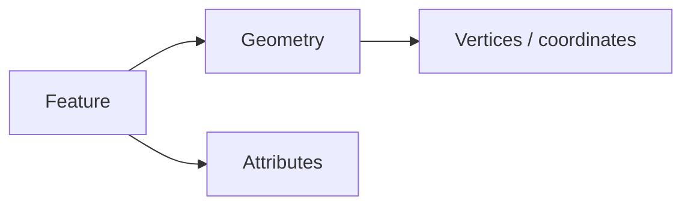
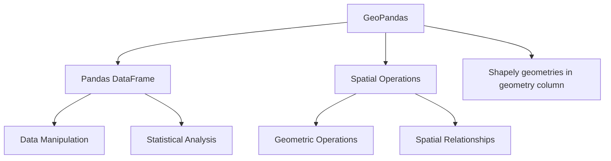
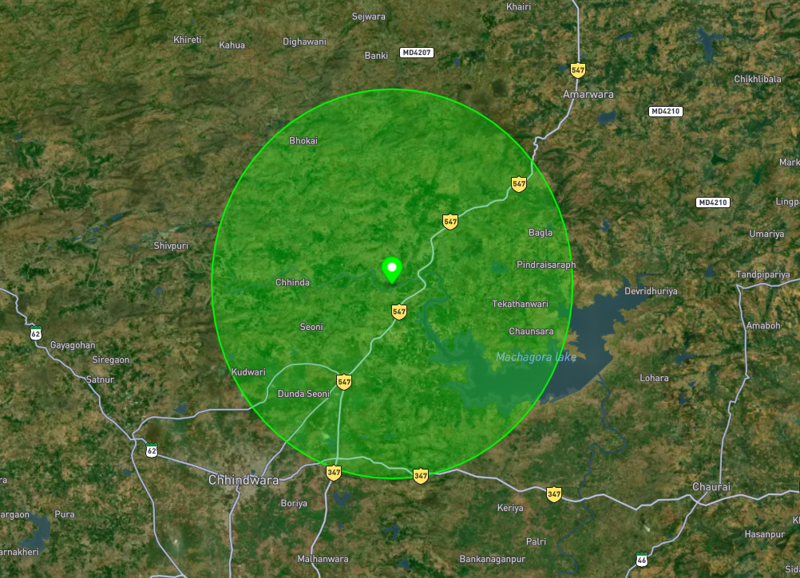
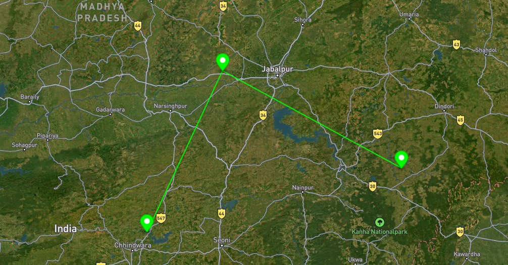
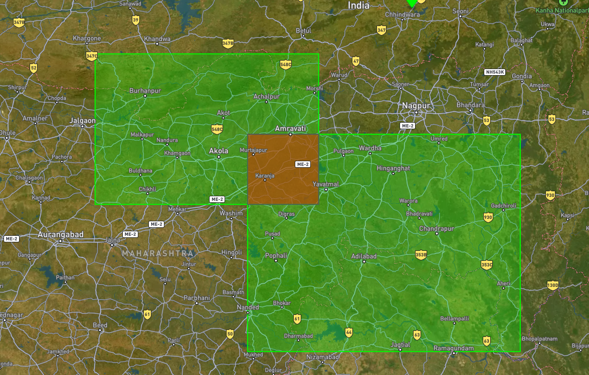
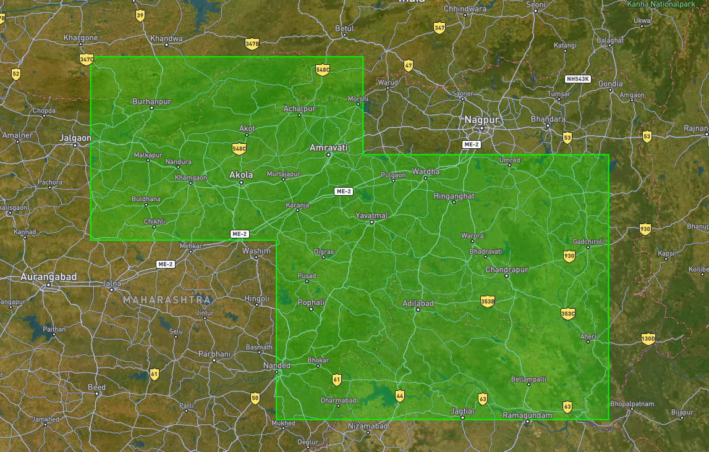
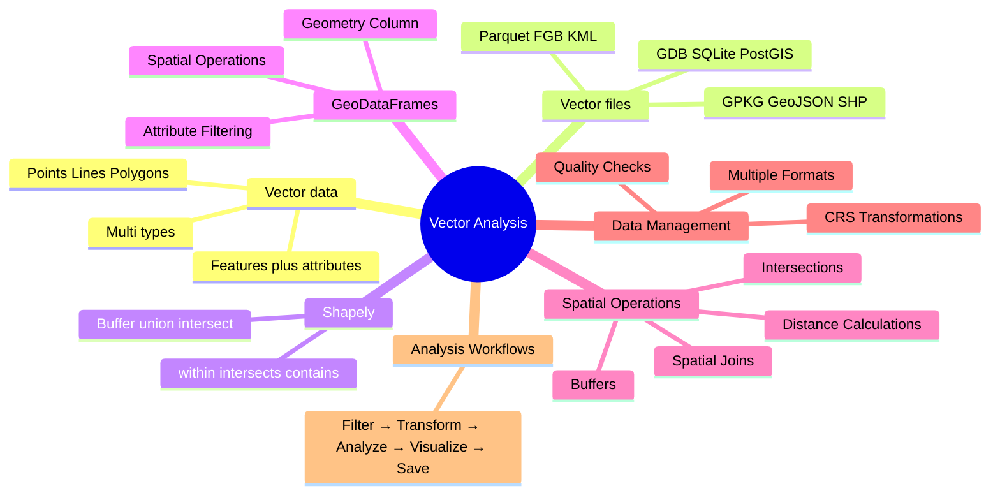
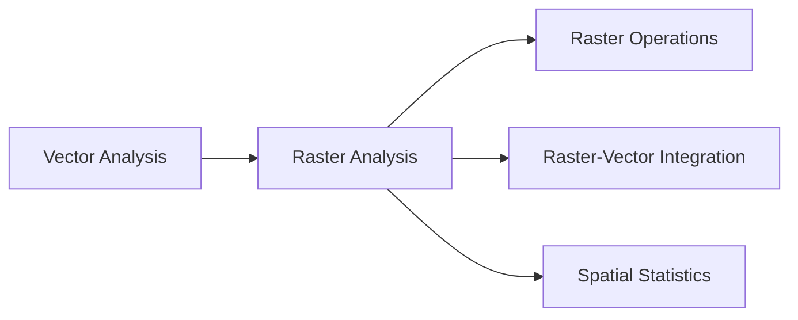

# Module 3: Vector Data & Analysis

## Learning Goals

- Define **vector data** as geometry + attributes and contrast **point, line, polygon** (and **multipart**) roles in GIS
- Navigate common **vector formats** (GeoJSON, Shapefile, GeoPackage, and others) and open them with **GeoPandas**
- Apply **Shapely** to one geometry at a time: **buffer**, **union**, **intersection**, and predicates such as **`within`** / **`intersects`**
- Build and explore **GeoDataFrames**: the **`geometry`** column, **CRS** on the table, and **pandas-style** row/column work
- Run the **GeoPandas basics** loop: **read**, **filter/update attributes**, **reproject** when analysis needs consistent units, **export** to disk
- Complete the **basics assignment** path (**geojson.io**, small files, Shapely + GeoPandas) before the deeper **advanced GeoPandas** topics
- Use **spatial joins**, **overlays**, and other **spatial operations** to relate layers and summarize by geography
- **Create** new geometries (from coordinates or operations) and **write** results to GeoJSON, GeoPackage, or other supported drivers

## What is vector data?

**Vector data** represents real-world objects as **discrete shapes** built from **coordinates** (and optional **measures** or **z** values). Each record is usually a **feature**: a **geometry** (where it is) plus **attributes** (what it is—name, population, land use, and so on). It is stored as **vertices** and how they connect (paths and closed rings), which keeps boundaries, networks, and labelled locations efficient to edit, query, and style.



### Types of vector geometries

Vector layers store one **geometry type** per column (or mixed types in some formats, but GeoPandas still uses one column). The standard types you will see in **GeoJSON**, **Shapefiles**, **GeoPackage**, and **Shapely** are:

| Type | What it stores | Examples |
|------|----------------|----------|
| **Point** | Single `(x, y)` (often lon/lat) | City centroid, sensor, well |
| **LineString** | Ordered sequence of vertices (a path) | Road segment, river reach, contour as line |
| **Polygon** | Closed ring(s): one **exterior** boundary and optional **interior** rings (holes) | Country, lake, building footprint |
| **MultiPoint** | Several separate points in one feature | Multi-campus school as one record |
| **MultiLineString** | Several lines in one feature | Disconnected trail segments under one id |
| **MultiPolygon** | Several polygons in one feature | Archipelago, country with exclaves |
| **GeometryCollection** | Mixed geometries in one feature | Rare; used when one id truly mixes types |

**Simple vs multipart:** a **Polygon** is one connected area; a **MultiPolygon** is many areas that belong to one attribute row (one “feature” in the table). Operations like **buffer** or **union** may change simple types to multipart when shapes split or merge.

### Features, layers, and files

- **Feature** — one row: geometry + attribute fields.
- **Layer** — a collection of features of the same kind (one thematic map layer: “roads”, “parcels”).
- **File / dataset** — may hold one or more layers (GeoPackage and File Geodatabase support multiple layers; one Shapefile set is usually one layer).

The **on-disk format** is only a container: geometry types (Point, Polygon, …) are the same across formats. The next section lists the main **vector file types** you will see in the wild and open with GeoPandas.


## Common vector file formats

Vector GIS data are stored in many **file and database formats**.


| Format | Typical extension(s) | Layers | Typical use | Notes | Example download |
|--------|----------------------|--------|-------------|-------|-------------------|
| **GeoJSON** | `.geojson`, `.json` | Usually one sequence | APIs, web maps, teaching | Plain text; large files can be slow | [example.geojson](assets/examples/example.geojson) |
| **ESRI Shapefile** | `.shp` (+ required sidecars) | One per `.shp` set | Legacy industry exchange | Keep `.dbf`, `.shx`, `.prj` together; 2 GB size limit; use `.cpg` for UTF-8 text | [example.zip](assets/examples/example.zip) (zipped sidecars) |
| **KML** | `.kml` | Folders / structure | Google Earth, simple web | XML; often read via GDAL “KML” / “LIBKML” driver | [example.kml](assets/examples/example.kml) |
| **PostGIS** | (database connection, not a file) | Schemas / tables | Server-side GIS | `gpd.read_postgis()` with SQL | [example.sql](assets/examples/example.sql) (pg_dump–style script) |
| **CSV** | `.csv` | One table | Spreadsheets with a WKT or lon/lat columns | Not a spatial format unless columns are interpreted | [example.csv](assets/examples/example.csv) (`lon` / `lat` columns) |


Many other formats exist (**GeoPackage**, **GML**, **DXF**, etc.); check [GDAL vector drivers](https://gdal.org/drivers/vector/index.html) for the full list your install supports.

### Shapefile: keep the family together

A **shapefile** is never just `.shp`. At minimum you need:

- **`.shp`** — geometry  
- **`.shx`** — index  
- **`.dbf`** — attributes  

Usually also **`.prj`** (CRS) and often **`.cpg`** (text encoding, e.g. UTF-8). Copy or share the **whole set** with the same base name.


## Shapely — 

**Shapely** is a Python library used for creating and working with geometric shapes like points, lines, and polygons. It helps perform spatial operations such as measuring distance, calculating area, and checking relationships like intersection or containment. It is widely used in GIS and works well with GeoPandas.

**Shapely** gives you **`Point`**, **`LineString`**, **`Polygon`**, and **multi** variants as plain Python objects. You construct coordinates, then call methods such as **`.buffer()`**, **`.union()`**, **`.intersection()`**, and **predicates** like **`.within()`** and **`.intersects()`**. Shapely does **not** attach attribute tables—that is what **GeoPandas** adds—but every geometry stored in a GeoDataFrame’s `geometry` column **is a Shapely object**.


It helps us:

- create **points, lines, and polygons**
- measure **distance, length, and area**
- check **spatial relationships**
- perform **buffer, intersection, union, and split operations**

Shapely works with geometry only.

It does **not** manage attribute tables or read GIS files.

---

### 1 — Import Shapely

```python
# Core geometry types and helpers
from shapely.geometry import Point, LineString, Polygon, mapping
from shapely.ops import unary_union, split

# mapping(geom) → GeoJSON-like dict for export or printing
```

---

### 2 — Create points

```python
# School site: (longitude, latitude)
school = Point(79.12, 22.15)

print(school.geom_type)   # Point
print(school.x, school.y) # 79.12 22.15
print(school.wkt)         # POINT (79.12 22.15)
```

Output:

```text
Point
79.12 22.15
POINT (79.12 22.15)
```

---

### 3 — Create lines

```python
# Road or river reach as ordered vertices
road = LineString([
    (79.05, 22.10),
    (79.15, 22.12),
    (79.25, 22.14),
])

print(road.geom_type)
print(road.length)
print(len(road.coords))
```

Output:

```text
LineString
0.204
3
```

### 4 — Create polygons

```python
# Village boundary
village = Polygon([
    (79.10, 22.13),
    (79.14, 22.13),
    (79.14, 22.17),
    (79.10, 22.17),
    (79.10, 22.13),
])

# Nearby lake
lake = Polygon([
    (79.12, 22.11),
    (79.14, 22.11),
    (79.14, 22.13),
    (79.12, 22.13),
    (79.12, 22.11),
])

print(village.geom_type)
print(village.area)
print(village.centroid)
```

Output:

```text
Polygon
0.0016
POINT (79.12 22.15)
```

---

### 5 — Bounds and centroid

Get geometry extent and center.

```python
print(village.bounds)

center = village.centroid

print(center)
print(center.x, center.y)
```

Output:

```text
(79.10, 22.13, 79.14, 22.17)
POINT (79.12 22.15)
79.12 22.15
```

Use case:

- map extent
- zoom to feature
- center label

---

### 6 — Distance between features

```python
print(school.distance(lake))
```

Output:

```text
0.02
```

> Distance uses coordinate units.  
> In EPSG:4326 this value is in degrees.

---

### 7 — Spatial relationships

Check how features relate.

```python
print(village.contains(school))
print(school.within(village))
print(village.intersects(lake))
print(village.touches(lake))
```

Output:

```text
True
True
True
False
```

Useful for:

- schools inside villages
- roads touching parcels
- lakes intersecting boundaries

---

### 8 — Convert to GeoJSON-style dictionary

Useful for exporting.

```python
geojson_data = mapping(village)

print(geojson_data["type"])
print(geojson_data["coordinates"])
```

Output:

```text
Polygon
(((79.10, 22.13), ...))
```


## Introduction to GeoPandas

### What is GeoPandas?

**GeoPandas** is a Python library used to work with **geospatial data** in a tabular format, similar to Pandas. It extends Pandas by adding support for geometry (points, lines, polygons) and spatial operations like mapping, filtering, and projections. It is widely used in GIS and works with libraries like Shapely.


So: **Shapely** = one geometry, many methods; **GeoPandas** = many geometries + attributes + CRS + file read/write + spatial joins and overlays.



### GeoPandas basics: read, export, access, update

These patterns are the same ones you will reuse in the rest of this module: **read** a vector file into a **`GeoDataFrame`**, **inspect** rows and columns, **change** attribute values or add columns, and **write** results back to disk.

**Read a file** — `read_file()` accepts a path, URL, or ZIP; set **`layer=`** when the container has more than one table (GeoPackage, FileGDB).

```python
from pathlib import Path
import geopandas as gpd

# Example: bundled sample GeoJSON (adjust path if your working directory differs)
path = Path("assets/examples/example.geojson")
if not path.exists():
    path = Path("docs/assets/examples/example.geojson")

gdf = gpd.read_file(path)
print(gdf.crs)              # CRS when declared in the file (GeoJSON often EPSG:4326)
print(gdf.shape)            # (number of rows, number of columns)
print(gdf.geometry.name)    # active geometry column name (usually "geometry")
```

**Example printed output** (reading [`assets/examples/example.geojson`](assets/examples/example.geojson) from this course):

```text
EPSG:4326
(5, 6)
geometry
```

So this sample layer has **5 features**, **6 columns** (including `geometry`), WGS 84 coordinates, and the geometry column is named **`geometry`**.

**Access data** — a GeoDataFrame is a **pandas** table plus **`geometry`**: use **`head`**, **`loc`** / **`iloc`**, column names, and boolean filters exactly like a `DataFrame`.

```python
# First rows and all attribute columns + geometry
print(gdf.head(3))

# Subset of columns (default .head() shows five rows)
print(gdf[["name", "geometry"]].head())

# Rows by position or label (use in your own logic; shown here as patterns)
row0 = gdf.iloc[0]
subset = gdf.loc[gdf["name"] == "Feature 3"]

# Geometry types and point coordinates (only for Point rows)
print(gdf.geometry.geom_type.unique())
pts = gdf[gdf.geometry.geom_type == "Point"]
print(pts.geometry.x, pts.geometry.y)
```

**Example printed output** (same `example.geojson` after `read_file` above):

**1 — `print(gdf.head(3))`**

```text
   id       name category  status  value                                         geometry
0   1  Feature 1   region  active    100  POLYGON ((77.57767 21.03445, 77.57767 20.62253...
1   2  Feature 2    route  active    200  LINESTRING (80.65195 23.14701, 80.57995 19.098...
2   3  Feature 3     site  active    300                          POINT (79.56102 21.59242)
```

**2 — `print(gdf[["name", "geometry"]].head())`**

```text
        name                                         geometry
0  Feature 1  POLYGON ((77.57767 21.03445, 77.57767 20.62253...
1  Feature 2  LINESTRING (80.65195 23.14701, 80.57995 19.098...
2  Feature 3                          POINT (79.56102 21.59242)
3  Feature 4                          POINT (76.26425 19.42733)
4  Feature 5  POLYGON ((75.52703 23.63438, 74.33056 21.38052...
```

**3 — `print(gdf.geometry.geom_type.unique())`**

```text
['Polygon' 'LineString' 'Point']
```

**4 — `print(pts.geometry.x, pts.geometry.y)`** (only the two **Point** features)

```text
2    79.561022
3    76.264254
dtype: float64 2    21.592421
3    19.427326
dtype: float64
```

The last line is **two Series** printed one after the other (longitude then latitude index `2` and `3` match the original row indices in `gdf`).

**Update data** — assign **new attribute columns** or overwrite cells with pandas syntax; keep the **`geometry`** column valid when you replace geometries.

```python
# Add / overwrite attribute columns (copy first so you do not mutate a shared view)
gdf = gdf.copy()
gdf["source"] = "example.geojson"
gdf["value_doubled"] = gdf["value"] * 2
print(gdf)

# Update selected rows (pandas .loc on the attribute column)
gdf.loc[gdf["status"] == "active", "status"] = "ACTIVE"
print(gdf)
```

**Example printed output** (continuing from the same `gdf` loaded earlier):

**1 — After adding `source` and `value_doubled` (`print(gdf)`)**

```text
   id       name category    status  value                                         geometry           source  value_doubled
0   1  Feature 1   region    active    100  POLYGON ((77.57767 21.03445, 77.57767 20.62253...  example.geojson            200
1   2  Feature 2    route    active    200  LINESTRING (80.65195 23.14701, 80.57995 19.098...  example.geojson            400
2   3  Feature 3     site    active    300                          POINT (79.56102 21.59242)  example.geojson            600
3   4  Feature 4     site  inactive    400                          POINT (76.26425 19.42733)  example.geojson            800
4   5  Feature 5   region  inactive    500  POLYGON ((75.52703 23.63438, 74.33056 21.38052...  example.geojson           1000
```

**2 — After `gdf.loc[gdf["status"] == "active", "status"] = "ACTIVE"` (`print(gdf)`)**

```text
   id       name category    status  value                                         geometry           source  value_doubled
0   1  Feature 1   region    ACTIVE    100  POLYGON ((77.57767 21.03445, 77.57767 20.62253...  example.geojson            200
1   2  Feature 2    route    ACTIVE    200  LINESTRING (80.65195 23.14701, 80.57995 19.098...  example.geojson            400
2   3  Feature 3     site    ACTIVE    300                          POINT (79.56102 21.59242)  example.geojson            600
3   4  Feature 4     site  inactive    400                          POINT (76.26425 19.42733)  example.geojson            800
4   5  Feature 5   region  inactive    500  POLYGON ((75.52703 23.63438, 74.33056 21.38052...  example.geojson           1000
```

Rows that were **`active`** are now **`ACTIVE`**; **`inactive`** rows are unchanged.

**Export a file** — **`to_file()`** writes GeoPackage, GeoJSON, Shapefile, etc. Pick a **`driver`** when the extension is ambiguous; use **`index=False`**-style options via pandas only for non-spatial exports.

This course ships a **ready-made export** at **[`assets/output/sites_out.geojson`](assets/output/sites_out.geojson)** — it matches the **`gdf`** from the **Update data** step above (`source`, `value_doubled`, `ACTIVE` / `inactive`). Your own `to_file()` run should reproduce the same schema and values.

```python
out_dir = Path("output")
out_dir.mkdir(parents=True, exist_ok=True)

# GeoJSON (good for sharing small layers)
gdf.to_file(out_dir / "sites_out.geojson", driver="GeoJSON")
```
**Bundled output file** (result of the export pipeline — download or open in QGIS):

- **[sites_out.geojson](assets/output/sites_out.geojson)**

## Vector Data Analysis

## Attribute Data Management

Spatial features store geometry, but they also contain **attribute data**.

Attribute data describes **non-spatial information** such as:

- name
- category
- population
- road type
- area
- creation date

GeoPandas stores attributes in a **table structure**, similar to a Pandas DataFrame.

Example:

| id | city | population | district | geometry |
|----|------|------------|----------|----------|
| 1 | Nashik | 1500000 | Nashik | POINT(...) |
| 2 | Pune | 7000000 | Pune | POINT(...) |

Here:

- each **row** = one feature
- each **column** = one field
- `geometry` = spatial column

---

## Attribute table structure

A GeoDataFrame combines:

- **attribute columns**
- **geometry column**
- optional **CRS**

Example:

```python
import geopandas as gpd

gdf = gpd.read_file(
    "assets/examples/example.geojson"
)

print(gdf.columns)
```

Output:

```text
Index([
    'id',
    'name',
    'category',
    'value',
    'geometry'
], dtype='object')
```

Check table size:

```python
print(gdf.shape)
```

Output:

```text
(5, 5)
```

Meaning:

- 5 rows
- 5 columns

Preview first rows:

```python
print(gdf.head())
```

Example:

```text
   id      name   category  value    geometry
0   1  Feature1   region    100    POLYGON(...)
1   2  Feature2   road      200    LINESTRING(...)
```

---

## Field types

Each field stores a specific data type.

Common field types:

| Type | Example | Python dtype |
|------|---------|-------------|
| Text | "Nashik" | object |
| Integer | 10 | int64 |
| Float | 45.7 | float64 |
| Date | 2026-05-25 | datetime64 |
| Boolean | True | bool |

Check field types:

```python
print(gdf.dtypes)
```

Output:

```text
id             int64
name          object
value        float64
geometry    geometry
```

Example table:

| city | population | rainfall | survey_date |
|------|------------|----------|-------------|
| Nashik | 1500000 | 640.5 | 2026-05-25 |

---

## Add fields

Create new attribute columns.

Example:

```python
gdf["state"] = "Maharashtra"

gdf["value_double"] = gdf["value"] * 2

print(gdf)
```

Output:

```text
name      value   value_double
Feature1   100      200
Feature2   200      400
```

Useful for:

- calculated values
- classification
- labels
- metadata

---

## Edit fields

Update existing values.

Example:

```python
gdf.loc[
    gdf["name"] == "Feature1",
    "value"
] = 999

print(gdf)
```

Output:

```text
Feature1   999
```

Edit multiple rows:

```python
gdf.loc[
    gdf["value"] > 200,
    "category"
] = "high"
```

---

## Delete fields

Remove columns.

Example:

```python
gdf = gdf.drop(
    columns=["state"]
)

print(gdf.columns)
```

Output:

```text
Index([
    'id',
    'name',
    'category',
    'value',
    'geometry'
])
```

Useful when:

- removing temporary columns
- cleaning exports
- simplifying data

---

## Sorting attributes

Sort rows by field values.

Ascending:

```python
sorted_gdf = gdf.sort_values(
    by="value"
)

print(sorted_gdf)
```

Descending:

```python
sorted_gdf = gdf.sort_values(
    by="value",
    ascending=False
)

print(sorted_gdf)
```

Example:

```text
Feature3   500
Feature2   200
Feature1   100
```

Useful for:

- highest values
- ranking
- reports

---

## Filtering attributes

Filter rows based on conditions.

Example:

```python
high_value = gdf[
    gdf["value"] > 200
]

print(high_value)
```

Output:

```text
Feature3
Feature4
```

Multiple conditions:

```python
result = gdf[
    (gdf["value"] > 100) &
    (gdf["category"] == "road")
]

print(result)
```

Text filter:

```python
roads = gdf[
    gdf["category"] == "road"
]
```

Useful for:

- selecting roads
- population threshold
- land-use classes

---

## Select by attribute

Select features using SQL-like expressions.

Example:

```python
selected = gdf.query(
    "value > 200"
)

print(selected)
```

Output:

```text
Feature3
Feature4
```

More examples:

Select text:

```python
gdf.query(
    "category == 'road'"
)
```

Select range:

```python
gdf.query(
    "100 <= value <= 300"
)
```

Multiple rules:

```python
gdf.query(
    "category == 'road' and value > 100"
)
```

Use cases:

- find all villages with population > 5000
- select roads by type
- filter recent survey records

---

## Attribute summary statistics

Quick statistics.

```python
print(
    gdf["value"].describe()
)
```

Output:

```text
count      5
mean     240
min      100
max      500
```

Useful for:

- min/max
- average
- analysis

---
## Spatial Queries

Spatial queries allow us to find features based on **their geographic relationship** with other features.

Unlike attribute filtering (`population > 1000`), spatial queries use geometry relationships such as:

- Select by location
- Intersects
- Contains
- Within
- Touches
- Overlaps
- Nearest neighbor

GeoPandas uses **Shapely** geometry methods internally.

---

## Load GeoJSON

We will use this GeoJSON file for all examples.

Save the file as:

```text
assets/examples/spatial_queries.geojson
```

Then read it with GeoPandas.

```python
import geopandas as gpd

gdf = gpd.read_file(
    "assets/examples/spatial_queries.geojson"
)

print(gdf)
print(gdf.geom_type)
```

Example output:

```text
geometry
0 POLYGON(...)
1 LINESTRING(...)
2 POINT(...)
3 POINT(...)
...
```

Check geometry types:

```python
print(
    gdf.geom_type.value_counts()
)
```

Output:

```text
Point         8
Polygon       1
LineString    1
```

Separate geometries:

```python
polygon = gdf[
    gdf.geom_type == "Polygon"
]

line = gdf[
    gdf.geom_type == "LineString"
]

points = gdf[
    gdf.geom_type == "Point"
]
```

Preview:

```python
print(polygon)
print(line)
print(points.head())
```

---

# Select by location

Select features based on location.

Example:

Find points inside polygon.

```python
selected = points[
    points.within(
        polygon.geometry.iloc[0]
    )
]

print(selected)
```

Example output:

```text
POINT (76.817687 17.696219)
POINT (76.815596 17.697099)
POINT (76.815965 17.696059)
```

Use cases:

- villages inside district
- trees inside farm
- wells inside boundary

---

# Intersects

Returns `True` if geometries share any space.

Check points intersect polygon.

```python
print(
    points.intersects(
        polygon.geometry.iloc[0]
    )
)
```

Example output:

```text
2 True
3 False
4 False
5 False
6 True
7 True
8 True
9 False
dtype: bool
```

Check line intersects polygon.

```python
print(
    line.intersects(
        polygon.geometry.iloc[0]
    )
)
```

Output:

```text
1 False
dtype: bool
```

Use cases:

- river crossing village
- road touching district

---

# Contains

Checks if polygon fully contains another geometry.

Example:

```python
print(
    polygon.geometry.iloc[0].contains(
        points.geometry.iloc[0]
    )
)
```

Output:

```text
True
```

Another:

```python
print(
    polygon.geometry.iloc[0].contains(
        points.geometry.iloc[-1]
    )
)
```

Output:

```text
False
```

Use cases:

- district contains village
- farm contains trees

---

# Within

Opposite of contains.

Check which points lie inside polygon.

```python
inside = points.within(
    polygon.geometry.iloc[0]
)

print(inside)
```

Output:

```text
2 True
3 False
4 False
5 False
6 True
7 True
8 True
9 False
dtype: bool
```

Use cases:

- sensors inside zone
- buildings inside parcel

---

# Touches

Returns `True` when boundaries touch.

Example:

```python
print(
    polygon.geometry.iloc[0].touches(
        line.geometry.iloc[0]
    )
)
```

Output:

```text
False
```

Use cases:

- parcel touching road
- shared district border

---

# Overlaps

Returns `True` when geometries partially overlap.

Polygon and line usually do not overlap.

Example:

```python
print(
    polygon.geometry.iloc[0].overlaps(
        line.geometry.iloc[0]
    )
)
```

Output:

```text
False
```

Example for polygons:

```python
poly_only = gdf[
    gdf.geom_type == "Polygon"
]

print(poly_only)
```

Use cases:

- overlapping land parcels
- flood zone overlap

---

# Nearest neighbor

Find closest point to line.

Compute distance.

```python
distances = points.distance(
    line.geometry.iloc[0]
)

print(distances)
```

Example output:

```text
2 0.0041
3 0.0017
4 0.0023
5 0.0015
...
```

Nearest:

```python
nearest = points.iloc[
    distances.idxmin()
]

print(nearest)
```

Output:

```text
POINT (76.820148 17.697331)
```

Use cases:

- nearest road
- nearest hospital
- nearest water source

---

### Block 1 — Buffer around a point

**`.buffer(distance)`** uses the **same units as your coordinates** (here: degrees). For buffers in **meters**, project with GeoPandas (`to_crs("EPSG:32643")`) before buffering, as in the next section.

```python
"""
Buffer a point using meters/kilometers
and print one GeoJSON Feature.
"""

import json
from shapely.geometry import Point, mapping
from shapely.ops import transform
from pyproj import Transformer

# Longitude, Latitude (EPSG:4326)
site = Point(79.03740972004755, 22.178636725204527)

# -----------------------------
# Buffer distance
# -----------------------------
distance_meters = 500          # 500 m
# distance_meters = 2 * 1000   # 2 km

# -----------------------------
# CRS transformers
# WGS84 -> Web Mercator (meters)
# -----------------------------
to_meters = Transformer.from_crs(
    "EPSG:4326",
    "EPSG:3857",
    always_xy=True
).transform

to_wgs84 = Transformer.from_crs(
    "EPSG:3857",
    "EPSG:4326",
    always_xy=True
).transform

# Convert point to projected CRS
site_projected = transform(to_meters, site)

# Buffer in meters
buffer_projected = site_projected.buffer(distance_meters)

# Convert back to WGS84
buffer_polygon = transform(to_wgs84, buffer_projected)

# -----------------------------
# GeoJSON Feature
# -----------------------------
feature = {
    "type": "Feature",
    "properties": {
        "operation": "buffer",
        "radius_meters": distance_meters,
        "radius_km": distance_meters / 1000,
        "center_site": "site_1",
    },
    "geometry": mapping(buffer_polygon),
}

print(json.dumps(feature, indent=2, ensure_ascii=False))
```

!!! tip "Buffers in meters"
    Prefer **`gdf.to_crs("EPSG:32643")`** (WGS 84 / UTM zone 43N for this longitude) then **`.buffer(50000)`** for 50 km, then **`to_crs(4326)`** if you need lon/lat again.

**Printed GeoJSON (`Feature`) output — buffer (sample)**

_Formatted (scroll the box if your theme wraps it):_

<div style="max-height:22rem;overflow-y:auto;border:1px solid #ccc;border-radius:6px;padding:0.5rem;margin:0.75rem 0;background:var(--md-code-bg-color, #f4f4f4);">

```json
{
  "type": "Feature",
  "properties": {
    "operation": "buffer",
    "radius_meters": 500,
    "radius_km": 0.5,
    "center_site": "site_1"
  },
  "geometry": {
    "type": "Polygon",
    "coordinates": [
      [
        [
          79.04190129646813,
          22.178636725204523
        ],
        [
          79.04187966829998,
          22.178229046726464
        ],
        [
          79.04181499208666,
          22.17782529324954
        ],
        [
          79.04170789069542,
          22.177429353190888
        ],
        [
          79.04155939557124,
          22.17704503975161
        ],
        [
          79.0413709368033,
          22.176676054190445
        ],
        [
          79.0411443293526,
          22.17632595017434
        ],
        [
          79.04088175557273,
          22.175998099549567
        ],
        [
          79.04058574419277,
          22.175695659863095
        ],
        [
          79.04025914596407,
          22.175421543947305
        ],
        [
          79.03990510620616,
          22.175178391861195
        ],
        [
          79.03952703451542,
          22.174968545458487
        ],
        [
          79.0391285719289,
          22.17479402582795
        ],
        [
          79.03871355585916,
          22.174656513823297
        ],
        [
          79.0382859831378,
          22.17455733387049
        ],
        [
          79.03784997152385,
          22.174497441208583
        ],
        [
          79.03740972004753,
          22.174477412687075
        ],
        [
          79.03696946857121,
          22.174497441208583
        ],
        [
          79.03653345695727,
          22.17455733387049
        ],
        [
          79.03610588423592,
          22.174656513823297
        ],
        [
          79.03569086816617,
          22.17479402582795
        ],
        [
          79.03529240557965,
          22.174968545458487
        ],
        [
          79.03491433388892,
          22.175178391861195
        ],
        [
          79.034560294131,
          22.175421543947305
        ],
        [
          79.0342336959023,
          22.175695659863095
        ],
        [
          79.03393768452234,
          22.175998099549567
        ],
        [
          79.03367511074246,
          22.17632595017434
        ],
        [
          79.03344850329178,
          22.176676054190445
        ],
        [
          79.03326004452383,
          22.17704503975161
        ],
        [
          79.03311154939965,
          22.177429353190888
        ],
        [
          79.03300444800841,
          22.17782529324954
        ],
        [
          79.03293977179509,
          22.178229046726464
        ],
        [
          79.03291814362693,
          22.178636725204523
        ],
        [
          79.03293977179509,
          22.17904440250007
        ],
        [
          79.03300444800841,
          22.17944815247489
        ],
        [
          79.03311154939965,
          22.179844086846437
        ],
        [
          79.03326004452383,
          22.180228392632145
        ],
        [
          79.03344850329178,
          22.180597368867417
        ],
        [
          79.03367511074246,
          22.180947462243687
        ],
        [
          79.03393768452234,
          22.18127530132356
        ],
        [
          79.0342336959023,
          22.181577729003745
        ],
        [
          79.034560294131,
          22.18185183291324
        ],
        [
          79.03491433388892,
          22.18209497345446
        ],
        [
          79.03529240557965,
          22.182304809217335
        ],
        [
          79.03569086816617,
          22.182479319521974
        ],
        [
          79.03610588423592,
          22.182616823873065
        ],
        [
          79.03653345695727,
          22.182715998138757
        ],
        [
          79.03696946857121,
          22.182775887298558
        ],
        [
          79.03740972004753,
          22.182795914637556
        ],
        [
          79.03784997152385,
          22.182775887298558
        ],
        [
          79.0382859831378,
          22.182715998138757
        ],
        [
          79.03871355585916,
          22.182616823873065
        ],
        [
          79.0391285719289,
          22.182479319521974
        ],
        [
          79.03952703451542,
          22.182304809217335
        ],
        [
          79.03990510620616,
          22.18209497345446
        ],
        [
          79.04025914596407,
          22.18185183291324
        ],
        [
          79.04058574419277,
          22.181577729003745
        ],
        [
          79.04088175557273,
          22.18127530132356
        ],
        [
          79.0411443293526,
          22.180947462243687
        ],
        [
          79.0413709368033,
          22.180597368867417
        ],
        [
          79.04155939557124,
          22.180228392632145
        ],
        [
          79.04170789069542,
          22.179844086846437
        ],
        [
          79.04181499208666,
          22.17944815247489
        ],
        [
          79.04187966829998,
          22.17904440250007
        ],
        [
          79.04190129646813,
          22.178636725204523
        ]
      ]
    ]
  }
}

```

</div>

**Map preview** — buffer around site_1 (same coordinates as above):



### Block 2 — LineString from three points

Builds one **LineString** through the three survey coordinates (order: site_1 → site_2 → site_3) and prints it as GeoJSON.

```python
"""One program: three points → one line → print one GeoJSON Feature."""
import json
from shapely.geometry import Point, LineString, mapping

p1 = Point(79.03740972004755, 22.178636725204527)
p2 = Point(79.55494947888741, 23.199065028047414)
p3 = Point(80.7856252663941, 22.58277453021138)
route = LineString([(p1.x, p1.y), (p2.x, p2.y), (p3.x, p3.y)])

feature = {
    "type": "Feature",
    "properties": {
        "operation": "line_from_points",
        "order": ["site_1", "site_2", "site_3"],
    },
    "geometry": mapping(route),
}
print(json.dumps(feature, indent=2, ensure_ascii=False))
```

**Printed GeoJSON (`Feature`) output — line from points (sample)**

_Formatted (scroll):_

<div style="max-height:22rem;overflow-y:auto;border:1px solid #ccc;border-radius:6px;padding:0.5rem;margin:0.75rem 0;background:var(--md-code-bg-color, #f4f4f4);">

```json
{
  "type": "Feature",
  "properties": {
    "operation": "line_from_points",
    "order": [
      "site_1",
      "site_2",
      "site_3"
    ]
  },
  "geometry": {
    "type": "LineString",
    "coordinates": [
      [
        79.03740972004755,
        22.178636725204527
      ],
      [
        79.55494947888741,
        23.199065028047414
      ],
      [
        80.7856252663941,
        22.58277453021138
      ]
    ]
  }
}
```

</div>

**Map preview** — line through site_1 → site_2 → site_3:



### Block 3 — Intersection of two polygons

Computes **`poly_a.intersection(poly_b)`** (shared area only) and prints it as one GeoJSON **Feature**.

```python
"""One program: two polygons → intersection → print one GeoJSON Feature."""
import json
from shapely.geometry import Polygon, mapping

poly_a = Polygon(
    [
        (75.70190002567679, 21.72372690573995),
        (75.70190002567679, 20.241430489641303),
        (78.05657866688904, 20.241430489641303),
        (78.05657866688904, 21.72372690573995),
        (75.70190002567679, 21.72372690573995),
    ]
)
poly_b = Polygon(
    [
        (77.30739303922036, 20.93443718935589),
        (77.30739303922036, 18.778554619422025),
        (80.17952030424942, 18.778554619422025),
        (80.17952030424942, 20.93443718935589),
        (77.30739303922036, 20.93443718935589),
    ]
)
overlap = poly_a.intersection(poly_b)

feature = {
    "type": "Feature",
    "properties": {"operation": "intersection", "inputs": ["region_north", "region_south"]},
    "geometry": mapping(overlap),
}
print(json.dumps(feature, indent=2, ensure_ascii=False))
```

**Printed GeoJSON (`Feature`) output — intersection (sample)**

_Formatted (scroll):_

<div style="max-height:22rem;overflow-y:auto;border:1px solid #ccc;border-radius:6px;padding:0.5rem;margin:0.75rem 0;background:var(--md-code-bg-color, #f4f4f4);">

```json
{
  "type": "Feature",
  "properties": {
    "operation": "intersection",
    "inputs": [
      "region_north",
      "region_south"
    ]
  },
  "geometry": {
    "type": "Polygon",
    "coordinates": [
      [
        [
          78.05657866688904,
          20.241430489641303
        ],
        [
          77.30739303922036,
          20.241430489641303
        ],
        [
          77.30739303922036,
          20.93443718935589
        ],
        [
          78.05657866688904,
          20.93443718935589
        ],
        [
          78.05657866688904,
          20.241430489641303
        ]
      ]
    ]
  }
}
```

</div>

**Map preview** — intersection of region north and region south:



### Block 4 — Union of two polygons

Computes **`poly_a.union(poly_b)`** (merged outline) and prints it as one GeoJSON **Feature**.

```python
"""One program: two polygons → union → print one GeoJSON Feature."""
import json
from shapely.geometry import Polygon, mapping

poly_a = Polygon(
    [
        (75.70190002567679, 21.72372690573995),
        (75.70190002567679, 20.241430489641303),
        (78.05657866688904, 20.241430489641303),
        (78.05657866688904, 21.72372690573995),
        (75.70190002567679, 21.72372690573995),
    ]
)
poly_b = Polygon(
    [
        (77.30739303922036, 20.93443718935589),
        (77.30739303922036, 18.778554619422025),
        (80.17952030424942, 18.778554619422025),
        (80.17952030424942, 20.93443718935589),
        (77.30739303922036, 20.93443718935589),
    ]
)
merged = poly_a.union(poly_b)

feature = {
    "type": "Feature",
    "properties": {"operation": "union", "inputs": ["region_north", "region_south"]},
    "geometry": mapping(merged),
}
print(json.dumps(feature, indent=2, ensure_ascii=False))
```

**Printed GeoJSON (`Feature`) output — union (sample)**

_Formatted (scroll):_

<div style="max-height:22rem;overflow-y:auto;border:1px solid #ccc;border-radius:6px;padding:0.5rem;margin:0.75rem 0;background:var(--md-code-bg-color, #f4f4f4);">

```json
{
  "type": "Feature",
  "properties": {
    "operation": "union",
    "inputs": [
      "region_north",
      "region_south"
    ]
  },
  "geometry": {
    "type": "Polygon",
    "coordinates": [
      [
        [
          75.70190002567679,
          20.241430489641303
        ],
        [
          75.70190002567679,
          21.72372690573995
        ],
        [
          78.05657866688904,
          21.72372690573995
        ],
        [
          78.05657866688904,
          20.93443718935589
        ],
        [
          80.17952030424942,
          20.93443718935589
        ],
        [
          80.17952030424942,
          18.778554619422025
        ],
        [
          77.30739303922036,
          18.778554619422025
        ],
        [
          77.30739303922036,
          20.241430489641303
        ],
        [
          75.70190002567679,
          20.241430489641303
        ]
      ]
    ]
  }
}
```

</div>

**Map preview** — union of region north and region south (single merged outline):



For **many features** and **attribute tables**, combine the Shapely ideas above with **GeoPandas** tables: read layers, filter rows, and run spatial operations such as **`sjoin`** and **`overlay`** in the sections that follow.

### Block 5 — Within (points inside polygon)

Reads one **GeoJSON file**, takes the **first polygon**, checks all **points within** that polygon, and prints a GeoJSON **FeatureCollection** containing:

- the polygon
- all points inside it

```python
import json
from shapely.geometry import shape, mapping, Point, Polygon

# Input GeoJSON file
INPUT_FILE = "/content/spatial_data.geojson"

# Read GeoJSON
with open(INPUT_FILE, "r", encoding="utf-8") as f:
    data = json.load(f)

# Separate points and polygons
points = []
polygons = []

for feature in data["features"]:
    geom = shape(feature["geometry"])

    if isinstance(geom, Point):
        points.append(geom)

    elif isinstance(geom, Polygon):
        polygons.append(geom)

# Take first polygon
if not polygons:
    raise ValueError("No polygon found in GeoJSON")

target_polygon = polygons[0]

# Find points within polygon
points_within = []

for pt in points:
    if pt.within(target_polygon):
        points_within.append(pt)

# Build output GeoJSON
output_features = []

# Add polygon
output_features.append({
    "type": "Feature",
    "properties": {
        "type": "polygon"
    },
    "geometry": mapping(target_polygon),
})

# Add points within
for pt in points_within:
    output_features.append({
        "type": "Feature",
        "properties": {
            "type": "point_within"
        },
        "geometry": mapping(pt),
    })

# Final FeatureCollection
result = {
    "type": "FeatureCollection",
    "features": output_features,
}

# Print GeoJSON
print(json.dumps(result, indent=2))
```

Example input:

```json
{
  "type": "FeatureCollection",
  "features": [
    {
      "type": "Feature",
      "properties": {},
      "geometry": {
        "type": "Polygon",
        "coordinates": [
          [[0,0],[5,0],[5,5],[0,5],[0,0]]
        ]
      }
    },
    {
      "type": "Feature",
      "properties": {},
      "geometry": {
        "type": "Point",
        "coordinates": [2,2]
      }
    },
    {
      "type": "Feature",
      "properties": {},
      "geometry": {
        "type": "Point",
        "coordinates": [8,8]
      }
    }
  ]
}
```

Example output:

```json
{
  "type": "FeatureCollection",
  "features": [
    {
      "type": "Feature",
      "properties": {
        "operation": "within",
        "feature_type": "polygon"
      },
      "geometry": {
        "type": "Polygon"
      }
    },
    {
      "type": "Feature",
      "properties": {
        "operation": "within",
        "feature_type": "point_within"
      },
      "geometry": {
        "type": "Point",
        "coordinates": [2,2]
      }
    }
  ]
}
```

Use cases:

- schools inside village boundary
- trees inside park
- wells inside survey parcel
- GPS points inside district

> **Note:** `within()` returns `True` only when a point lies completely inside the polygon.  
> If the point touches the polygon boundary exactly, it returns `False`.

### Block 6 — Nearest neighbor (line buffer + nearby points)

Reads one **GeoJSON file**, takes the **first line**, creates a **buffer around the line** using a distance in **kilometers**, finds all **points inside that buffer**, and prints a GeoJSON **FeatureCollection** containing:

- the original line
- the buffer polygon
- all nearby points inside the buffer

```python
"""One program: line buffer + nearby points → print GeoJSON FeatureCollection."""
import json
from shapely.geometry import shape, mapping, Point, LineString
from shapely.ops import transform
from pyproj import Transformer

# Input GeoJSON
INPUT_FILE = "data.geojson"

# Buffer distance
buffer_km = 2
buffer_meters = buffer_km * 1000

# Read GeoJSON
with open(INPUT_FILE, "r", encoding="utf-8") as f:
    data = json.load(f)

# Store features
points = []
lines = []

# Read geometries
for feature in data["features"]:
    geom = shape(feature["geometry"])

    if isinstance(geom, Point):
        points.append(geom)

    elif isinstance(geom, LineString):
        lines.append(geom)

# Take first line
if not lines:
    raise ValueError("No LineString found in GeoJSON")

target_line = lines[0]

# Projection helpers
to_meters = Transformer.from_crs(
    "EPSG:4326",
    "EPSG:3857",
    always_xy=True
).transform

to_wgs84 = Transformer.from_crs(
    "EPSG:3857",
    "EPSG:4326",
    always_xy=True
).transform

# Convert line into projected CRS
line_projected = transform(to_meters, target_line)

# Buffer in meters
buffer_projected = line_projected.buffer(buffer_meters)

# Convert back to WGS84
buffer_polygon = transform(to_wgs84, buffer_projected)

# Points inside buffer
nearby_points = []

for pt in points:
    if pt.within(buffer_polygon):
        nearby_points.append(pt)

# Build output
features = []

# Original line
features.append({
    "type": "Feature",
    "properties": {
        "operation": "nearest_neighbor",
        "feature_type": "line",
    },
    "geometry": mapping(target_line),
})

# Buffer polygon
features.append({
    "type": "Feature",
    "properties": {
        "operation": "nearest_neighbor",
        "feature_type": "buffer",
        "buffer_km": buffer_km,
    },
    "geometry": mapping(buffer_polygon),
})

# Nearby points
for pt in nearby_points:
    features.append({
        "type": "Feature",
        "properties": {
            "operation": "nearest_neighbor",
            "feature_type": "nearby_point",
        },
        "geometry": mapping(pt),
    })

# Final GeoJSON
result = {
    "type": "FeatureCollection",
    "features": features,
}

print(json.dumps(result, indent=2, ensure_ascii=False))
```

Example use cases:

- schools near road
- wells near canal
- trees near river
- bus stops near highway

> **Note:**  
> Buffer distance is measured in **meters/kilometers** using projected CRS (**EPSG:3857**).  
> Only points inside the buffer are returned.


### Block 7 — Polygon buffer

Creates a **buffer around the first polygon** from a GeoJSON variable using distance in **meters / kilometers**, then prints the original polygon + buffer as GeoJSON.

```python
"""One program: polygon buffer → print GeoJSON FeatureCollection."""
import json
from shapely.geometry import shape, mapping, Polygon
from shapely.ops import transform
from pyproj import Transformer

# GeoJSON input
geojson = {
    "type": "FeatureCollection",
    "features": [
        {
            "type": "Feature",
            "properties": {},
            "geometry": {
                "type": "Polygon",
                "coordinates": [[
                    [79.10, 22.13],
                    [79.14, 22.13],
                    [79.14, 22.17],
                    [79.10, 22.17],
                    [79.10, 22.13]
                ]]
            }
        }
    ]
}

# Buffer distance
buffer_km = 1
buffer_meters = buffer_km * 1000

# Collect polygons
polygons = []

for feature in geojson["features"]:
    geom = shape(feature["geometry"])

    if isinstance(geom, Polygon):
        polygons.append(geom)

# Take first polygon
if not polygons:
    raise ValueError("No polygon found")

target_polygon = polygons[0]

# CRS transforms
to_meters = Transformer.from_crs(
    "EPSG:4326",
    "EPSG:3857",
    always_xy=True
).transform

to_wgs84 = Transformer.from_crs(
    "EPSG:3857",
    "EPSG:4326",
    always_xy=True
).transform

# Project polygon
polygon_projected = transform(to_meters, target_polygon)

# Buffer in meters
buffer_projected = polygon_projected.buffer(buffer_meters)

# Convert back
buffer_polygon = transform(to_wgs84, buffer_projected)

# Output GeoJSON
result = {
    "type": "FeatureCollection",
    "features": [
        {
            "type": "Feature",
            "properties": {
                "feature_type": "polygon"
            },
            "geometry": mapping(target_polygon),
        },
        {
            "type": "Feature",
            "properties": {
                "feature_type": "polygon_buffer",
                "buffer_km": buffer_km,
            },
            "geometry": mapping(buffer_polygon),
        },
    ],
}

print(json.dumps(result, indent=2, ensure_ascii=False))
```

Use cases:

- village expansion zone
- lake protection zone
- land parcel setback
- environmental planning

> **Note**
>
> - `1000 meters = 1 kilometer`
> - EPSG:4326 stores coordinates in degrees
> - transform to projected CRS before buffering for accurate distance

### Block 8 — Dissolve buffers

Creates buffers around **multiple polygons** from a GeoJSON variable, merges overlapping buffers into one geometry, and prints GeoJSON.

```python
"""One program: dissolve polygon buffers → print GeoJSON FeatureCollection."""
import json
from shapely.geometry import shape, mapping, Polygon
from shapely.ops import transform, unary_union
from pyproj import Transformer

# GeoJSON input
geojson = {
    "type": "FeatureCollection",
    "features": [
        {
            "type": "Feature",
            "properties": {},
            "geometry": {
                "type": "Polygon",
                "coordinates": [[
                    [79.10, 22.13],
                    [79.14, 22.13],
                    [79.14, 22.17],
                    [79.10, 22.17],
                    [79.10, 22.13]
                ]]
            }
        },
        {
            "type": "Feature",
            "properties": {},
            "geometry": {
                "type": "Polygon",
                "coordinates": [[
                    [79.13, 22.15],
                    [79.17, 22.15],
                    [79.17, 22.19],
                    [79.13, 22.19],
                    [79.13, 22.15]
                ]]
            }
        }
    ]
}

# Buffer distance
buffer_km = 1
buffer_meters = buffer_km * 1000

# Collect polygons
polygons = []

for feature in geojson["features"]:
    geom = shape(feature["geometry"])

    if isinstance(geom, Polygon):
        polygons.append(geom)

if not polygons:
    raise ValueError("No polygons found")

# CRS transforms
to_meters = Transformer.from_crs(
    "EPSG:4326",
    "EPSG:3857",
    always_xy=True
).transform

to_wgs84 = Transformer.from_crs(
    "EPSG:3857",
    "EPSG:4326",
    always_xy=True
).transform

# Create buffers
buffers = []

for polygon in polygons:
    projected = transform(to_meters, polygon)
    buffered = projected.buffer(buffer_meters)
    back = transform(to_wgs84, buffered)

    buffers.append(back)

# Dissolve / merge
merged = unary_union(buffers)

# Output
result = {
    "type": "FeatureCollection",
    "features": [
        {
            "type": "Feature",
            "properties": {
                "feature_type": "dissolved_buffer",
                "buffer_km": buffer_km,
            },
            "geometry": mapping(merged),
        }
    ],
}

print(json.dumps(result, indent=2, ensure_ascii=False))
```

Use cases:

- merge village service areas
- combine protected zones
- dissolve multiple parcel buffers

### Block 9 — Buffer distance units

Shows how to create buffers using **meters and kilometers** from a GeoJSON variable.

```python
"""One program: compare buffer distance units."""
import json
from shapely.geometry import shape, mapping, Point
from shapely.ops import transform
from pyproj import Transformer

# GeoJSON input
geojson = {
    "type": "FeatureCollection",
    "features": [
        {
            "type": "Feature",
            "properties": {},
            "geometry": {
                "type": "Point",
                "coordinates": [79.12, 22.15]
            }
        }
    ]
}

# Distances
distance_meters = 500
distance_km = 2

# Find first point
points = []

for feature in geojson["features"]:
    geom = shape(feature["geometry"])

    if isinstance(geom, Point):
        points.append(geom)

if not points:
    raise ValueError("No point found")

site = points[0]

# CRS transforms
to_meters = Transformer.from_crs(
    "EPSG:4326",
    "EPSG:3857",
    always_xy=True
).transform

to_wgs84 = Transformer.from_crs(
    "EPSG:3857",
    "EPSG:4326",
    always_xy=True
).transform

# Project point
site_projected = transform(to_meters, site)

# Buffers
buffer_500m = site_projected.buffer(distance_meters)
buffer_2km = site_projected.buffer(distance_km * 1000)

# Back to WGS84
buffer_500m = transform(to_wgs84, buffer_500m)
buffer_2km = transform(to_wgs84, buffer_2km)

# Output
result = {
    "type": "FeatureCollection",
    "features": [
        {
            "type": "Feature",
            "properties": {
                "distance": "500 meters"
            },
            "geometry": mapping(buffer_500m),
        },
        {
            "type": "Feature",
            "properties": {
                "distance": "2 kilometers"
            },
            "geometry": mapping(buffer_2km),
        },
    ],
}

print(json.dumps(result, indent=2, ensure_ascii=False))
```

Use cases:

- 500 meter walking zone
- 2 km service radius
- compare different buffer distances

> **Note**
>
> - `1000 meters = 1 kilometer`
> - EPSG:4326 stores coordinates in degrees
> - convert to projected CRS before buffering for accurate distance

### Block 10 — Clip

Uses the **first polygon as clip boundary**, clips all other polygons to that boundary, and prints a GeoJSON **FeatureCollection**.

```python
"""One program: clip polygons using first polygon."""
import json
from shapely.geometry import shape, mapping, Polygon

# GeoJSON input
geojson = {
    "type": "FeatureCollection",
    "features": [
        {
            # Clip boundary
            "type": "Feature",
            "properties": {
                "name": "clip_area"
            },
            "geometry": {
                "type": "Polygon",
                "coordinates": [[
                    [79.10, 22.13],
                    [79.16, 22.13],
                    [79.16, 22.19],
                    [79.10, 22.19],
                    [79.10, 22.13]
                ]]
            }
        },
        {
            # Polygon to clip
            "type": "Feature",
            "properties": {
                "name": "village_1"
            },
            "geometry": {
                "type": "Polygon",
                "coordinates": [[
                    [79.12, 22.15],
                    [79.18, 22.15],
                    [79.18, 22.21],
                    [79.12, 22.21],
                    [79.12, 22.15]
                ]]
            }
        },
        {
            # Polygon to clip
            "type": "Feature",
            "properties": {
                "name": "village_2"
            },
            "geometry": {
                "type": "Polygon",
                "coordinates": [[
                    [79.08, 22.11],
                    [79.13, 22.11],
                    [79.13, 22.16],
                    [79.08, 22.16],
                    [79.08, 22.11]
                ]]
            }
        }
    ]
}

# Collect polygons
polygons = []

for feature in geojson["features"]:
    geom = shape(feature["geometry"])

    if isinstance(geom, Polygon):
        polygons.append(geom)

# First polygon = clip boundary
if not polygons:
    raise ValueError("No polygons found")

clip_boundary = polygons[0]

# Clip remaining polygons
features = []

# Add clip boundary
features.append({
    "type": "Feature",
    "properties": {
        "feature_type": "clip_boundary"
    },
    "geometry": mapping(clip_boundary),
})

# Clip polygons
for polygon in polygons[1:]:
    clipped = polygon.intersection(clip_boundary)

    if not clipped.is_empty:
        features.append({
            "type": "Feature",
            "properties": {
                "feature_type": "clipped_polygon"
            },
            "geometry": mapping(clipped),
        })

# Final GeoJSON
result = {
    "type": "FeatureCollection",
    "features": features,
}

print(json.dumps(result, indent=2, ensure_ascii=False))
```

Use cases:

- clip villages inside district
- roads inside project boundary
- forest area inside study area
- parcel data inside admin boundary

> **Note**
>
> - first polygon is used as clip boundary
> - `intersection()` returns only overlapping area
> - non-overlapping features are ignored

## Measurement & Proximity

### Block 11 — Area calculation

Calculates the **area of a polygon** and prints the result in **square meters (`sqm`)** and **square kilometers (`sqkm`)**.

```python
"""One program: polygon area calculation."""
import json
from shapely.geometry import shape, Polygon
from shapely.ops import transform
from pyproj import Transformer

# GeoJSON input
geojson = {
    "type": "FeatureCollection",
    "features": [
        {
            "type": "Feature",
            "properties": {},
            "geometry": {
                "type": "Polygon",
                "coordinates": [[
                    [79.10, 22.13],
                    [79.14, 22.13],
                    [79.14, 22.17],
                    [79.10, 22.17],
                    [79.10, 22.13]
                ]]
            }
        }
    ]
}

# WGS84 -> projected CRS in meters
to_meters = Transformer.from_crs(
    "EPSG:4326",
    "EPSG:3857",
    always_xy=True
).transform

for feature in geojson["features"]:
    geom = shape(feature["geometry"])

    if isinstance(geom, Polygon):
        # Convert polygon into meters
        geom_projected = transform(to_meters, geom)

        # Area in square meters
        area_sqm = geom_projected.area

        # Convert to square kilometers
        area_sqkm = area_sqm / 1_000_000

        print("Area (sqm):", round(area_sqm, 2))
        print("Area (sqkm):", round(area_sqkm, 4))
```
Example output:

```text
Area (sqm): 21884545.37
Area (sqkm): 21.8845
```

Use cases:

- parcel size
- village area
- lake coverage

> Area is in coordinate units unless projected CRS is used.

### Block 12 — Length calculation (meters / kilometers)

Calculates the **length of a line** and prints the result in **meters (`m`)** and **kilometers (`km`)**.

```python
"""One program: line length calculation."""
import json
from shapely.geometry import shape, LineString
from shapely.ops import transform
from pyproj import Transformer

geojson = {
    "type": "FeatureCollection",
    "features": [
        {
            "type": "Feature",
            "geometry": {
                "type": "LineString",
                "coordinates": [
                    [79.05, 22.10],
                    [79.15, 22.12],
                    [79.25, 22.14]
                ]
            },
            "properties": {}
        }
    ]
}

# WGS84 -> projected CRS in meters
to_meters = Transformer.from_crs(
    "EPSG:4326",
    "EPSG:3857",
    always_xy=True
).transform

for feature in geojson["features"]:
    geom = shape(feature["geometry"])

    if isinstance(geom, LineString):
        # Convert line into meters
        geom_projected = transform(to_meters, geom)

        # Length in meters
        length_m = geom_projected.length

        # Convert to kilometers
        length_km = length_m / 1000

        print("Length (m):", round(length_m, 2))
        print("Length (km):", round(length_km, 3))
```

Example output:

```text
Length (m): 22792.41
Length (km): 22.792
```

Use cases:

- road length
- canal length
- river segment
- utility pipelines
- railway tracks

### Block 13 — Distance measurement (meters / kilometers)

Measures the **distance between two points** and prints the result in **meters (`m`)** and **kilometers (`km`)**.

```python
"""One program: distance between points."""
import json
from shapely.geometry import shape, Point
from shapely.ops import transform
from pyproj import Transformer

geojson = {
    "type": "FeatureCollection",
    "features": [
        {
            "type": "Feature",
            "geometry": {
                "type": "Point",
                "coordinates": [79.12, 22.15]
            },
            "properties": {}
        },
        {
            "type": "Feature",
            "geometry": {
                "type": "Point",
                "coordinates": [79.18, 22.20]
            },
            "properties": {}
        }
    ]
}

# WGS84 -> projected CRS in meters
to_meters = Transformer.from_crs(
    "EPSG:4326",
    "EPSG:3857",
    always_xy=True
).transform

points = []

for feature in geojson["features"]:
    geom = shape(feature["geometry"])

    if isinstance(geom, Point):
        # Convert point into meters
        point_projected = transform(to_meters, geom)
        points.append(point_projected)

if len(points) >= 2:
    # Distance in meters
    distance_m = points[0].distance(points[1])

    # Convert to kilometers
    distance_km = distance_m / 1000

    print("Distance (m):", round(distance_m, 2))
    print("Distance (km):", round(distance_km, 3))
```

Example output:

```text
Distance (m): 8625.47
Distance (km): 8.625
```

Use cases:

- school to hospital
- village to well
- tower to tower
- customer to delivery point
- bus stop to railway station

### Block 14 — Nearest feature

Finds the **nearest point** to the first point.

```python
"""One program: nearest feature."""
import json
from shapely.geometry import shape, Point, mapping

geojson = {
    "type": "FeatureCollection",
    "features": [
        {
            "type": "Feature",
            "geometry": {
                "type": "Point",
                "coordinates": [79.12, 22.15]
            },
            "properties": {
                "name": "school"
            }
        },
        {
            "type": "Feature",
            "geometry": {
                "type": "Point",
                "coordinates": [79.13, 22.16]
            },
            "properties": {
                "name": "hospital"
            }
        },
        {
            "type": "Feature",
            "geometry": {
                "type": "Point",
                "coordinates": [79.25, 22.25]
            },
            "properties": {
                "name": "market"
            }
        }
    ]
}

points = []

for feature in geojson["features"]:
    geom = shape(feature["geometry"])

    if isinstance(geom, Point):
        points.append(geom)

target = points[0]

nearest = None
nearest_distance = None

for pt in points[1:]:
    d = target.distance(pt)

    if nearest is None or d < nearest_distance:
        nearest = pt
        nearest_distance = d

result = {
    "type": "FeatureCollection",
    "features": [
        {
            "type": "Feature",
            "properties": {
                "feature_type": "target_point"
            },
            "geometry": mapping(target),
        },
        {
            "type": "Feature",
            "properties": {
                "feature_type": "nearest_point",
                "distance": nearest_distance,
            },
            "geometry": mapping(nearest),
        }
    ],
}

print(json.dumps(result, indent=2, ensure_ascii=False))
```

Use cases:

- nearest hospital
- nearest water source
- nearest bus stop
- nearest tower

### Block 15 — Line intersects polygon

Checks whether a **line crosses a polygon**, returns the **polygon**, **original line**, and **intersected line** as GeoJSON, and calculates both line lengths in **meters** and **kilometers**.

```python
"""One program: line intersects polygon."""
import json
from shapely.geometry import shape, mapping, LineString, Polygon
from shapely.ops import transform
from pyproj import Transformer

geojson = {
    "type": "FeatureCollection",
    "features": [
        {
            "type": "Feature",
            "geometry": {
                "type": "Polygon",
                "coordinates": [[
                    [79.10, 22.13],
                    [79.16, 22.13],
                    [79.16, 22.19],
                    [79.10, 22.19],
                    [79.10, 22.13]
                ]]
            },
            "properties": {}
        },
        {
            "type": "Feature",
            "geometry": {
                "type": "LineString",
                "coordinates": [
                    [79.08, 22.15],
                    [79.18, 22.17]
                ]
            },
            "properties": {}
        }
    ]
}

# WGS84 -> projected CRS in meters
to_meters = Transformer.from_crs(
    "EPSG:4326",
    "EPSG:3857",
    always_xy=True
).transform

polygon = None
line = None

for feature in geojson["features"]:
    geom = shape(feature["geometry"])

    if isinstance(geom, Polygon):
        polygon = geom

    elif isinstance(geom, LineString):
        line = geom

# Original line length
line_projected = transform(to_meters, line)
original_length_m = line_projected.length
original_length_km = original_length_m / 1000

# Intersection geometry
intersection = line.intersection(polygon)

# Intersection length
intersection_length_m = 0
intersection_length_km = 0

if not intersection.is_empty:
    intersection_projected = transform(to_meters, intersection)
    intersection_length_m = intersection_projected.length
    intersection_length_km = intersection_length_m / 1000

result = {
    "type": "FeatureCollection",
    "features": [
        {
            "type": "Feature",
            "properties": {
                "name": "polygon",
                "fill": "#d9d9d9",
                "fill-opacity": 0.4,
                "stroke": "#666666",
                "stroke-width": 1
            },
            "geometry": mapping(polygon)
        },
        {
            "type": "Feature",
            "properties": {
                "name": "original_line",
                "color": "blue",
                "length_m": round(original_length_m, 2),
                "length_km": round(original_length_km, 3),
                "stroke": "#0066ff",
                "stroke-width": 2,
                "stroke-opacity": 1
            },
            "geometry": mapping(line)
        },
        {
            "type": "Feature",
            "properties": {
                "name": "intersection_line",
                "color": "red",
                "length_m": round(intersection_length_m, 2),
                "length_km": round(intersection_length_km, 3),
                "stroke": "#e00000",
                "stroke-width": 2,
                "stroke-opacity": 1
            },
            "geometry": mapping(intersection)
        }
    ]
}

print(json.dumps(result, indent=2, ensure_ascii=False))
```

Example output:

```text
original_line length: 10.602 km
intersection_line length: 6.833 km
```

Use cases:

- road crossing district
- canal through parcel
- powerline crossing boundary
- railway through land parcel
- river inside village boundary


### Block 16 — Line intersection

Checks whether **two lines intersect**, returns both lines and the **intersection point** as GeoJSON.

```python
"""One program: line intersection."""
import json
from shapely.geometry import shape, mapping

geojson = {
    "type": "FeatureCollection",
    "features": [
        {
            "type": "Feature",
            "geometry": {
                "type": "LineString",
                "coordinates": [
                    [0, 0],
                    [5, 5]
                ]
            },
            "properties": {}
        },
        {
            "type": "Feature",
            "geometry": {
                "type": "LineString",
                "coordinates": [
                    [0, 5],
                    [5, 0]
                ]
            },
            "properties": {}
        }
    ]
}

line_a = shape(geojson["features"][0]["geometry"])
line_b = shape(geojson["features"][1]["geometry"])

# Find intersection
intersection = line_a.intersection(line_b)

result = {
    "type": "FeatureCollection",
    "features": [
        {
            "type": "Feature",
            "properties": {
                "name": "line_1",
                "color": "blue",
                "stroke": "#0066ff",
                "stroke-width": 2,
                "stroke-opacity": 1
            },
            "geometry": mapping(line_a)
        },
        {
            "type": "Feature",
            "properties": {
                "name": "line_2",
                "color": "green",
                "stroke": "#00a651",
                "stroke-width": 2,
                "stroke-opacity": 1
            },
            "geometry": mapping(line_b)
        },
        {
            "type": "Feature",
            "properties": {
                "name": "intersection_point",
                "color": "red",
                "marker-color": "#e00000"
            },
            "geometry": mapping(intersection)
        }
    ]
}

print(json.dumps(result, indent=2, ensure_ascii=False))
```

Example output:

```text
line_1 and line_2 intersect at POINT (2.5 2.5)
```

Use cases:

- road intersection
- crossing utility lines
- railway crossing
- route network analysis
- drainage network crossing

### Block 17 — Centroid intersection check

Checks whether the **centroid of one polygon lies inside another polygon**, and returns both polygons plus the centroid as GeoJSON.

```python
"""One program: centroid inside polygon."""
import json
from shapely.geometry import shape, mapping

geojson = {
    "type": "FeatureCollection",
    "features": [
        {
            "type": "Feature",
            "geometry": {
                "type": "Polygon",
                "coordinates": [[
                    [0, 0],
                    [4, 0],
                    [4, 4],
                    [0, 4],
                    [0, 0]
                ]]
            },
            "properties": {}
        },
        {
            "type": "Feature",
            "geometry": {
                "type": "Polygon",
                "coordinates": [[
                    [2, 2],
                    [8, 2],
                    [8, 8],
                    [2, 8],
                    [2, 2]
                ]]
            },
            "properties": {}
        }
    ]
}

polygon_a = shape(geojson["features"][0]["geometry"])
polygon_b = shape(geojson["features"][1]["geometry"])

# Centroid of first polygon
centroid = polygon_a.centroid

# Check if centroid lies inside polygon_b
is_inside = polygon_b.contains(centroid)

result = {
    "type": "FeatureCollection",
    "features": [
        {
            "type": "Feature",
            "properties": {
                "name": "polygon_a",
                "fill": "#4da6ff",
                "fill-opacity": 0.35,
                "stroke": "#0066cc",
                "stroke-width": 1
            },
            "geometry": mapping(polygon_a)
        },
        {
            "type": "Feature",
            "properties": {
                "name": "polygon_b",
                "fill": "#66cc66",
                "fill-opacity": 0.35,
                "stroke": "#008000",
                "stroke-width": 1
            },
            "geometry": mapping(polygon_b)
        },
        {
            "type": "Feature",
            "properties": {
                "name": "centroid",
                "inside_polygon_b": is_inside,
                "marker-color": "#e00000"
            },
            "geometry": mapping(centroid)
        }
    ]
}

print(json.dumps(result, indent=2, ensure_ascii=False))
```

Example output:

```text
Centroid inside polygon_b: True
```

Use cases:

- assign parcel to zone
- find center inside district
- building center inside campus
- village center inside boundary
- locate centroid inside service area


### Block 18 — Check if point is within polygon

Takes **one polygon** and **one point**, checks whether the point is inside the polygon, and prints `True` or `False`.

```python
"""One program: check point within polygon."""
from shapely.geometry import Point, Polygon

# Polygon
polygon = Polygon([
    (79.10, 22.13),
    (79.16, 22.13),
    (79.16, 22.19),
    (79.10, 22.19),
    (79.10, 22.13),
])

# Point
point = Point(79.12, 22.15)

# Check
is_inside = point.within(polygon)

print(is_inside)
```

Example output:

```text
True
```

Example with point outside:

```python
point = Point(79.20, 22.25)

print(point.within(polygon))
```

Output:

```text
False
```

Use cases:

- school inside village
- tree inside park
- survey point inside parcel
- well inside district

> **Note**
>
> - `within()` returns **True** only when point is fully inside polygon
> - if point lies exactly on polygon boundary → returns **False**


## Basics assignment: vectors, Shapely, GeoPandas & geojson.io

These assignments recap this module’s **vector** ideas (points, lines, polygons), **Shapely** constructors and spatial predicates, **GeoPandas** I/O and attribute tables, and working with **GeoJSON** files. Complete them in order where it helps; each should take a short notebook or script. (CRS **reprojection** is covered later in this chapter; this assignment stays in **lon/lat** unless your instructor says otherwise.)

Use **[geojson.io](https://geojson.io/)** to sketch geometries on a map: draw on the map, edit the JSON on the right, then **Save** (menu) or copy the **FeatureCollection** into a `.geojson` file. geojson.io uses **WGS 84 (lon/lat)**; when you build a `GeoDataFrame` by hand, set **`crs="EPSG:4326"`** so it matches.

!!! tip "geojson.io workflow"
    - Draw with the point / line / polygon tools, then click features to edit **properties** (add fields like `name`, `id`, `population`, `priority`).
    - **Save → GeoJSON** downloads a file you can open with **`gpd.read_file("your_file.geojson")`**.
    - If the site shows only a **Feature**, wrap it in a **FeatureCollection** or save as-is.

1. **Create and download a point** — In geojson.io, place one **Point**, set a property **`name`**. Download/save as `my_place.geojson`. Load with GeoPandas, print CRS, preview rows, and confirm geometry type is `Point`.

2. **LineString length** — Draw a **LineString** with at least **three** vertices. Export, load in Python, print length and total bounds. In one sentence, explain why length is **not** metres yet.

3. **Polygon area and centroid** — Draw one **Polygon**. Export, load, print area and centroid. Note: in **EPSG:4326**, area is in **degree²**, which is fine for practice.

4. **Shapely buffer** — Load your polygon from (3) as a Shapely geometry, create a buffer, and export it as GeoJSON. Optional: open the result in geojson.io.

5. **Intersection** — Create **two overlapping polygons**. Export as one FeatureCollection. In Python, calculate the intersection and identify the overlap geometry type.

6. **Attributes: add and export** — Load any geojson.io export. Add columns such as **`source`** and **`student_id`**. Save as GeoJSON, re-open, and verify rows and columns.

7. **Filter by attribute** — Give at least two features a numeric property such as **`priority`**. Keep only rows with a selected value or higher. Print the filtered result and row count.

8. **Point in polygon** — Draw one **polygon** and one **point inside** it. Load and check whether the point lies inside the polygon. Repeat with a point outside and compare results.

9. **Pure-Python FeatureCollection** — Without geojson.io, create **Point**, **LineString**, and **Polygon** geometries, build a GeoDataFrame, export to GeoJSON, and open it in geojson.io to visually check.

10. **Polygon buffer** — Draw one polygon. Create a buffer around it and compare the original and buffered geometry. Note how the shape and area change.

11. **Dissolve buffers** — Draw two nearby polygons. Buffer both and merge the buffers. Observe whether overlapping areas dissolve into one geometry.

12. **Clip** — Create one large polygon and two smaller polygons. Use the large polygon as the clip boundary. Identify which geometry remains after clipping.

13. **Nearest feature** — Draw one point and multiple nearby points. Find the nearest point and note the measured distance.

14. **Line buffer + nearby points** — Draw one line and several points around it. Create a buffer around the line and identify which points fall inside.

15. **Touches vs overlaps** — Create polygons that touch at an edge and polygons that overlap. Compare the results and describe the difference.

16. **Contains and within** — Draw one polygon and several points. Check which points are contained by the polygon and compare with the within relationship.

17. **Area and perimeter** — Draw a polygon and calculate both area and perimeter. Write one sentence explaining the difference.

18. **Export formats** — Export one layer as:
    - GeoJSON
    - GeoPackage
    - Shapefile

    Compare:
    - file size
    - readability
    - whether multiple layers are supported

Submit your **`.geojson` files**, a single **`.py` or `.ipynb`**, and short answers for any “explain” prompts your instructor assigns.

---

## Advanced GeoPandas workflows

The sections below use **larger teaching datasets** (for example Natural Earth) and go deeper into **CRS**, **spatial operations**, **joins**, and **writing results**. Complete the **Basics assignment** first if you want the geojson.io + Shapely + small-table workflow fresh before scaling up.

## Setting Up the Environment

```python
import geopandas as gpd
import pandas as pd
import matplotlib.pyplot as plt
import numpy as np
from shapely.geometry import Point, LineString, Polygon
import warnings


# Set up plotting
plt.style.use('default')
```

## 1. Understanding GeoDataFrames

A **GeoDataFrame** is like a regular pandas DataFrame but with a special **geometry column**:

```python
# Load Natural Earth data
import geopandas as gpd

world=gpd.read_file("/content/countries.zip")
states=gpd.read_file("/content/states.zip")
cities=gpd.read_file("/content/city.geojson")

print("=== WORLD COUNTRIES GEODATAFRAME ===")
print(f"Type: {type(world)}")
print(f"Shape: {world.shape}")
print(f"CRS: {world.crs}")
print(f"Geometry column: {world.geometry.name}")

# Inspect the data
print("\n=== COLUMNS ===")
print(sorted(world.columns.tolist()))

print("\n=== FIRST FEW ROWS ===")
print(world[['name', 'continent', 'pop_est', 'geometry']].head())
```

### The Geometry Column

```python
# Examine geometry types
print("=== GEOMETRY ANALYSIS ===")
print(f"Geometry types: {world.geometry.type.value_counts()}")

# Get geometric properties
print(f"\nTotal bounds: {world.total_bounds}")  # [minx, miny, maxx, maxy]
print(f"Is valid: {world.geometry.is_valid.all()}")

# Individual geometry properties
usa = world[world['name'] == 'United States of America'].iloc[0]
print(f"\nUSA geometry type: {usa.geometry.geom_type}")
print(f"USA bounds: {usa.geometry.bounds}")
print(f"USA area (degrees²): {usa.geometry.area:.2f}")
print(f"USA centroid: {usa.geometry.centroid}")
```

## 2. Loading and Inspecting Vector Data

### Loading Different Data Sources

```python
# Method 1: Natural Earth data (built-in)
world = gpd.read_file(gpd.datasets.get_path('naturalearth_lowres'))
cities = gpd.read_file(gpd.datasets.get_path('naturalearth_cities'))

# Method 2: From URL (example)
# world = gpd.read_file('https://naturalearth.s3.amazonaws.com/110m_cultural/ne_110m_admin_0_countries.zip')

# Method 3: From local file
# world = gpd.read_file('path/to/your/shapefile.shp')
# world = gpd.read_file('path/to/your/geojson.geojson')

print("=== DATA OVERVIEW ===")
print(f"Countries: {len(world)} features")
print(f"Cities: {len(cities)} features")
```

### Data Quality Checks

```python
def inspect_geodataframe(gdf, name):
    """Comprehensive inspection of a GeoDataFrame"""
    print(f"\n=== {name.upper()} INSPECTION ===")
    print(f"Shape: {gdf.shape}")
    print(f"CRS: {gdf.crs}")
    print(f"Geometry types: {gdf.geometry.type.value_counts().to_dict()}")
    print(f"Valid geometries: {gdf.geometry.is_valid.sum()}/{len(gdf)}")
    print(f"Bounds: {gdf.total_bounds}")
    
    # Check for empty geometries
    empty_geoms = gdf.geometry.is_empty.sum()
    if empty_geoms > 0:
        print(f"⚠️  Empty geometries: {empty_geoms}")
    
    return gdf

# Inspect our datasets
world = inspect_geodataframe(world, "World Countries")
cities = inspect_geodataframe(cities, "Cities")
```

## 3. Attribute-Based Filtering

### Basic Filtering

```python
# Filter by single condition

# Just to handle large number
import pandas as pd
pd.options.display.float_format = '{:,.0f}'.format

large_countries = world[world['POP_EST'] > 100_000_000]
print(f"Countries with >100M people: {len(large_countries)}")
print(large_countries[['NAME', 'POP_EST']].sort_values('POP_EST', ascending=False))

# Filter by multiple conditions
large_rich_countries = world[
    (world['POP_EST'] > 50_000_000) & 
    (world['GDP_MD'] > 1_000_000)
]
print(f"\nLarge (50M) & wealthy countries (1M GDP): {len(large_rich_countries)}")

# Filter by continent
asian_countries = world[world['REGION_UN'] == 'Asia']
print(f"\nAsian countries: {len(asian_countries)}")

# Filter using isin() for multiple values
developed_continents = world[world['REGION_UN'].isin(['Europe', 'North America'])]
print(f"European & North American countries: {len(developed_continents)}")
```

### Exporting and Visualizing

```python
# Export Asian countries to GeoJSON
asian_countries.to_file(
    "asian_countries.geojson",
    driver="GeoJSON"
)

# Visualize Asian countries
import matplotlib.pyplot as plt
fig, ax = plt.subplots(figsize=(10, 8))
asian_countries.plot(
    ax=ax,
    color="lightgreen",
    edgecolor="black"
)

ax.set_title("Asian Countries")
plt.show()

ax.set_title("Asian Countries")
plt.show()

# Load and visualize from GeoJSON with color mapping
asia_geojson = gpd.read_file("asian_countries.geojson")

asia_geojson.plot(
    figsize=(10, 8),
    column="NAME",
    cmap="hsv",
    edgecolor="black"
)
plt.title("Asian Countries (Loaded from GeoJSON)")
plt.show()
```

### String Operations

```python
# Countries with 'United' in the name
united_countries = world[world['NAME'].str.contains('United', na=False)]
print("Countries with 'United' in name:")
print(united_countries['NAME'].tolist())

# Countries starting with 'S'
s_countries = world[world['NAME'].str.startswith('S')]
print(f"\nCountries starting with 'S': {len(s_countries)}")

# Case-insensitive search
island_countries = world[world['NAME'].str.contains('island', case=False, na=False)]
print(f"Countries with 'island' in name: {len(island_countries)}")

# Countries with "South" AND "Africa"
south_africa_like = world[
    world['NAME'].str.contains('South', na=False) &
    world['NAME'].str.contains('Africa', na=False)
]

print("Countries with 'South' and 'Africa':")
print(south_africa_like['NAME'].tolist())

# Countries with "New" OR "United"
new_or_united = world[
    world['NAME'].str.contains('New', na=False) |
    world['NAME'].str.contains('United', na=False)
]

print("Countries with 'New' or 'United':")
print(new_or_united['NAME'].tolist())
```

## 4. Coordinate Reference Systems & Reprojection

### Understanding CRS

```python
print("=== CRS INFORMATION ===")
print(f"World CRS: {world.crs}")
print(f"States CRS: {states.crs}")

# Check if CRS match
if world.crs == states.crs:
    print("✅ CRS match - safe for spatial operations")
else:
    print("❌ CRS mismatch - need to reproject")
```

### Reprojection for Analysis

```python
# For area calculations, use an equal-area projection
# Mollweide is good for global area calculations
world_equal_area = world.to_crs('+proj=moll')

# Calculate areas in km² using the reprojected data
world_equal_area['area_km2_calc'] = world_equal_area.geometry.area / 1_000_000

# Calculate areas in degrees squared from original
world['area_deg2'] = world.geometry.area
world['area_km2'] = world.area_deg2 / 1_000_000

# Compare both calculations
world_equal_area['area_km2_orig'] = world['area_km2']

comparison = world_equal_area[['NAME', 'area_km2_orig', 'area_km2_calc']].copy()
comparison['difference'] = abs(comparison['area_km2_orig'] - comparison['area_km2_calc'])

print("=== AREA CALCULATION COMPARISON ===")
display(comparison.sort_values('area_km2_calc', ascending=False).head().style.format({
    'area_km2_orig': '{:.6f}',
    'area_km2_calc': '{:.2f}',
    'difference': '{:.2f}'
}))
```

### Regional Projections

```python
# For accurate analysis of specific regions, use appropriate projections
# Example: North America in Albers Equal Area Conic
north_america = world[world['continent'] == 'North America']

# Albers Equal Area Conic for North America
na_albers = north_america.to_crs('+proj=aea +lat_1=20 +lat_2=60 +lat_0=40 +lon_0=-96')

# Calculate accurate areas
na_albers['accurate_area'] = na_albers.geometry.area / 1_000_000

print("=== NORTH AMERICA AREAS (Albers projection) ===")
print(na_albers[['name', 'accurate_area']].sort_values('accurate_area', ascending=False))
```

## 5. Spatial Operations

### Buffers

```python
import geopandas as gpd
import matplotlib.pyplot as plt

# Project states to meters
states_proj = states.to_crs("EPSG:3857")

# Extract Madhya Pradesh geometry
mp_geom = states_proj.loc[
    states_proj["name"] == "Madhya Pradesh", "geometry"
].iloc[0]

print("MP geometry type:", mp_geom.geom_type)

# 100 km buffer (in meters)
mp_buffer = mp_geom.buffer(100_000)

# Wrap into GeoSeries
mp_gs = gpd.GeoSeries([mp_geom], crs="EPSG:3857")
mp_buffer_gs = gpd.GeoSeries([mp_buffer], crs="EPSG:3857")

# Reproject back to WGS84
mp_gs_wgs84 = mp_gs.to_crs("EPSG:4326")
mp_buffer_gs_wgs84 = mp_buffer_gs.to_crs("EPSG:4326")

states_wgs84 = states.to_crs("EPSG:4326")

# Two-panel plot (Original MP | MP with 100 km buffer)
fig, (ax1, ax2) = plt.subplots(1, 2, figsize=(20, 15))

# --- Left: Original Madhya Pradesh ---
states_wgs84.plot(ax=ax1, color="lightgray", edgecolor="black")
mp_gs_wgs84.plot(
    ax=ax1,
    color="none",
    edgecolor="red",
    linewidth=2
)

ax1.set_title("Original Madhya Pradesh")
ax1.set_xlim(72, 85)
ax1.set_ylim(20, 37)

# --- Right: Madhya Pradesh with 100 km buffer ---
states_wgs84.plot(ax=ax2, color="lightgray", edgecolor="black")

mp_buffer_gs_wgs84.plot(
    ax=ax2,
    color="red",
    alpha=0.3,
    edgecolor="black"
)

mp_gs_wgs84.plot(
    ax=ax2,
    color="none",
    edgecolor="red",
    linewidth=2
)

ax2.set_title("Madhya Pradesh with 100 km Buffer")
ax2.set_xlim(72, 85)
ax2.set_ylim(20, 37)

plt.tight_layout()
plt.show()
```

### Spatial Relationships

```python
# Find intersecting states (excluding MP itself)
intersecting_states = []

for idx, row in states_proj.iterrows():
    if row["name"] == "Madhya Pradesh":
        continue

    if mp_buffer.intersects(row.geometry):
        intersecting_states.append(row["name"])

print(f"States intersecting MP 100 km buffer ({len(intersecting_states)}):")
print(intersecting_states)

Understanding spatial relationships is crucial for geospatial analysis. Here's a comprehensive guide to spatial predicates and their use cases:

| Spatial Predicate | Description | Use Cases | Example |
|------------------|-------------|-----------|----------|
| **intersects** | Geometries share at least one point | General overlap detection, finding features that touch or overlap | Roads intersecting with flood zones |
| **within** | Geometry A is completely inside geometry B | Point-in-polygon analysis, containment queries | Cities within countries, buildings within parcels |
| **contains** | Geometry A completely contains geometry B | Reverse containment, administrative boundaries | Countries containing cities, parks containing facilities |
| **touches** | Geometries share boundary but no interior points | Adjacent features, boundary analysis | Adjacent land parcels, neighboring countries |
| **crosses** | Geometries intersect but neither contains the other | Linear features crossing areas | Rivers crossing administrative boundaries |
| **overlaps** | Geometries share some but not all points | Partial overlap analysis | Overlapping service areas, competing territories |
| **disjoint** | Geometries share no points | Isolation analysis, gap detection | Non-adjacent properties, isolated habitats |
| **equals** | Geometries are spatially equal | Duplicate detection, exact matching | Identical boundary definitions |
| **covers** | Geometry A covers geometry B (includes boundary) | Coverage analysis with boundaries | Service areas covering demand points |
| **covered_by** | Geometry A is covered by geometry B | Reverse coverage analysis | Facilities covered by service areas |

### Point-in-Polygon Operations

```python

# Find which country each city belongs to
cities_with_countries = gpd.sjoin(cities, world, how='left', predicate='within')

print("=== CITIES WITH THEIR COUNTRIES ===")
city_country_check = cities_with_countries[['city', 'NAME']].copy()

print(city_country_check.head(10))

# city_country_check = city_country_check.rename(
#     columns={'NAME': 'country'}
# )
# Count cities per country
cities_per_country = city_country_check['NAME'].value_counts()
print(f"\nTop 10 countries by number of major cities:")
print(cities_per_country.head(10))

# Also analyze states and their countries
states_with_country = gpd.sjoin(
    states,
    world,
    how='left',
    predicate='within'
)

for country, group in states_with_country.groupby('NAME'):
    print(f"\n🌍 Country: {country}")
    print(group['name'].tolist())
```

## 6. Geometric Calculations

### Distance Calculations

```python
# Calculate distances between cities
from shapely.geometry import Point

# Select a few major cities
major_cities = cities[cities['city'].isin(['New York', 'London', 'Tokyo', 'Sydney'])].copy()

# Reproject for accurate distance calculation
major_cities_proj = major_cities.to_crs('EPSG:3857')

# Calculate distance matrix
city_names = major_cities['city'].tolist()
distances = {}

for i, city1 in major_cities_proj.iterrows():
    distances[city1['city']] = {}
    for j, city2 in major_cities_proj.iterrows():
        if city1['city'] != city2['city']:
            dist_m = city1.geometry.distance(city2.geometry)
            dist_km = dist_m / 1000
            distances[city1['city']][city2['city']] = dist_km

print("=== DISTANCE MATRIX (km) ===")
import pandas as pd
distance_df = pd.DataFrame(distances).fillna(0)
print(distance_df.round(0))
```

### Area and Perimeter

```python
# Calculate country statistics
# Reprojects geometries to Mollweide projection
world_stats = world.to_crs('+proj=moll').copy()  # Equal area projection

# Calculate geometric properties
world_stats['area_km2'] = world_stats.geometry.area / 1_000_000
world_stats['perimeter_km'] = world_stats.geometry.length / 1_000

# Display results
print("=== COUNTRY GEOMETRIC STATISTICS ===")
stats_display = world_stats[['NAME', 'area_km2', 'perimeter_km']].copy()
stats_display = stats_display.sort_values('area_km2', ascending=False)

print("Largest countries by area:")
print(stats_display.head())
```

## 7. Spatial Joins

### Joining Based on Spatial Relationships

```python
# Create a more detailed spatial join
# Find all cities within each country and calculate statistics

# Perform spatial join
cities_in_countries = gpd.sjoin(cities, world, how='left', predicate='within')

# Calculate statistics per country
country_stats = cities_in_countries.groupby('NAME').agg({
    'city': 'count',  # Number of cities
    'POP_EST': ['sum', 'mean']  # Total and average city population
}).round(0)

# Flatten column names
country_stats.columns = ['num_cities', 'total_city_pop', 'avg_city_pop']
country_stats = country_stats.sort_values('num_cities', ascending=False)

print("=== COUNTRIES WITH MOST MAJOR CITIES ===")
print(country_stats.head(10))

# Merge back with world data for visualization
world_with_cities = world.merge(country_stats, left_on='NAME', right_index=True, how='left')
world_with_cities['num_cities'] = world_with_cities['num_cities'].fillna(0)
```

### Visualizing Spatial Joins

```python
# Create a choropleth map showing number of major cities per country
fig, ax = plt.subplots(1, 1, figsize=(20, 12))

world_with_cities.plot(
    column='num_cities',
    cmap='YlOrRd',
    legend=True,
    ax=ax,
    edgecolor='black',
    linewidth=0.5,
    legend_kwds={'label': 'Number of Major Cities'}
)

cities.plot(ax=ax, color='blue', markersize=15, alpha=0.7)

ax.set_title('Countries by Number of Major Cities', fontsize=16, fontweight='bold')
ax.set_xlim(-180, 180)
ax.set_ylim(-60, 80)
ax.axis('off')

plt.tight_layout()
plt.show()
```

## 8. Creating New Geometries

### Creating Points from Coordinates

```python
# Create new cities from coordinate data
new_cities_data = {
    'name': ['Mumbai', 'São Paulo', 'Cairo', 'Lagos'],
    'country': ['India', 'Brazil', 'Egypt', 'Nigeria'],
    'latitude': [19.0760, -23.5505, 30.0444, 6.5244],
    'longitude': [72.8777, -46.6333, 31.2357, 3.3792],
    'population': [20_400_000, 12_300_000, 10_200_000, 14_900_000]
}

# Create GeoDataFrame
new_cities_df = pd.DataFrame(new_cities_data)
geometry = [Point(xy) for xy in zip(new_cities_df.longitude, new_cities_df.latitude)]
new_cities_gdf = gpd.GeoDataFrame(new_cities_df, geometry=geometry, crs='EPSG:4326')

print("=== NEW CITIES CREATED ===")
print(new_cities_gdf)
```

### Creating Lines and Polygons

```python
# Create flight routes (lines) between cities
from shapely.geometry import LineString

# Define some flight routes
routes = [
    {'from': 'New York', 'to': 'London', 'from_coords': [-74.0060, 40.7128], 'to_coords': [-0.1276, 51.5074]},
    {'from': 'Tokyo', 'to': 'Sydney', 'from_coords': [139.6917, 35.6895], 'to_coords': [151.2093, -33.8688]},
    {'from': 'Mumbai', 'to': 'Dubai', 'from_coords': [72.8777, 19.0760], 'to_coords': [55.2708, 25.2048]}
]

# Create flight route geometries
route_geometries = []
route_info = []

for route in routes:
    line = LineString([route['from_coords'], route['to_coords']])
    route_geometries.append(line)
    route_info.append({
        'route': f"{route['from']} - {route['to']}",
        'from_city': route['from'],
        'to_city': route['to']
    })

# Create GeoDataFrame for routes
routes_gdf = gpd.GeoDataFrame(route_info, geometry=route_geometries, crs='EPSG:4326')

print("=== FLIGHT ROUTES CREATED ===")
print(routes_gdf)

# Visualize
fig, ax = plt.subplots(1, 1, figsize=(15, 10))
world.plot(ax=ax, color='lightgray', edgecolor='black')
routes_gdf.plot(ax=ax, color='red', linewidth=2, alpha=0.7)
cities.plot(ax=ax, color='blue', markersize=30, alpha=0.8)
ax.set_title('World Map with Flight Routes')
ax.set_xlim(-180, 180)
ax.set_ylim(-60, 80)
plt.show()
```

## 9. Saving Results

### Different Output Formats

```python
# Save to different formats
output_dir = '/content/output'

# Create output directory (in real scenario)
# import os
# os.makedirs(output_dir, exist_ok=True)

large_countries = world.copy()

# 1. GeoJSON (web-friendly)
large_countries.to_file(f'{output_dir}large_countries.geojson', driver='GeoJSON')

# 2. Shapefile (traditional GIS format)
large_countries.to_file(f'{output_dir}large_countries.shp')

# 3. GeoPackage (modern, efficient)
large_countries.to_file(f'{output_dir}analysis_results.gpkg', layer='large_countries')

# 4. CSV with WKT geometry (for databases)
large_countries_csv = large_countries.copy()

large_countries_csv.drop('geometry', axis=1).to_csv(f'{output_dir}large_countries.csv', index=False)

print("=== FILES SAVED ===")
print("✅ large_countries.geojson")
print("✅ large_countries.shp (+ associated files)")
print("✅ analysis_results.gpkg (multiple layers)")
```

## Practice Problems

### Problem 1: European Analysis
Analyze European countries in detail:

```python
# TODO:
# 1. Filter European countries
# 2. Find the most populous European country
# 3. Calculate total European population
# 4. Find European countries with coastlines (hint: use geometry.length)
# 5. Create buffers around European countries
# 6. Save results to GeoJSON

# Your code here
```

??? success "Solution"
    ```python
    # 1. Filter European countries
    europe = world[world['continent'] == 'Europe'].copy()
    print(f"European countries: {len(europe)}")
    
    # 2. Most populous European country
    most_populous = europe.loc[europe['pop_est'].idxmax()]
    print(f"Most populous: {most_populous['name']} ({most_populous['pop_est']:,})")
    
    # 3. Total European population
    total_pop = europe['pop_est'].sum()
    print(f"Total European population: {total_pop:,}")
    
    # 4. Countries with coastlines (longer perimeter suggests coastline)
    europe_proj = europe.to_crs('EPSG:3857')  # Project for accurate length
    europe_proj['perimeter_km'] = europe_proj.geometry.length / 1000
    
    # Countries with long coastlines (>5000km perimeter)
    coastal_countries = europe_proj[europe_proj['perimeter_km'] > 5000]
    print(f"Countries with long coastlines:")
    print(coastal_countries[['name', 'perimeter_km']].sort_values('perimeter_km', ascending=False))
    
    # 5. Create 200km buffers
    europe_buffers = europe_proj.copy()
    europe_buffers['geometry'] = europe_proj.geometry.buffer(200_000)
    europe_buffers = europe_buffers.to_crs('EPSG:4326')
    
    # 6. Save results
    europe.to_file('europe_analysis.geojson', driver='GeoJSON')
    europe_buffers.to_file('europe_buffers.geojson', driver='GeoJSON')
    
    # Visualize
    fig, (ax1, ax2) = plt.subplots(1, 2, figsize=(20, 8))
    
    europe.plot(ax=ax1, color='lightblue', edgecolor='black')
    ax1.set_title('European Countries')
    
    europe_buffers.plot(ax=ax2, color='red', alpha=0.3)
    europe.plot(ax=ax2, color='lightblue', edgecolor='black')
    ax2.set_title('European Countries with 200km Buffers')
    
    plt.tight_layout()
    plt.show()
    ```

### Problem 2: City-Country Analysis
Perform detailed analysis of cities and their countries:

```python
# TODO:
# 1. Find cities that are NOT in any country (spatial join issues)
# 2. Calculate the average distance between cities in the same country
# 3. Find the country with cities spread over the largest area
# 4. Create convex hulls around cities for each country
# 5. Identify island nations (countries with no land borders)

# Your code here
```

??? success "Solution"
    ```python
    # 1. Cities not in any country
    cities_countries = gpd.sjoin(cities, world, how='left', predicate='within')
    orphan_cities = cities_countries[cities_countries['name_right'].isna()]
    print(f"Cities not in any country: {len(orphan_cities)}")
    if len(orphan_cities) > 0:
        print(orphan_cities[['name_left', 'geometry']])
    
    # 2. Average distance between cities in same country
    from itertools import combinations
    
    cities_with_country = cities_countries.dropna(subset=['name_right'])
    country_distances = {}
    
    for country in cities_with_country['name_right'].unique():
        country_cities = cities_with_country[cities_with_country['name_right'] == country]
        if len(country_cities) > 1:
            # Project for accurate distance
            country_cities_proj = country_cities.to_crs('EPSG:3857')
            distances = []
            
            for city1, city2 in combinations(country_cities_proj.itertuples(), 2):
                dist = city1.geometry.distance(city2.geometry) / 1000  # km
                distances.append(dist)
            
            if distances:
                country_distances[country] = np.mean(distances)
    
    # Sort by average distance
    sorted_distances = sorted(country_distances.items(), key=lambda x: x[1], reverse=True)
    print("\nCountries with largest average distances between cities:")
    for country, avg_dist in sorted_distances[:5]:
        print(f"{country}: {avg_dist:.0f} km")
    
    # 3. Country with cities spread over largest area
    country_spreads = {}
    for country in cities_with_country['name_right'].unique():
        country_cities = cities_with_country[cities_with_country['name_right'] == country]
        if len(country_cities) > 1:
            # Calculate bounding box area
            bounds = country_cities.total_bounds
            width = bounds[2] - bounds[0]  # max_x - min_x
            height = bounds[3] - bounds[1]  # max_y - min_y
            area = width * height
            country_spreads[country] = area
    
    largest_spread = max(country_spreads.items(), key=lambda x: x[1])
    print(f"\nCountry with most spread out cities: {largest_spread[0]}")
    
    # 4. Convex hulls around cities for each country
    from shapely.geometry import MultiPoint
    
    country_hulls = []
    for country in cities_with_country['name_right'].unique():
        country_cities = cities_with_country[cities_with_country['name_right'] == country]
        if len(country_cities) >= 3:  # Need at least 3 points for convex hull
            points = MultiPoint(country_cities.geometry.tolist())
            hull = points.convex_hull
            country_hulls.append({
                'country': country,
                'geometry': hull,
                'num_cities': len(country_cities)
            })
    
    hulls_gdf = gpd.GeoDataFrame(country_hulls, crs='EPSG:4326')
    print(f"\nCreated convex hulls for {len(hulls_gdf)} countries")
    
    # 5. Island nations (simplified approach - countries with small perimeter relative to area)
    world_proj = world.to_crs('EPSG:3857')
    world_proj['area_km2'] = world_proj.geometry.area / 1_000_000
    world_proj['perimeter_km'] = world_proj.geometry.length / 1_000
    world_proj['perimeter_area_ratio'] = world_proj['perimeter_km'] / world_proj['area_km2']
    
    # Island nations typically have high perimeter to area ratios
    potential_islands = world_proj[world_proj['perimeter_area_ratio'] > 1.0]
    potential_islands = potential_islands.sort_values('perimeter_area_ratio', ascending=False)
    
    print(f"\nPotential island nations (high perimeter/area ratio):")
    print(potential_islands[['name', 'perimeter_area_ratio']].head(10))
    ```

### Problem 3: Advanced Spatial Analysis
Create a comprehensive analysis combining multiple operations:

```python
# TODO:
# 1. Find all countries within 1000km of a specific city (e.g., London)
# 2. Calculate which percentage of each country's area is within this buffer
# 3. Create a "sphere of influence" analysis
# 4. Visualize the results with different colors based on influence level

# Your code here
```

??? success "Solution"
    ```python
    # 1. Find countries within 1000km of London
    london = cities[cities['name'] == 'London'].iloc[0]
    
    # Project to equal area for accurate buffer
    london_proj = gpd.GeoDataFrame([london], crs='EPSG:4326').to_crs('EPSG:3857')
    london_buffer = london_proj.geometry.buffer(1_000_000).iloc[0]  # 1000km
    
    # Convert back to WGS84
    london_buffer_wgs84 = gpd.GeoDataFrame([{'geometry': london_buffer}], crs='EPSG:3857').to_crs('EPSG:4326')
    
    # Find intersecting countries
    world_proj = world.to_crs('EPSG:3857')
    london_buffer_proj = gpd.GeoDataFrame([{'geometry': london_buffer}], crs='EPSG:3857')
    
    # Calculate intersections and percentages
    influence_analysis = []
    
    for idx, country in world_proj.iterrows():
        intersection = country.geometry.intersection(london_buffer)
        if not intersection.is_empty:
            intersection_area = intersection.area / 1_000_000  # km²
            country_area = country.geometry.area / 1_000_000  # km²
            percentage = (intersection_area / country_area) * 100
            
            influence_analysis.append({
                'country': country['name'],
                'intersection_area_km2': intersection_area,
                'country_area_km2': country_area,
                'percentage_in_buffer': percentage,
                'geometry': country.geometry
            })
    
    # Create GeoDataFrame
    influence_gdf = gpd.GeoDataFrame(influence_analysis, crs='EPSG:3857')
    influence_gdf = influence_gdf.to_crs('EPSG:4326')
    
    # Categorize influence levels
    influence_gdf['influence_level'] = pd.cut(
        influence_gdf['percentage_in_buffer'],
        bins=[0, 25, 50, 75, 100],
        labels=['Low (0-25%)', 'Medium (25-50%)', 'High (50-75%)', 'Very High (75-100%)']
    )
    
    print("=== LONDON'S SPHERE OF INFLUENCE ===")
    print(influence_gdf[['country', 'percentage_in_buffer', 'influence_level']].sort_values('percentage_in_buffer', ascending=False))
    
    # Visualize
    fig, ax = plt.subplots(1, 1, figsize=(15, 12))
    
    # Plot world in gray
    world.plot(ax=ax, color='lightgray', edgecolor='black', alpha=0.5)
    
    # Plot influenced countries with color coding
    colors = {'Low (0-25%)': 'yellow', 'Medium (25-50%)': 'orange', 
              'High (50-75%)': 'red', 'Very High (75-100%)': 'darkred'}
    
    for level in influence_gdf['influence_level'].unique():
        if pd.notna(level):
            subset = influence_gdf[influence_gdf['influence_level'] == level]
            subset.plot(ax=ax, color=colors[level], label=level, alpha=0.7, edgecolor='black')
    
    # Plot London buffer
    london_buffer_wgs84.plot(ax=ax, color='none', edgecolor='blue', linewidth=2, linestyle='--', alpha=0.8)
    
    # Plot London
    gpd.GeoDataFrame([london], crs='EPSG:4326').plot(ax=ax, color='blue', markersize=100, marker='*')
    
    ax.set_title("London's 1000km Sphere of Influence", fontsize=16, fontweight='bold')
    ax.legend(loc='upper left')
    ax.set_xlim(-20, 40)
    ax.set_ylim(35, 70)
    
    plt.tight_layout()
    plt.show()
    
    # Save results
    influence_gdf.to_file('london_influence.geojson', driver='GeoJSON')
    ```

## Key Takeaways



!!! success "What You've Learned"
    - **Vector data**: Discrete geometries + attributes; types from Point through MultiPolygon and GeometryCollection
    - **File formats**: GeoPackage, GeoJSON, Shapefile, GeoParquet, KML/KMZ, FileGDB, and others via GDAL
    - **Shapely**: Point/Line/Polygon objects; buffer, union, intersection, spatial predicates
    - **GeoDataFrames**: Tables of Shapely geometries + CRS + I/O; spatial join and overlay
    - **Spatial Operations**: Buffers, intersections, and spatial relationships
    - **Attribute Filtering**: Query data based on properties
    - **CRS Management**: Transform data for accurate analysis
    - **Geometric Calculations**: Areas, distances, and spatial statistics
    - **Data Export**: Save results in various formats

!!! tip "Best Practices"
    - Always check and align CRS before spatial operations
    - Use appropriate projections for your analysis type
    - Validate geometries before complex operations
    - Document your analysis workflow
    - Save intermediate results for debugging
    - Visualize data at each step to catch errors

## Next Steps

In the next module, we'll explore raster data analysis:
- Loading and inspecting raster datasets
- Raster-vector interactions
- Raster calculations and statistics
- Clipping and masking operations
- Combining raster and vector analysis

