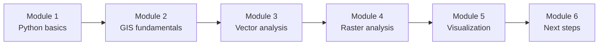
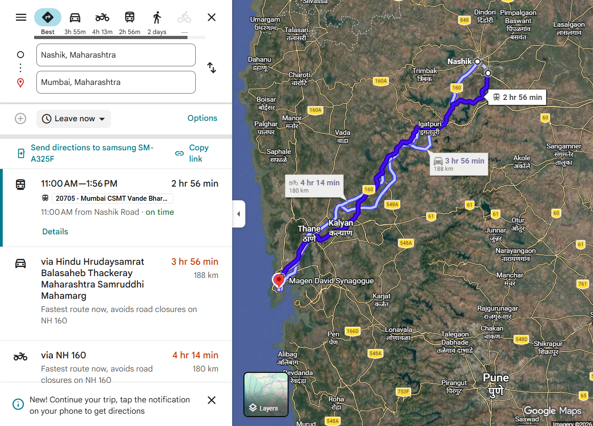
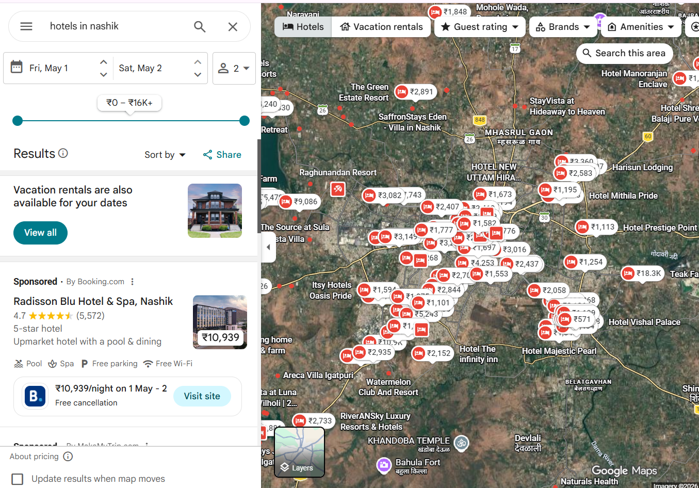
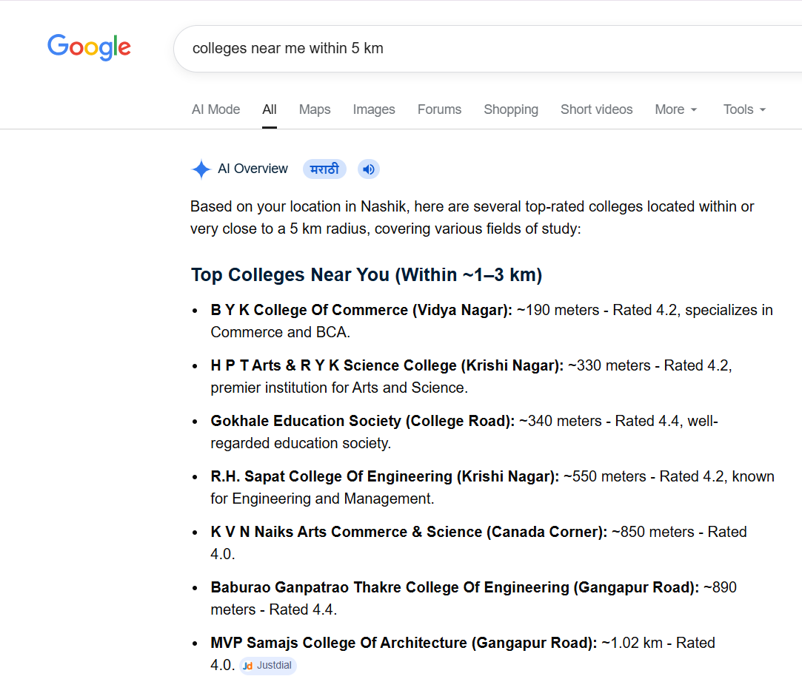
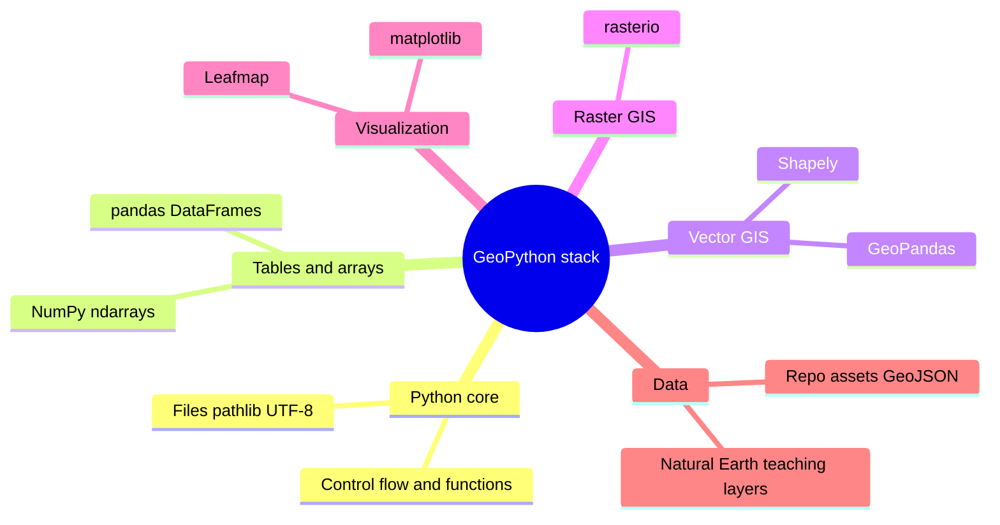

# GeoPython

Welcome to **GeoPython**—a **self-paced** introduction to **Python for geospatial analysis and visualization**. The material is written for learners who are new or returning to Python and want a clear path from syntax to **vector and raster workflows** in common open-source libraries.

## Course map

The six modules build in order: core Python, how geographic data is represented, vector analysis, raster analysis, visualization, then follow-on topics and resources.

!!! info "Want more depth?"
    For a longer course, projects, and support options, see [krishnaglodha.com/courses](https://krishnaglodha.com/courses/).
## What is GIS?

GIS (Geographic Information System) is a computer-based system used to collect, store, manage, analyze, and visualize geographic or location-based data. It allows users to map real-world features, study patterns, and understand relationships between different data layers, helping in planning, decision-making, resource management, and solving real-world problems efficiently.

## You already use “GIS”—you just don’t call it that yet

When you **search for a place** on **Google Maps**, ask for **directions**, or tap **Nearby** (cafés, fuel, ATMs), your phone is doing **geospatial work**: it combines **where you are**, **where targets are**, **roads or paths**, and **rules** (shortest time, avoid tolls, open now).

### Everyday maps (examples)

Route planning, local search, and “what’s near me?” are the same family of questions as many GIS workflows—here are a few familiar screenshots (your apps may look slightly different). **Click an image** to open it **full screen** (this works for **most figures across the site**); click the dark backdrop or **×**, or press **Escape**, to close.

### 1. Route Search in Google Maps

When you search for a route on Google Maps, for example from Nashik to Mumbai, it displays the best possible path. Do you know how this routing system works behind the scenes?

### 2. Hotel Search

When you search for hotels, such as “hotels in Nashik,” Google Maps shows a list of nearby hotels. Do you know how it identifies and ranks these results?

### 3. Nearby Place Search (Distance-based)

When you search for places within a specific distance, such as 1 km or 10 km, the system returns nearby results. Do you know how it calculates and filters locations based on distance?

## Modules

### [Module 1: Python Basics](01_python_basics.md)

- **Programming**, **RAM vs databases** (volatile memory, disk persistence, diagram), and **Python** in context
- Variables, types, **strings**, and collections (lists, tuples, sets, dictionaries)
- **Conditionals**, **`for` / `while`**, functions, and **imports**
- **Text files**: paths, UTF-8, `with open`, **`pathlib`**
- **NumPy**: `ndarray`, vectorized math
- **pandas**: `DataFrame` / `Series`, create, access, filter, add/edit/drop, missing values, CSV I/O
- **Practice problems** with collapsible solutions (cities, weather, countries, files, pandas)

### [Module 2: GIS Fundamentals](02_gis_fundamentals.md)

- What **GIS** does: locations + attributes; **vector vs raster** and typical uses
- **Vector**: point, line, polygon (with sample **GeoJSON**); **raster** variants (continuous, categorical, multi-band) and **TIFF / GeoTIFF** (figures under **`docs/assets/`**)
- **CRS**: geographic vs projected, **EPSG**, datum in brief, **reproject vs assign**, common mistakes, and **CRS figures** in the chapter
- Open and **inspect** vector layers and relate **wrong-CRS** choices to the map examples (**Natural Earth**-style paths where used)

### [Module 3: Vector Data & Analysis](03_vector_analysis.md)

- **Vector** formats, **multipart** geometries, **Shapely** (buffer, union, intersection, predicates)
- **GeoPandas**: `GeoDataFrame`, **`geometry`** column, CRS on the table, read–filter–reproject–export
- **Basics assignment** path: **geojson.io**, Shapely + small GeoPandas tasks before advanced topics
- **Spatial joins**, **overlays**, creating new geometries, exports, and **practice problems**

### [Module 4: Raster Data & Analysis](04_raster_analysis.md)

- Raster as a **grid** (resolution, extent, **CRS**, **NoData**, bands, dtypes)
- **`rasterio`** recipes and workflows: read/inspect, stats, mask/clip, merge, **resampling**; bundled **`Tiff_1.tif`** / **`Tiff_2.tif`** in **`docs/assets/tiff/`**
- Raster–vector integration, **NoData** handling, and **practice** (elevation-style and multi-criteria examples)

### [Module 5: Visualization with Matplotlib & Leafmap](05_visualization.md)

- **Matplotlib**: figures/axes, **`GeoDataFrame.plot`**, and **raster** plots with **`rasterio`** (display, colormap, histogram, NoData masking, window/crop, overlays, subplots); **`pip install`** **matplotlib**, **numpy**, **rasterio**
- **Leafmap**: interactive maps—create map, **basemaps**, **markers**, **GeoJSON**, **`to_html`** export; **`pip install leafmap`** and optional **`localtileserver`**; example screenshots in **`docs/assets/`**
- Further sections: **GeoPandas** layer stacks and choropleths, **popups**, **export/print**, and optional **ipyleaflet** for deeper widget control

### [Module 6: Next Steps & Learning Path](06_next_steps.md)

- Recap of skills, **portfolio** and project ideas
- Intermediate Python, cloud GIS, databases, and **Streamlit**-style directions
- Pointers to advanced topics (ML, big data, DevOps) and curated resources—without repeating the six core modules

## Prerequisites

- **Python**: no prior experience required for Module 1; later modules assume you can run notebooks or scripts.
- **GIS**: basic map literacy helps (coordinates, layers); CRS ideas are taught in Module 2.
- **Environment**: **Jupyter**, **VS Code**, or **Google Colab** are all fine—use whichever matches how you run the code cells in each file.

## Data and materials in this repository

- **Bundled examples** under **`docs/assets/`**: sample **GeoJSON** (including **`assets/examples/`**), diagrams, map screenshots, and packaged outputs used in the vector, raster, and visualization chapters.
- **Sample GeoTIFFs** **`Tiff_1.tif`** and **`Tiff_2.tif`** in **`docs/assets/tiff/`** for raster and visualization exercises (download buttons also appear in the raster module).
- **Natural Earth** and similar teaching layers appear in several chapters; download links and paths are given inside each module where they apply.
- **geojson.io** is referenced explicitly in the **vector basics assignment** for drawing and exporting GeoJSON.

## What you can build

!!! success "Typical outcomes from the modules"
    - Small **Python scripts and notebooks** that load, clean, and summarize tables (**pandas**) and arrays (**NumPy**)
    - **Vector workflows** with **GeoPandas** and **Shapely** (read, filter, reproject, spatial join, export)
    - **Raster workflows** with **rasterio** (read, compute, clip, respect NoData)
    - **Static** maps and **raster figures** (**matplotlib** + **rasterio**) and **interactive** maps (**Leafmap**), suitable as starting points for a portfolio README or report figures

## Core stack (mind map)

## How to use this site

1. Open **[Module 1: Python Basics](01_python_basics.md)** and run examples in order.
2. Use the **Learning Goals** at the top of each module as a checklist.
3. Try **practice** sections before expanding the solutions.
4. Keep a single folder or repo for your own copies of scripts, outputs, and maps.

## Learning outcomes

After working through the modules, you should be able to:

!!! check "Technical skills"
    - Read and write short Python programs using collections, loops, functions, files, **NumPy**, and **pandas**
    - Explain **vector vs raster**, common **file formats**, and **CRS** metadata at a practical level
    - Use **GeoPandas** and **Shapely** for common vector operations and exports
    - Use **rasterio** for read/compute/clip patterns and **NoData** awareness
    - Produce **static** maps and **raster plots** with **matplotlib** (and **rasterio** where used) and **interactive** maps with **Leafmap**

!!! check "Practical habits"
    - Inspect **CRS** and **dtypes** before analysis
    - Prefer **vectorized** and library-native operations over ad hoc loops where possible
    - Reproducible paths (`pathlib`), UTF-8 text, and clear column names in tables

## Documentation conventions

- **Mermaid** figures for flows and stacks
- **Runnable code** in fenced blocks; longer modules also use **practice** and **solution** patterns
- **Admonitions** (`tip`, `warning`, `success`) for habits and pitfalls

## Get started

[Open Module 1: Python Basics](01_python_basics.md){ .md-button .md-button--primary }

---

!!! quote "Course philosophy"
    *Each module ties syntax to geographic questions: tables and coordinates are not abstract exercises—they are the same objects you will use in GeoPandas, rasterio, and maps.*

**Happy mapping with Python.**
