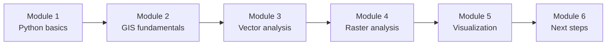
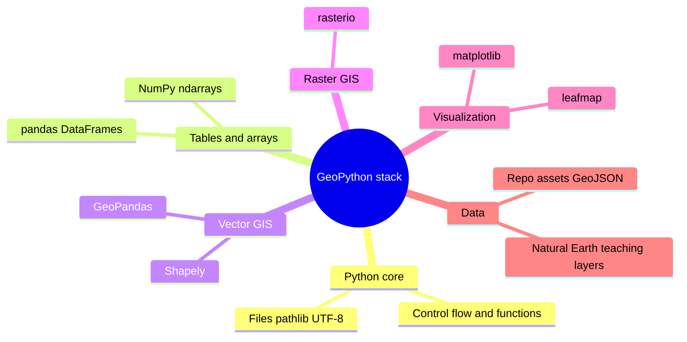

# GeoPython 101

Welcome to **GeoPython 101**—a **self-paced** introduction to **Python for geospatial analysis and visualization**. The material is written for learners who are new or returning to Python and want a clear path from syntax to **vector and raster workflows** in common open-source libraries.

## Course map

The six modules build in order: core Python, how geographic data is represented, vector analysis, raster analysis, visualization, then follow-on topics and resources.

!!! info "Want more depth?"
    For a longer course, projects, and support options, see [krishnaglodha.com/courses](https://krishnaglodha.com/courses/).

## Modules

### [Module 1: Python Basics](01_python_basics.md)

- Variables, types, operators, strings, and collections (lists, tuples, sets, dictionaries)
- Control flow (`if`, loops), functions, and imports
- **Text files**: paths, UTF-8, `with open`, `pathlib`
- **NumPy**: `ndarray`, vectorized math, optional **string dtypes** and `np.char`
- **pandas**: `DataFrame` / `Series`, create, access, filter, add/edit/drop, missing values, CSV I/O
- **Practice problems** with collapsible solutions (cities, weather, countries, files, pandas)

### [Module 2: GIS Fundamentals](02_gis_fundamentals.md)

- GIS, **vector vs raster**, geometry types (point, line, polygon) with sample GeoJSON
- **Raster overview**: continuous vs categorical vs multi-band data; **TIFF / GeoTIFF** and bundled diagrams under `docs/assets/`
- **CRS**: what a CRS is, types (geographic vs projected), **datum**, **EPSG**, **reprojection**, common mistakes without correct metadata
- Vector data loading and inspection (including **Natural Earth**-style examples where the notebooks reference them)
- **Practice**: CRS and data-inspection exercises as in the module

### [Module 3: Vector Data & Analysis](03_vector_analysis.md)

- Vector formats (GeoJSON, Shapefile, GeoPackage, and others) and **Shapely** operations (buffer, union, intersection, predicates)
- **GeoPandas**: `GeoDataFrame`, I/O, attributes, reprojection for analysis, spatial joins and overlays
- **Basics assignment** (before the advanced GeoPandas track): **geojson.io**, small tables, Shapely + GeoPandas workflows **without** a CRS-change homework track
- **Practice problems** in the module (European analysis, spatial relationships, etc., as documented there)

### [Module 4: Raster Data & Analysis](04_raster_analysis.md)

- Raster structure, resolution, extent, **NoData**, dtypes
- **rasterio**: read, inspect, compute, clip with vectors, combine with vector context
- **Practice**: elevation and suitability-style workflows described in the module

### [Module 5: Visualization with Matplotlib & Leafmap](05_visualization.md)

- **Matplotlib** static maps with **GeoPandas** layers
- **leafmap** (Folium / ipyleaflet stack) for interactive maps: basemaps, layers, popups, export
- **Practice**: exercises built around the chapter (maps and layer controls)

### [Module 6: Next Steps & Learning Path](06_next_steps.md)

- Recap of skills, **portfolio** and project ideas
- Pointers to advanced topics (e.g. Streamlit-style apps, ML, big data) and curated resources—not a fourth duplicate of the core lessons

## Prerequisites

- **Python**: no prior experience required for Module 1; later modules assume you can run notebooks or scripts.
- **GIS**: basic map literacy helps (coordinates, layers); CRS ideas are taught in Module 2.
- **Environment**: **Jupyter**, **VS Code**, or **Google Colab** are all fine—use whichever matches how you run the code cells in each file.

## Data and materials in this repository

- **Bundled examples** under **`docs/assets/`** (e.g. sample GeoJSON, diagrams, packaged outputs used in the vector chapter).
- **Natural Earth** and similar teaching layers appear in several chapters; download links and paths are given inside each module where they apply.
- **geojson.io** is referenced explicitly in the **vector basics assignment** for drawing and exporting GeoJSON.

## What you can build

!!! success "Typical outcomes from the modules"
    - Small **Python scripts and notebooks** that load, clean, and summarize tables (**pandas**) and arrays (**NumPy**)
    - **Vector workflows** with **GeoPandas** and **Shapely** (read, filter, reproject, spatial join, export)
    - **Raster workflows** with **rasterio** (read, compute, clip, respect NoData)
    - **Static and interactive maps** (**matplotlib** + **leafmap**), suitable as starting points for a portfolio README or report figures

## Core stack (mind map)

## How to use this site

1. Open **[Module 1: Python Basics](01_python_basics.md)** and run examples in order.
2. Use the **Learning Goals** at the top of each module as a checklist.
3. Try **practice** sections before expanding the solutions.
4. Keep a single folder or repo for your own copies of scripts, outputs, and maps.

## Learning outcomes

After working through the modules, you should be able to:

!!! check "Technical skills"
    - Read and write short Python programs using collections, loops, functions, files, **NumPy**, and **pandas**
    - Explain **vector vs raster**, common **file formats**, and **CRS** metadata at a practical level
    - Use **GeoPandas** and **Shapely** for common vector operations and exports
    - Use **rasterio** for read/compute/clip patterns and **NoData** awareness
    - Produce **static** and **interactive** maps with **matplotlib** and **leafmap**

!!! check "Practical habits"
    - Inspect **CRS** and **dtypes** before analysis
    - Prefer **vectorized** and library-native operations over ad hoc loops where possible
    - Reproducible paths (`pathlib`), UTF-8 text, and clear column names in tables

## Documentation conventions

- **Mermaid** figures for flows and stacks
- **Runnable code** in fenced blocks; longer modules also use **practice** and **solution** patterns
- **Admonitions** (`tip`, `warning`, `success`) for habits and pitfalls

## Get started

[Open Module 1: Python Basics](01_python_basics.md){ .md-button .md-button--primary }

---

!!! quote "Course philosophy"
    *Each module ties syntax to geographic questions: tables and coordinates are not abstract exercises—they are the same objects you will use in GeoPandas, rasterio, and maps.*

**Happy mapping with Python.**
